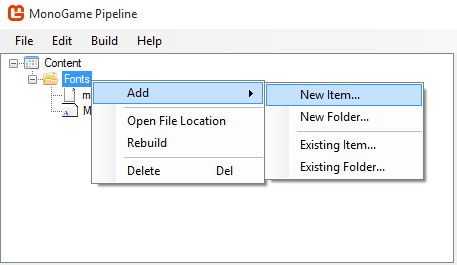
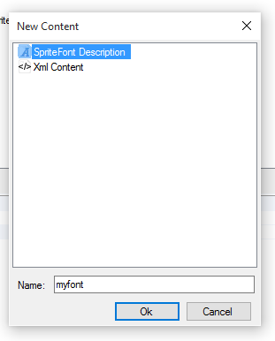

MonoGame supports more than one method of using fonts, the following is an explanation of how to use TrueType fonts.

#### Using TrueType Fonts with MonoGame
To be able to use a truetype font, MonoGame requires the truetype font file and a .spritefont file.
Truetype fonts may be installed on the system, or added to the project manually using your IDE in the same directory as the .spritefont file.

1. Create the .spritefont file.

<p align="center">

</p>

<p align="center">

</p>

2- Open the newly created .spritefont file in your text editor of choice, find this line and change it to your selected .ttf font.
If the font is installed on the system, just type the name of the font.
```
<FontName>Arial</FontName>
```

#### Usage Example
Make a class variable of type Spritefont
```
SpriteFont font;
```
Load the font in the LoadContent function
```
font = myGame.Content.Load<SpriteFont>("Fonts/myFont")
```
Draw any text in the Draw function
```
spriteBatch.Begin();
// Finds the center of the string in coordinates inside the text rectangle
Vector2 textMiddlePoint = font.MeasureString(text) / 2;
// Places text in center of the screen
Vector2 position = new Vector2(myGame.Window.ClientBounds.Width / 2, myGame.Window.ClientBounds.Height / 2);
spriteBatch.DrawString(font, "MonoGame Font Test", position, Color.White, 0, textMiddlePoint, 1.0f, SpriteEffects.None, 0.5f)
spriteBatch.End();
```

If you want to know more, please refer to the [API Documentation]()
