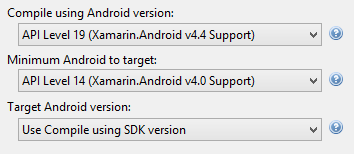
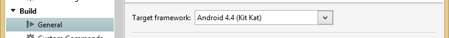
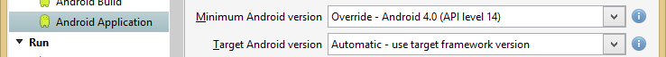

# 

## Target Frameworks
Specifying the target Android versions can be confusing.  MonoGame is built to target Android 4.2 (API Level 17), but can run on lower Android versions.  If you build MonoGame from source, you will need the SDK Platform for API Level 17 installed in the Android SDK Manager.

Since MonoGame targets Android 4.2, the Target Framework in your Android project must be set to 4.2 or higher.  To allow your game to run on lower Android versions, set the Minimum Android version to the desired version in the project properties.

### Visual Studio
There are three settings in the Application tab of the project properties to set the target Android versions.

`Compile using Android version` must be set to a minimum of `Android 4.2`.  If you are using APIs available only in later Android versions, this must be set to the Android version that API became available or higher.

`Minimum Android to target` is set to the lowest Android version that you wish to support.

`Target Android version` is usually set to `Use Compile using SDK version`.  This means to use the same value that we set the app to be built with.  There is usually no reason to set this to any other value.

This is an example of a project set to build with the 4.4 SDK and target 4.0 as a minimum Android version.

### Xamarin Studio

Xamarin Studio has the same settings in the propject options dialog. They are just in different places.

`Target framework` on the `General` page is the equivalent of Visual Studio's `Compile using Android version`.

On the `Application Application` page, you will find `Minimum Android version` (Visual Studio's `Minimum Android to target`) and `Target Android version` (same as Visual Studio).

## References

[Such Android API Levels, Much Confuse. Wow.](http://redth.codes/such-android-api-levels-much-confuse-wow/) is a blog post by Redth going into more detail about setting the Android versions in a Xamarin project.