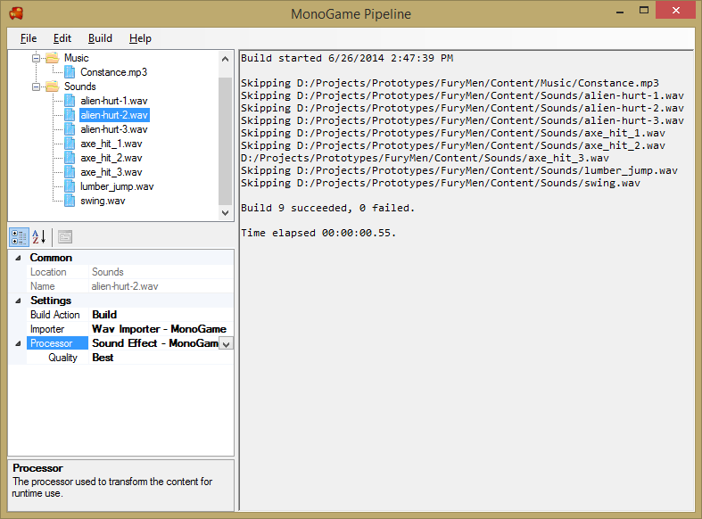

The MonoGame Pipeline Tool (Pipeline.exe) is the front-end GUI editor for MonoGame content builder projects.

The Pipeline Tool has the following features:

  * Create, open, and save MGCB projects.
  * Import existing XNA .contentproj.
  * Tree view showing content of project.
  * Property grid for editing content settings.
  * Full undo/redo support.
  * Build, rebuild, and clean the project.
  * Rebuild selected items.
  * Create new content like fonts and xml.
  * Support for custom importers/processors/writers.
  * Template format for adding new custom content types.

The Pipeline Tool is included in the SDK installation.

[Read detailed documentation](using_pipeline_tool.md)

