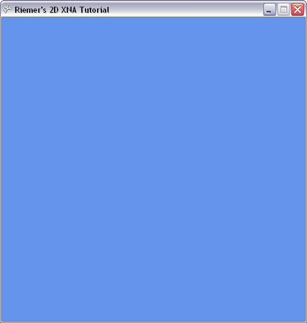

## Starting your XNA 4.0 Project
Welcome to the first entry of this XNA Tutorial. This tutorial is aimed at people who haven't done any XNA programming so far and would like to see some results in the shortest possible time. Released in December 2006, XNA is a new language, built around DirectX, which eases game programming in a lot of ways.

#### Required Software (free):
The software required to start writing your own XNA code is completely free to download:

- Microsoft XNA Game Studio 4.0, the programming environment (free) ([link](http://www.microsoft.com/downloads/en/details.aspx?FamilyID=9ac86eca-206f-4274-97f2-ef6c8b1f478f))
- Microsoft Visual Studio C# Express (free) ([link, make sure you select the C# edition, marked in green](http://www.microsoft.com/express/Downloads/#2010-Visual-CS)). XNA Game Studio 4.0 will also work with the full version of Visual Studio 2010.

#### Starting a new XNA Project:
With this free software installed, you can start up Microsoft XNA Game Studio 4.0, which you can find as an entry in the start menu. Next, go to the File menu, and select New Project. If you have the full version of Visual Studio 2010, next you'll have to select "Visual C# -> XNA Game Studio 4.0" as project type in the list on the left.

As project template, we need Windows Game (4.0). Deploying your game on an Xbox360 will be discussed later. Fill in XNAtutorial as name for the project, and hit the OK button!

A small XNA project is being made for you. In the Solution Explorer on the right side of your screen you see your project already contains 2 code files: Game1.cs and Program.cs. You can look at the code in the files by right clicking on them and selecting View code. When you will later on run your program, your program will start in the Program.cs file, in the Main method. This main method simply calls up the code in the Game1.cs file. There's nothing we need to change in the Program.cs file.

#### Program structure:
Open the code in the Game1.cs file. Although it's littered with comments in green (feel free to remove them), we can discover the structure of a XNA game program:

- The constructor method Game1() is called once at startup. It is used to load some variables needed by the XNA framework.
- The Initialize method is also called once on startup. This is the method where we should put our initialization code.
- The LoadContent method is used for importing media (such as images, objects and audio) as well as data related to the graphics card. The UnLoadContent method is the ideal place to unload any graphical content, if you need to. It's also called once, at startup of our game.
- The Update method is called every frame, at a rate go exactly 60 times/second. Here we will put the code that needs to be updated throughout the lifetime of our program, such as the code that reads the keyboard and updates the geometry of our scene.
- As often as your computer (and especially your graphics card) allows, the Draw method is called. This is where we should put the code that actually draws stuff to the screen.

As you can see, there is no code needed to open a window, as this will be done automatically for us. When you run your project at this moment by pressing F5, you will already get a nice blue window.

Let's move on, and discuss the graphics device. In short, the 'device' I'll be talking about in the next series of tutorials, is a direct link to your graphical adapter. It is an object in your code that gives you direct access to the piece of hardware inside your computer. This variable is readily available in our code as the GraphicsDevice variable, but as we'll be using this a lot (really, a lot) we'll make a shortcut for this. First, we'll declare this variable, by adding this line to the top of our class, exactly above the Game1() method:

    GraphicsDevice device;

Obviously we need to fill this variable. Add this line to your LoadContent method:

    device = graphics.GraphicsDevice;

Next, we're going to specify some extra stuff related to our window such as its size and title. Add this code to the Initialize method:

    graphics.PreferredBackBufferWidth = 500;
    graphics.PreferredBackBufferHeight = 500;
    graphics.IsFullScreen = false;
    graphics.ApplyChanges();
    Window.Title = "Riemer's 2D XNA Tutorial";
    
    
The first line sets the size of our backbuffer, which will contain what will be drawn to the screen. We also indicate we want our program to run in a window, after which we apply the changes. The last line sets the title of our window.

When you run this code, you should see a window of 500x500 pixels, with the title you set, as shown below.

Where appropriate, after some chapters I will suggest some short exercises, allowing you practice what you've learned in the chapter. After the exercise, the whole code of the chapter is listed, with the changes of the current chapter highlighted. I have stripped away all the comments, so it looks a bit more compact.

__Important:__ When you copy-paste the code into your Game.cs file, make sure you change the name of the namespace in your Program.cs file to XNAtutorial. The namespace is the same as the name you specifyied when creating the new project, so in my case it is XNAtutorial. You can find the namespace immediate below the using-block at the top of the code.

You can try these exercises to practice what you've learned:
- Change the size of your window to 800x600.
- Instead of creating a windowed game, switch to 800x600 fullscreen mode (use Alt+F4 to terminate your program).

-----

    using System;
    using System.Collections.Generic;
    using System.Linq;
    using Microsoft.Xna.Framework;
    using Microsoft.Xna.Framework.Audio;
    using Microsoft.Xna.Framework.Content;
    using Microsoft.Xna.Framework.GamerServices;
    using Microsoft.Xna.Framework.Graphics;
    using Microsoft.Xna.Framework.Input;
    using Microsoft.Xna.Framework.Media;

    namespace XNATutorial
    {
        public class Game1 : Microsoft.Xna.Framework.Game
        {
            GraphicsDeviceManager graphics;
            SpriteBatch spriteBatch;
            GraphicsDevice device;

            public Game1()
            {
                graphics = new GraphicsDeviceManager(this);
                Content.RootDirectory = "Content";
            }

            protected override void Initialize()
            {
                graphics.PreferredBackBufferWidth = 500;
                graphics.PreferredBackBufferHeight = 500;
                graphics.IsFullScreen = false;
                graphics.ApplyChanges();
                Window.Title = "Riemer's 2D XNA Tutorial";

                base.Initialize();
            }

            protected override void LoadContent()
            {
                spriteBatch = new SpriteBatch(GraphicsDevice);
                device = graphics.GraphicsDevice;
            }

            protected override void UnloadContent()
            {
            }

            protected override void Update(GameTime gameTime)
            {
                if (GamePad.GetState(PlayerIndex.One).Buttons.Back == ButtonState.Pressed)
                    this.Exit();

                base.Update(gameTime);
            }

            protected override void Draw(GameTime gameTime)
            {
                GraphicsDevice.Clear(Color.CornflowerBlue);

                base.Draw(gameTime);
            }
        }
    }