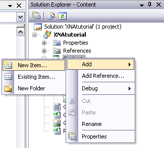
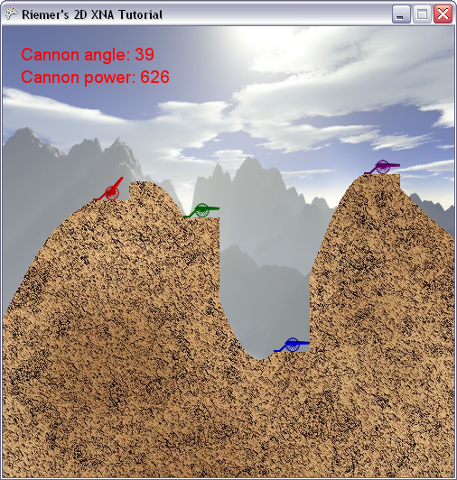

## Writing text to the screen in XNA
In this chapter, we will learn how to render text to the screen so we can print the Power and Angle of the current player's cannon.

This has been made quite easy by XNA. First, we need to add a font to our project and bind it to a variable in our code, much like how we would add an image to a project. Then we can simply render it using the SpriteBatch. We even don't need to create a separate SpriteBatch: we can simply use the SpriteBatch we're using to render our terrain and cannons.

Let's start by adding the font to our project. To do this, find the Content project in your Solution Explorer at the top-right of your screen, and right-click on it. From the drop-down list, select Add -> New Item, as shown in the image below.

In the dialog that opens, select "Sprite Font" and give it a name at the bottom: myFont.spritefont and click the Add button. You should see that the myFont.spritefont file has been added to the Content project of our project.

Also, you will be presented with a weird looking text file in your main window. Luckily, there's not too much we need to change here. __Find the FontName entry in the file, and change Segoe UI Mono to Arial__. This will define the font family, and you can choose any font installed on your system. To see which fonts are installed on your system, open the C:/Windows/Fonts folder. Note also that in this text file you can also change the size of your font. By default, the size is set to 14 points.

Next, go back to our Game1.cs file add this variable to the top of our code:

    SpriteFont font;

A Texture2D object can link to an image file, in the same way a SpriteFont object can link to a font file. Load the file into the variable in our LoadContent method:

    font = Content.Load<SpriteFont> ("myFont");

Find the analogy to loading an image: we're also using the Content.Load method, specify which type of variable we're loading here, together with the first part of the filename.

With the font loaded and the SpriteBatch already active, we're ready to draw some text. Once again, we will not put this directly in our Draw method, but in a separate method:

    private void DrawText()
    {
        spriteBatch.DrawString(font, "Cannon power: 100", new Vector2(20, 45), Color.White);
    }

The line of code asks the SpriteBatch to render some text using our 'font' object. We specify the position, color and text, indicating the power of the cannon. This will be rendered 20 pixels to the right and 45 down from the top-left corner of the screen.

Don't forget to call this method from within our Draw method:

    protected override void Draw(GameTime gameTime)
    {
        graphics.GraphicsDevice.Clear(Color.CornflowerBlue);

        spriteBatch.Begin();
        DrawScenery();
        DrawPlayers();
        DrawText();
        spriteBatch.End();

        base.Draw(gameTime);
    }

Now when you run this code, you will see the current Power indicated at the top-left corner!

Obviously, the number printed to the screen does not correspond to the actual power when you change it, as we've defined it as a fixed number. Instead, change our DrawText method to this:

    private void DrawText()
    {
        PlayerData player = players[currentPlayer];
        int currentAngle = (int)MathHelper.ToDegrees(player.Angle);
        spriteBatch.DrawString(font, "Cannon angle: " + currentAngle.ToString(), new Vector2(20, 20), player.Color);
        spriteBatch.DrawString(font, "Cannon power: " + player.Power.ToString(), new Vector2(20, 45), player.Color);
    }

This looks up the data of the current player in our PlayerData array. From this data, we use both the Angle, Power and Color values while drawing the text to the screen.

That's it! When you run the code you should see the screen below. Try to change the angle or the power: the values printed on the screen should change accordingly.

Our code so far:

    using System;
    using System.Collections.Generic;
    using System.Linq;
    using Microsoft.Xna.Framework;
    using Microsoft.Xna.Framework.Audio;
    using Microsoft.Xna.Framework.Content;
    using Microsoft.Xna.Framework.GamerServices;
    using Microsoft.Xna.Framework.Graphics;
    using Microsoft.Xna.Framework.Input;
    using Microsoft.Xna.Framework.Media;

    namespace XNATutorial
    {
        public struct PlayerData
        {
            public Vector2 Position;
            public bool IsAlive;
            public Color Color;
            public float Angle;
            public float Power;
        }

        public class Game1 : Microsoft.Xna.Framework.Game
        {
            GraphicsDeviceManager graphics;
            SpriteBatch spriteBatch;
            GraphicsDevice device;
            Texture2D backgroundTexture;
            Texture2D foregroundTexture;
            Texture2D carriageTexture;
            Texture2D cannonTexture;
            SpriteFont font;
            int screenWidth;
            int screenHeight;
            PlayerData[] players;
            int numberOfPlayers = 4;
            float playerScaling;
            int currentPlayer = 0;

            public Game1()
            {
                graphics = new GraphicsDeviceManager(this);
                Content.RootDirectory = "Content";
            }

            protected override void Initialize()
            {
                graphics.PreferredBackBufferWidth = 500;
                graphics.PreferredBackBufferHeight = 500;
                graphics.IsFullScreen = false;
                graphics.ApplyChanges();
                Window.Title = "Riemer's 2D XNA Tutorial";

                base.Initialize();
            }

            private void SetUpPlayers()
            {
                Color[] playerColors = new Color[10];
                playerColors[0] = Color.Red;
                playerColors[1] = Color.Green;
                playerColors[2] = Color.Blue;
                playerColors[3] = Color.Purple;
                playerColors[4] = Color.Orange;
                playerColors[5] = Color.Indigo;
                playerColors[6] = Color.Yellow;
                playerColors[7] = Color.SaddleBrown;
                playerColors[8] = Color.Tomato;
                playerColors[9] = Color.Turquoise;

                players = new PlayerData[numberOfPlayers];
                for (int i = 0; i < numberOfPlayers; i++)
                {
                    players[i].IsAlive = true;
                    players[i].Color = playerColors[i];
                    players[i].Angle = MathHelper.ToRadians(90);
                    players[i].Power = 100;
                }

                players[0].Position = new Vector2(100, 193);
                players[1].Position = new Vector2(200, 212);
                players[2].Position = new Vector2(300, 361);
                players[3].Position = new Vector2(400, 164);
            }

            protected override void LoadContent()
            {
                spriteBatch = new SpriteBatch(GraphicsDevice);
                device = graphics.GraphicsDevice;

                backgroundTexture = Content.Load<Texture2D>("background");
                foregroundTexture = Content.Load<Texture2D>("foreground");
                carriageTexture = Content.Load<Texture2D>("carriage");
                cannonTexture = Content.Load<Texture2D>("cannon");
                font = Content.Load<SpriteFont>("myFont");
                screenWidth = device.PresentationParameters.BackBufferWidth;
                screenHeight = device.PresentationParameters.BackBufferHeight;

                SetUpPlayers();
                playerScaling = 40.0f / (float)carriageTexture.Width;
            }

            protected override void UnloadContent()
            {
            }

            protected override void Update(GameTime gameTime)
            {
                if (GamePad.GetState(PlayerIndex.One).Buttons.Back == ButtonState.Pressed)
                    this.Exit();

                ProcessKeyboard();

                base.Update(gameTime);
            }

            private void ProcessKeyboard()
            {
                KeyboardState keybState = Keyboard.GetState();
                if (keybState.IsKeyDown(Keys.Left))
                    players[currentPlayer].Angle -= 0.01f;
                if (keybState.IsKeyDown(Keys.Right))
                    players[currentPlayer].Angle += 0.01f;

                if (players[currentPlayer].Angle > MathHelper.PiOver2)
                    players[currentPlayer].Angle = -MathHelper.PiOver2;
                if (players[currentPlayer].Angle < -MathHelper.PiOver2)
                    players[currentPlayer].Angle = MathHelper.PiOver2;

                if (keybState.IsKeyDown(Keys.Down))
                    players[currentPlayer].Power -= 1;
                if (keybState.IsKeyDown(Keys.Up))
                    players[currentPlayer].Power += 1;
                if (keybState.IsKeyDown(Keys.PageDown))
                    players[currentPlayer].Power -= 20;
                if (keybState.IsKeyDown(Keys.PageUp))
                    players[currentPlayer].Power += 20;

                if (players[currentPlayer].Power > 1000)
                    players[currentPlayer].Power = 1000;
                if (players[currentPlayer].Power < 0)
                    players[currentPlayer].Power = 0;
            }

            protected override void Draw(GameTime gameTime)
            {
                GraphicsDevice.Clear(Color.CornflowerBlue);

                spriteBatch.Begin();
                DrawScenery();
                DrawPlayers();

                DrawText();
                spriteBatch.End();

                base.Draw(gameTime);
            }

            private void DrawScenery()
            {
                Rectangle screenRectangle = new Rectangle(0, 0, screenWidth, screenHeight);
                spriteBatch.Draw(backgroundTexture, screenRectangle, Color.White);
                spriteBatch.Draw(foregroundTexture, screenRectangle, Color.White);
            }

            private void DrawPlayers()
            {
                foreach (PlayerData player in players)
                {
                    if (player.IsAlive)
                    {
                        int xPos = (int)player.Position.X;
                        int yPos = (int)player.Position.Y;
                        Vector2 cannonOrigin = new Vector2(11, 50);

                        spriteBatch.Draw(cannonTexture, new Vector2(xPos + 20, yPos - 10), null, player.Color, player.Angle, cannonOrigin, playerScaling, SpriteEffects.None, 1);
                        spriteBatch.Draw(carriageTexture, player.Position, null, player.Color, 0, new Vector2(0, carriageTexture.Height), playerScaling, SpriteEffects.None, 0);
                    }
                }
            }

            private void DrawText()
            {
                PlayerData player = players[currentPlayer];
                int currentAngle = (int)MathHelper.ToDegrees(player.Angle);
                spriteBatch.DrawString(font, "Cannon angle: " + currentAngle.ToString(), new Vector2(20, 20), player.Color);
                spriteBatch.DrawString(font, "Cannon power: " + player.Power.ToString(), new Vector2(20, 45), player.Color);
            }
        }
    }