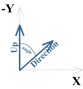
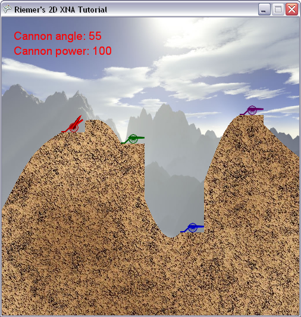

## Launching the rocket

This chapter, we will extend our code so the cannon will launch a rocket whenever the spacebar is pressed. Start by downloading the rocket image [by clicking here](http://www.riemers.net/Downloads/resources/Series2D/rocket.png) and importing it into your XNA project. Add this variable to the top of our code:

    Texture2D rocketTexture;

And initialize it in our LoadContent method:

    rocketTexture = Content.Load<Texture2D> ("rocket");

Next, add these variables to the top of our code:

    bool rocketFlying = false;
    Vector2 rocketPosition;
    Vector2 rocketDirection;
    float rocketAngle;
    float rocketScaling = 0.1f;

The first one keeps track of whether our rocket is in the air, and thus whether it should be drawn. Obviously, at all times we need to know the position of the rocket. The direction of the rocket is needed when calculating the next position of the rocket, and is closely related to the angle. In fact, the angle can be calculated from the direction, but because we need both quite frequently we want both to be a easy accessible variable. Finally, the scaling variable will remain a fixed constant, but since we will need it a few times in our code we also add it as a variable.

Let's start in our ProcessKeyboard method, where we want to launch the rocket on a keypress. So add this code to the end of the method:

    if (keybState.IsKeyDown(Keys.Enter) || keybState.IsKeyDown(Keys.Space))
    {
        rocketFlying = true;
    }

Which will for now only set the rocketFlying value to true. Next to that, we can also set the position and angle for the rocket, as these are the same as the cannon that is firing the rocket. Add this code inside the the if-block above:

    rocketPosition = players[currentPlayer].Position;
    rocketPosition.X += 20;
    rocketPosition.Y -= 10;
    rocketAngle = players[currentPlayer].Angle;

For the position, you start at the bottom-left corner of the carriage, and add 20 pixels to the right and 10 pixels up, corresponding to the center of the carriage. As starting angle of the rocket, we should simply take the current angle of the cannon.

A bit more complicated is to find the direction of the rocket. A direction should have a X and Y component, indicating how many pixels horizontally and vertically the rocket should be moved each time. Obviously, this can be found from the angle of the rocket.

One approach would be to take the sine and cosine of this angle and use this as Y and X components, but XNA allows us to use a much more elegant solution. We will start from the (0,-1) Up direction, and ask XNA to rotate this over an angle we specify. This is illustrated in the image below:

Let's start by defining the Up vector which is along the negative Y axis, as its coordinates are (0,-1): (put this code underneath the previous line)

    Vector2 up = new Vector2(0, -1);

Next, we want XNA to rotate this vector. For this, we want XNA to construct a rotation matrix. This sounds very complex, but it's not: a matrix is something you can multiply with a vector to obtain a transformed version of that vector. If XNA can give us a matrix containing our rotation, we can use this matrix to obtain the rotated version of our vector.

This is how we can obtain the rotation matrix:

    Matrix rotMatrix = Matrix.CreateRotationZ(rocketAngle);

To explain the line above, think of how you would rotate the Up vector shown in the image above. You would take it between 2 fingers, and rotate it. Important here is that your fingers are pointing to the screen.

This helps to understand the line of code above: it creates a matrix containing a rotation around the Z axis. This is what we need: if the X axis is pointing to the right and the Y axis is pointing down, the Z axis is sticking out of the screen!

Now we have this matrix containing our rotation, we can ask XNA to transform our Up vector with this rotation:

    rocketDirection = Vector2.Transform(up, rotMatrix);

This will take the original up direction, transform it with the rotation around the Z axis, and store the result in the rocketDirection variable! Now all we need to do, is scale this direction up or down, depending on the Power the rocket was shot:

    rocketDirection *= players[currentPlayer].Power / 50.0f;

At this moment, we have stored everything we need of our rocket, so let's create a small method that renders the rocket to the screen:

    private void DrawRocket()
    {
        if (rocketFlying)
            spriteBatch.Draw(rocketTexture, rocketPosition, null, players[currentPlayer].Color, rocketAngle, new Vector2(42, 240), 0.1f, SpriteEffects.None, 1);
    }

The first line checks whether we fired a rocket. The second line issues the SpriteBatch to draw:

- our rocket image
- to the rocketPosition on the screen
- the whole image, that is
- in the color of the current player
- rotated over an angle stored in rocketAngle
- with (42, 240) (look this position up in the original rocket image) as rotational and positional origin
- scaled down 10 times
- not mirrored
- and on the layer with distance 1

Don't forget to call this method from within our Draw method:

    DrawRocket();

Now when you run this code, whenever you press the spacebar or enter key, you should see a rocket positioned at the cannon! Since we are not yet updating the position, the rocket will not move yet, but this is easy to solve in the next chapter as we've already calculated the direction of the rocket!

Our code thus far:

    using System;
    using System.Collections.Generic;
    using System.Linq;
    using Microsoft.Xna.Framework;
    using Microsoft.Xna.Framework.Audio;
    using Microsoft.Xna.Framework.Content;
    using Microsoft.Xna.Framework.GamerServices;
    using Microsoft.Xna.Framework.Graphics;
    using Microsoft.Xna.Framework.Input;
    using Microsoft.Xna.Framework.Media;

    namespace XNATutorial
    {
        public struct PlayerData
        {
            public Vector2 Position;
            public bool IsAlive;
            public Color Color;
            public float Angle;
            public float Power;
        }

        public class Game1 : Microsoft.Xna.Framework.Game
        {
            GraphicsDeviceManager graphics;
            SpriteBatch spriteBatch;
            GraphicsDevice device;
            Texture2D backgroundTexture;
            Texture2D foregroundTexture;
            Texture2D carriageTexture;
            Texture2D cannonTexture;
            Texture2D rocketTexture;
            SpriteFont font;
            int screenWidth;
            int screenHeight;
            PlayerData[] players;
            int numberOfPlayers = 4;
            float playerScaling;
            int currentPlayer = 0;
            bool rocketFlying = false;
            Vector2 rocketPosition;
            Vector2 rocketDirection;
            float rocketAngle;
            float rocketScaling = 0.1f;

            public Game1()
            {
                graphics = new GraphicsDeviceManager(this);
                Content.RootDirectory = "Content";
            }

            protected override void Initialize()
            {
                graphics.PreferredBackBufferWidth = 500;
                graphics.PreferredBackBufferHeight = 500;
                graphics.IsFullScreen = false;
                graphics.ApplyChanges();
                Window.Title = "Riemer's 2D XNA Tutorial";

                base.Initialize();
            }

            private void SetUpPlayers()
            {
                Color[] playerColors = new Color[10];
                playerColors[0] = Color.Red;
                playerColors[1] = Color.Green;
                playerColors[2] = Color.Blue;
                playerColors[3] = Color.Purple;
                playerColors[4] = Color.Orange;
                playerColors[5] = Color.Indigo;
                playerColors[6] = Color.Yellow;
                playerColors[7] = Color.SaddleBrown;
                playerColors[8] = Color.Tomato;
                playerColors[9] = Color.Turquoise;

                players = new PlayerData[numberOfPlayers];
                for (int i = 0; i < numberOfPlayers; i++)
                {
                    players[i].IsAlive = true;
                    players[i].Color = playerColors[i];
                    players[i].Angle = MathHelper.ToRadians(90);
                    players[i].Power = 100;
                }

                players[0].Position = new Vector2(100, 193);
                players[1].Position = new Vector2(200, 212);
                players[2].Position = new Vector2(300, 361);
                players[3].Position = new Vector2(400, 164);
            }

            protected override void LoadContent()
            {
                spriteBatch = new SpriteBatch(GraphicsDevice);
                device = graphics.GraphicsDevice;

                backgroundTexture = Content.Load<Texture2D>("background");
                foregroundTexture = Content.Load<Texture2D>("foreground");
                carriageTexture = Content.Load<Texture2D>("carriage");
                cannonTexture = Content.Load<Texture2D>("cannon");
                rocketTexture = Content.Load<Texture2D>("rocket");
                font = Content.Load<SpriteFont>("myFont");
                screenWidth = device.PresentationParameters.BackBufferWidth;
                screenHeight = device.PresentationParameters.BackBufferHeight;

                SetUpPlayers();
                playerScaling = 40.0f / (float)carriageTexture.Width;
            }

            protected override void UnloadContent()
            {
            }

            protected override void Update(GameTime gameTime)
            {
                if (GamePad.GetState(PlayerIndex.One).Buttons.Back == ButtonState.Pressed)
                    this.Exit();

                ProcessKeyboard();

                base.Update(gameTime);
            }

            private void ProcessKeyboard()
            {
                KeyboardState keybState = Keyboard.GetState();
                if (keybState.IsKeyDown(Keys.Left))
                    players[currentPlayer].Angle -= 0.01f;
                if (keybState.IsKeyDown(Keys.Right))
                    players[currentPlayer].Angle += 0.01f;

                if (players[currentPlayer].Angle > MathHelper.PiOver2)
                    players[currentPlayer].Angle = -MathHelper.PiOver2;
                if (players[currentPlayer].Angle < -MathHelper.PiOver2)
                    players[currentPlayer].Angle = MathHelper.PiOver2;

                if (keybState.IsKeyDown(Keys.Down))
                    players[currentPlayer].Power -= 1;
                if (keybState.IsKeyDown(Keys.Up))
                    players[currentPlayer].Power += 1;
                if (keybState.IsKeyDown(Keys.PageDown))
                    players[currentPlayer].Power -= 20;
                if (keybState.IsKeyDown(Keys.PageUp))
                    players[currentPlayer].Power += 20;

                if (players[currentPlayer].Power > 1000)
                    players[currentPlayer].Power = 1000;
                if (players[currentPlayer].Power < 0)
                    players[currentPlayer].Power = 0;

                if (keybState.IsKeyDown(Keys.Enter) || keybState.IsKeyDown(Keys.Space))
                {
                    rocketFlying = true;

                    rocketPosition = players[currentPlayer].Position;
                    rocketPosition.X += 20;
                    rocketPosition.Y -= 10;
                    rocketAngle = players[currentPlayer].Angle;
                    Vector2 up = new Vector2(0, -1);
                    Matrix rotMatrix = Matrix.CreateRotationZ(rocketAngle);
                    rocketDirection = Vector2.Transform(up, rotMatrix);
                    rocketDirection *= players[currentPlayer].Power / 50.0f;
                }
            }

            protected override void Draw(GameTime gameTime)
            {
                GraphicsDevice.Clear(Color.CornflowerBlue);

                spriteBatch.Begin();
                DrawScenery();
                DrawPlayers();
                DrawText();
                DrawRocket();
                spriteBatch.End();

                base.Draw(gameTime);
            }

            private void DrawScenery()
            {
                Rectangle screenRectangle = new Rectangle(0, 0, screenWidth, screenHeight);
                spriteBatch.Draw(backgroundTexture, screenRectangle, Color.White);
                spriteBatch.Draw(foregroundTexture, screenRectangle, Color.White);
            }

            private void DrawPlayers()
            {
                foreach (PlayerData player in players)
                {
                    if (player.IsAlive)
                    {
                        int xPos = (int)player.Position.X;
                        int yPos = (int)player.Position.Y;
                        Vector2 cannonOrigin = new Vector2(11, 50);

                        spriteBatch.Draw(cannonTexture, new Vector2(xPos + 20, yPos - 10), null, player.Color, player.Angle, cannonOrigin, playerScaling, SpriteEffects.None, 1);
                        spriteBatch.Draw(carriageTexture, player.Position, null, player.Color, 0, new Vector2(0, carriageTexture.Height), playerScaling, SpriteEffects.None, 0);
                    }
                }
            }

            private void DrawText()
            {
                PlayerData player = players[currentPlayer];
                int currentAngle = (int)MathHelper.ToDegrees(player.Angle);
                spriteBatch.DrawString(font, "Cannon angle: " + currentAngle.ToString(), new Vector2(20, 20), player.Color);
                spriteBatch.DrawString(font, "Cannon power: " + player.Power.ToString(), new Vector2(20, 45), player.Color);
            }

            private void DrawRocket()
            {
                if (rocketFlying)
                    spriteBatch.Draw(rocketTexture, rocketPosition, null, players[currentPlayer].Color, rocketAngle, new Vector2(42, 240), 0.1f, SpriteEffects.None, 1);
            }
        }
    }