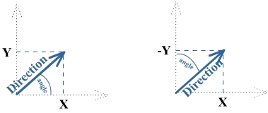
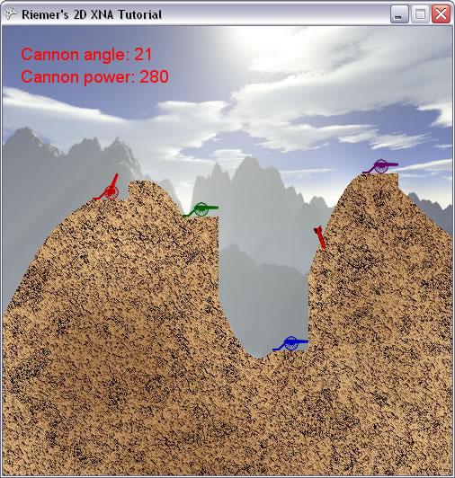

## Making the Rocket Move
This chapter, we will see how we can propagate the rocket. It's fairly easy to just make it move forward, since we've already calculated it's direction in the previous chapter. However, we also want it's trajectory to be influenced by the gravity, so what you shoot upwards will eventually come down again. As a result, since the direction of the rocket will be adjusted, we will to update the angle at which the rocket should be drawn each time its direction is changed.

Let's create a new method to handle this stuff. Since it doesn't render anything, but needs to be called frequently, we will call it from the Update method. This makes sure it is called exactly 60 times each second.

    private void UpdateRocket()
    {
        if (rocketFlying)
        {
            rocketPosition += rocketDirection;
        }
    }

Each time this method is called and a rocket has been shot, the rocketDirection will be added to the current position of the rocket. Since the rocketDirection remains the same, this will make the rocket move in a straight line. Call this method from our Update method:

    UpdateRocket();

Now run the code, and launch a rocket! The rocket will fly in a straight line, at a speed depending of the current Power.

Quite an achievement, but it doesn't look too real as it isn't coming down, even if you shoot it at a very low Power. Therefore, we will add some gravitational influence. The gravitational force has a downward influence on the direction of the rocket. Replace the contents inside the if-block of the UpdateRocket by this code:

    Vector2 gravity = new Vector2(0, 1);
    rocketDirection += gravity / 10.0f;
    rocketPosition += rocketDirection;

The gravity direction is along the positive Y axis, meaning downward. Each time the method is called (being 60 times per second), a portion of this downward direction is added to the direction of the rocket.

Now run this code again and try out the changes! You see the rocket makes a more realistic curve, but there's another problem: the rocket doesn't rotate accordingly!

This is because the SpriteBatch renders the image rotated by the rocketAngle value, and when we change the rocketDirection we don't change this value yet. So what we want to know is: __given a direction, what is the angle corresponding to this direction?__

To find this angle, take a look at the left image below:

Now back in high school, there were a few very basic rules that you should have stored in the back of your head. This is one of them:

"In a triangle having a corner of 90 degrees, you can find the angle of a corner by dividing the length of the opposite side by the length of the neighbouring side, and take the arctangent of this division."

This follows immediately from the definition of the sine, cosine and tangent.

Applied to our example, you can find the corresponding angle between our Direction and the Right (X) axis by taking the arctangent of Direction.Y/Direction.X. This is illustrated in the left part of the image above: we're starting from the Direction shown there, and we want to find the Angle between this direction and the X axis. This would be given by the following code:

    Math.Atan(Direction.Y/Direction.X)

That's the general case, which is usually taught in high-school maths. In the case of our rocket, there are 2 slight differences which I've put in bold:

- We're looking for the angle between the direction and the __Y__ axis
- In XNA, the Up axis is the __negative__ Y axis

The first one is solved by changing the places of X and Y, and the latter by negating the Y value. So this is what we get: (you can put this code immediately after the previous line inside the UpdateRocket method)

    rocketAngle = (float)Math.Atan2(rocketDirection.X, -rocketDirection.Y);

Instead of using the Atan method, you'll usually want to use the Atan2 method. The difference is that in the Atan method, you need to specify the division of the components as argument. Since we all know that –X/-Y is the same as X/Y, this would require an additional if-check. This if-check is contained in the Atan2 method, allowing us to specify the 2 components separately.

That's it for this chapter, run the code and notice how your rocket is rotated corresponding to its direction!

In this chapter and the previous chapter, you've seen how to go from angle to direction, and from direction to angle. You will need this quite often in both 2D and 3D game programming.

Our code thus far:

    using System;
    using System.Collections.Generic;
    using System.Linq;
    using Microsoft.Xna.Framework;
    using Microsoft.Xna.Framework.Audio;
    using Microsoft.Xna.Framework.Content;
    using Microsoft.Xna.Framework.GamerServices;
    using Microsoft.Xna.Framework.Graphics;
    using Microsoft.Xna.Framework.Input;
    using Microsoft.Xna.Framework.Media;

    namespace XNATutorial
    {
        public struct PlayerData
        {
            public Vector2 Position;
            public bool IsAlive;
            public Color Color;
            public float Angle;
            public float Power;
        }

        public class Game1 : Microsoft.Xna.Framework.Game
        {
            GraphicsDeviceManager graphics;
            SpriteBatch spriteBatch;
            GraphicsDevice device;
            Texture2D backgroundTexture;
            Texture2D foregroundTexture;
            Texture2D carriageTexture;
            Texture2D cannonTexture;
            Texture2D rocketTexture;
            SpriteFont font;
            int screenWidth;
            int screenHeight;
            PlayerData[] players;
            int numberOfPlayers = 4;
            float playerScaling;
            int currentPlayer = 0;
            bool rocketFlying = false;
            Vector2 rocketPosition;
            Vector2 rocketDirection;
            float rocketAngle;
            float rocketScaling = 0.1f;

            public Game1()
            {
                graphics = new GraphicsDeviceManager(this);
                Content.RootDirectory = "Content";
            }

            protected override void Initialize()
            {
                graphics.PreferredBackBufferWidth = 500;
                graphics.PreferredBackBufferHeight = 500;
                graphics.IsFullScreen = false;
                graphics.ApplyChanges();
                Window.Title = "Riemer's 2D XNA Tutorial";

                base.Initialize();
            }

            private void SetUpPlayers()
            {
                Color[] playerColors = new Color[10];
                playerColors[0] = Color.Red;
                playerColors[1] = Color.Green;
                playerColors[2] = Color.Blue;
                playerColors[3] = Color.Purple;
                playerColors[4] = Color.Orange;
                playerColors[5] = Color.Indigo;
                playerColors[6] = Color.Yellow;
                playerColors[7] = Color.SaddleBrown;
                playerColors[8] = Color.Tomato;
                playerColors[9] = Color.Turquoise;

                players = new PlayerData[numberOfPlayers];
                for (int i = 0; i < numberOfPlayers; i++)
                {
                    players[i].IsAlive = true;
                    players[i].Color = playerColors[i];
                    players[i].Angle = MathHelper.ToRadians(90);
                    players[i].Power = 100;
                }

                players[0].Position = new Vector2(100, 193);
                players[1].Position = new Vector2(200, 212);
                players[2].Position = new Vector2(300, 361);
                players[3].Position = new Vector2(400, 164);
            }

            protected override void LoadContent()
            {
                spriteBatch = new SpriteBatch(GraphicsDevice);
                device = graphics.GraphicsDevice;

                backgroundTexture = Content.Load<Texture2D>("background");
                foregroundTexture = Content.Load<Texture2D>("foreground");
                carriageTexture = Content.Load<Texture2D>("carriage");
                cannonTexture = Content.Load<Texture2D>("cannon");
                rocketTexture = Content.Load<Texture2D>("rocket");
                font = Content.Load<SpriteFont>("myFont");
                screenWidth = device.PresentationParameters.BackBufferWidth;
                screenHeight = device.PresentationParameters.BackBufferHeight;

                SetUpPlayers();
                playerScaling = 40.0f / (float)carriageTexture.Width;
            }

            protected override void UnloadContent()
            {
            }

            protected override void Update(GameTime gameTime)
            {
                if (GamePad.GetState(PlayerIndex.One).Buttons.Back == ButtonState.Pressed)
                    this.Exit();

                ProcessKeyboard();

                UpdateRocket();

                base.Update(gameTime);
            }

            private void UpdateRocket()
            {
                if (rocketFlying)
                {
                    Vector2 gravity = new Vector2(0, 1);
                    rocketDirection += gravity / 10.0f;
                    rocketPosition += rocketDirection;
                    rocketAngle = (float)Math.Atan2(rocketDirection.X, -rocketDirection.Y);
                }
            }

            private void ProcessKeyboard()
            {
                KeyboardState keybState = Keyboard.GetState();
                if (keybState.IsKeyDown(Keys.Left))
                    players[currentPlayer].Angle -= 0.01f;
                if (keybState.IsKeyDown(Keys.Right))
                    players[currentPlayer].Angle += 0.01f;

                if (players[currentPlayer].Angle > MathHelper.PiOver2)
                    players[currentPlayer].Angle = -MathHelper.PiOver2;
                if (players[currentPlayer].Angle < -MathHelper.PiOver2)
                    players[currentPlayer].Angle = MathHelper.PiOver2;

                if (keybState.IsKeyDown(Keys.Down))
                    players[currentPlayer].Power -= 1;
                if (keybState.IsKeyDown(Keys.Up))
                    players[currentPlayer].Power += 1;
                if (keybState.IsKeyDown(Keys.PageDown))
                    players[currentPlayer].Power -= 20;
                if (keybState.IsKeyDown(Keys.PageUp))
                    players[currentPlayer].Power += 20;

                if (players[currentPlayer].Power > 1000)
                    players[currentPlayer].Power = 1000;
                if (players[currentPlayer].Power < 0)
                    players[currentPlayer].Power = 0;

                if (keybState.IsKeyDown(Keys.Enter) || keybState.IsKeyDown(Keys.Space))
                {
                    rocketFlying = true;

                    rocketPosition = players[currentPlayer].Position;
                    rocketPosition.X += 20;
                    rocketPosition.Y -= 10;
                    rocketAngle = players[currentPlayer].Angle;
                    Vector2 up = new Vector2(0, -1);
                    Matrix rotMatrix = Matrix.CreateRotationZ(rocketAngle);
                    rocketDirection = Vector2.Transform(up, rotMatrix);
                    rocketDirection *= players[currentPlayer].Power / 50.0f;
                }
            }

            protected override void Draw(GameTime gameTime)
            {
                GraphicsDevice.Clear(Color.CornflowerBlue);

                spriteBatch.Begin();
                DrawScenery();
                DrawPlayers();
                DrawText();
                DrawRocket();
                spriteBatch.End();

                base.Draw(gameTime);
            }

            private void DrawScenery()
            {
                Rectangle screenRectangle = new Rectangle(0, 0, screenWidth, screenHeight);
                spriteBatch.Draw(backgroundTexture, screenRectangle, Color.White);
                spriteBatch.Draw(foregroundTexture, screenRectangle, Color.White);
            }

            private void DrawPlayers()
            {
                foreach (PlayerData player in players)
                {
                    if (player.IsAlive)
                    {
                        int xPos = (int)player.Position.X;
                        int yPos = (int)player.Position.Y;
                        Vector2 cannonOrigin = new Vector2(11, 50);

                        spriteBatch.Draw(cannonTexture, new Vector2(xPos + 20, yPos - 10), null, player.Color, player.Angle, cannonOrigin, playerScaling, SpriteEffects.None, 1);
                        spriteBatch.Draw(carriageTexture, player.Position, null, player.Color, 0, new Vector2(0, carriageTexture.Height), playerScaling, SpriteEffects.None, 0);
                    }
                }
            }

            private void DrawText()
            {
                PlayerData player = players[currentPlayer];
                int currentAngle = (int)MathHelper.ToDegrees(player.Angle);
                spriteBatch.DrawString(font, "Cannon angle: " + currentAngle.ToString(), new Vector2(20, 20), player.Color);
                spriteBatch.DrawString(font, "Cannon power: " + player.Power.ToString(), new Vector2(20, 45), player.Color);
            }

            private void DrawRocket()
            {
                if (rocketFlying)
                    spriteBatch.Draw(rocketTexture, rocketPosition, null, players[currentPlayer].Color, rocketAngle, new Vector2(42, 240), 0.1f, SpriteEffects.None, 1);
            }
        }
    }