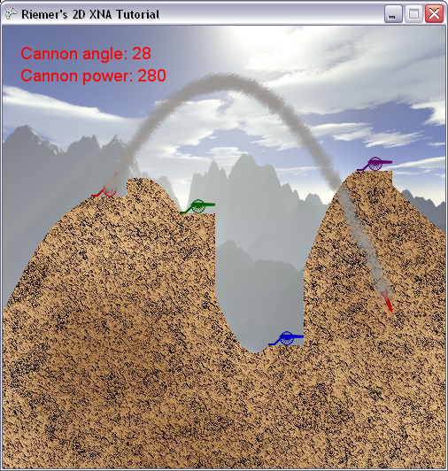

## Adding the smoke trail
This chapter will be pretty straightforward if you've been following allow the way, so it makes a nice exercise to practice a bit. The idea is simple enough: for each position of the rocket, we will add a small smoke image.

Start by downloading the smoke image [by clicking here](http://www.riemers.net/Downloads/resources/Series2D/smoke.png) and importing it into our XNA project. Add the corresponding variable at the top of our code:

    Texture2D smokeTexture;

And initialize it in our LoadContent method:

    smokeTexture = Content.Load<Texture2D> ("smoke");

There's one thing that makes the task a bit difficult: we don't know exactly how many smoke particles we'll need, so we don't know how many positions we need to store. But that's easily solved by using a default .NET feature: the List. A List is a collection of which you don't need to specify its size: just add or remove items to/from it when you want. So add this variable to the top of our code:

    List<Vector2> smokeList = new List<Vector2> ();
    Random randomizer = new Random();

We specify this List will be used to store Vector2 objects. We're already initializing it as an empty List. The second variable we're adding is very useful in game programming: it will generate random numbers whenever we ask it to. We can already use some random numbers in this chapter, as we will add a small random deviation to the position of the smoke particles.

This allows us to move to our UpdateRocket method. This is an ideal spot to store a position in our List, as this method is called 60 times each second. Add this code to the end of the if-block in the UpdateRocket method:

    Vector2 smokePos = rocketPosition;
    smokePos.X += randomizer.Next(10) - 5;
    smokePos.Y += randomizer.Next(10) - 5;
    smokeList.Add(smokePos);

This retrieves the current position of the rocket, and adds a random component to both the X and Y coordinates. The randomizer is asked for a random number between 0 and 10, from which we subtract 5, resulting in a random number between -5 and 5. The resulting position is stored in our smokeList!

All we need to do now, is draw the smoke image at each position stored in the smokeList. To this end, we will code a new, easy method, DrawSmoke:

    private void DrawSmoke()
    {
        foreach (Vector2 smokePos in smokeList)
            spriteBatch.Draw(smokeTexture, smokePos, null, Color.White, 0, new Vector2(40, 35), 0.2f, SpriteEffects.None, 1);
    }

For each position stored in the smokeList, we draw a smokeTexture. Since we're not adjusting any of the stuff inside the List, we can use a foreach-loop instead of a for-loop.

Don't forget to call this method from inside our Draw method:

    DrawSmoke();

Now try to run this code! When you fire a rocket, you should see a fine trail of smoke behind our rocket. We want some more smoke, so instead of adding just one particle at a time, we'll add 5: in our UpdateRocket method:

    for (int i = 0; i < 5; i++)
    {
        Vector2 smokePos = rocketPosition;
        smokePos.X += randomizer.Next(10) - 5;
        smokePos.Y += randomizer.Next(10) - 5;
        smokeList.Add(smokePos);
    }

That's it for this chapter!

Our code:

    using System;
    using System.Collections.Generic;
    using System.Linq;
    using Microsoft.Xna.Framework;
    using Microsoft.Xna.Framework.Audio;
    using Microsoft.Xna.Framework.Content;
    using Microsoft.Xna.Framework.GamerServices;
    using Microsoft.Xna.Framework.Graphics;
    using Microsoft.Xna.Framework.Input;
    using Microsoft.Xna.Framework.Media;

    namespace XNATutorial
    {
        public struct PlayerData
        {
            public Vector2 Position;
            public bool IsAlive;
            public Color Color;
            public float Angle;
            public float Power;
        }

        public class Game1 : Microsoft.Xna.Framework.Game
        {
            GraphicsDeviceManager graphics;
            SpriteBatch spriteBatch;
            GraphicsDevice device;
            Texture2D backgroundTexture;
            Texture2D foregroundTexture;
            Texture2D carriageTexture;
            Texture2D cannonTexture;
            Texture2D rocketTexture;
            Texture2D smokeTexture;
            SpriteFont font;
            int screenWidth;
            int screenHeight;
            PlayerData[] players;
            int numberOfPlayers = 4;
            float playerScaling;
            int currentPlayer = 0;
            bool rocketFlying = false;
            Vector2 rocketPosition;
            Vector2 rocketDirection;
            float rocketAngle;
            float rocketScaling = 0.1f;

            List<Vector2> smokeList = new List<Vector2>();
            Random randomizer = new Random();

            public Game1()
            {
                graphics = new GraphicsDeviceManager(this);
                Content.RootDirectory = "Content";
            }

            protected override void Initialize()
            {
                graphics.PreferredBackBufferWidth = 500;
                graphics.PreferredBackBufferHeight = 500;
                graphics.IsFullScreen = false;
                graphics.ApplyChanges();
                Window.Title = "Riemer's 2D XNA Tutorial";

                base.Initialize();
            }

            private void SetUpPlayers()
            {
                Color[] playerColors = new Color[10];
                playerColors[0] = Color.Red;
                playerColors[1] = Color.Green;
                playerColors[2] = Color.Blue;
                playerColors[3] = Color.Purple;
                playerColors[4] = Color.Orange;
                playerColors[5] = Color.Indigo;
                playerColors[6] = Color.Yellow;
                playerColors[7] = Color.SaddleBrown;
                playerColors[8] = Color.Tomato;
                playerColors[9] = Color.Turquoise;

                players = new PlayerData[numberOfPlayers];
                for (int i = 0; i < numberOfPlayers; i++)
                {
                    players[i].IsAlive = true;
                    players[i].Color = playerColors[i];
                    players[i].Angle = MathHelper.ToRadians(90);
                    players[i].Power = 100;
                }

                players[0].Position = new Vector2(100, 193);
                players[1].Position = new Vector2(200, 212);
                players[2].Position = new Vector2(300, 361);
                players[3].Position = new Vector2(400, 164);
            }

            protected override void LoadContent()
            {
                spriteBatch = new SpriteBatch(GraphicsDevice);
                device = graphics.GraphicsDevice;

                backgroundTexture = Content.Load<Texture2D>("background");
                foregroundTexture = Content.Load<Texture2D>("foreground");
                carriageTexture = Content.Load<Texture2D>("carriage");
                cannonTexture = Content.Load<Texture2D>("cannon");
                rocketTexture = Content.Load<Texture2D>("rocket");

                smokeTexture = Content.Load<Texture2D>("smoke");

                font = Content.Load<SpriteFont>("myFont");
                screenWidth = device.PresentationParameters.BackBufferWidth;
                screenHeight = device.PresentationParameters.BackBufferHeight;

                SetUpPlayers();
                playerScaling = 40.0f / (float)carriageTexture.Width;
            }

            protected override void UnloadContent()
            {
            }

            protected override void Update(GameTime gameTime)
            {
                if (GamePad.GetState(PlayerIndex.One).Buttons.Back == ButtonState.Pressed)
                    this.Exit();

                ProcessKeyboard();
                UpdateRocket();

                base.Update(gameTime);
            }

            private void UpdateRocket()
            {
                if (rocketFlying)
                {
                    Vector2 gravity = new Vector2(0, 1);
                    rocketDirection += gravity / 10.0f;
                    rocketPosition += rocketDirection;
                    rocketAngle = (float)Math.Atan2(rocketDirection.X, -rocketDirection.Y);

                    for (int i = 0; i < 5; i++)
                    {
                        Vector2 smokePos = rocketPosition;
                        smokePos.X += randomizer.Next(10) - 5;
                        smokePos.Y += randomizer.Next(10) - 5;
                        smokeList.Add(smokePos);
                    }
                }
            }

            private void ProcessKeyboard()
            {
                KeyboardState keybState = Keyboard.GetState();
                if (keybState.IsKeyDown(Keys.Left))
                    players[currentPlayer].Angle -= 0.01f;
                if (keybState.IsKeyDown(Keys.Right))
                    players[currentPlayer].Angle += 0.01f;

                if (players[currentPlayer].Angle > MathHelper.PiOver2)
                    players[currentPlayer].Angle = -MathHelper.PiOver2;
                if (players[currentPlayer].Angle < -MathHelper.PiOver2)
                    players[currentPlayer].Angle = MathHelper.PiOver2;

                if (keybState.IsKeyDown(Keys.Down))
                    players[currentPlayer].Power -= 1;
                if (keybState.IsKeyDown(Keys.Up))
                    players[currentPlayer].Power += 1;
                if (keybState.IsKeyDown(Keys.PageDown))
                    players[currentPlayer].Power -= 20;
                if (keybState.IsKeyDown(Keys.PageUp))
                    players[currentPlayer].Power += 20;

                if (players[currentPlayer].Power > 1000)
                    players[currentPlayer].Power = 1000;
                if (players[currentPlayer].Power < 0)
                    players[currentPlayer].Power = 0;

                if (keybState.IsKeyDown(Keys.Enter) || keybState.IsKeyDown(Keys.Space))
                {
                    rocketFlying = true;

                    rocketPosition = players[currentPlayer].Position;
                    rocketPosition.X += 20;
                    rocketPosition.Y -= 10;
                    rocketAngle = players[currentPlayer].Angle;
                    Vector2 up = new Vector2(0, -1);
                    Matrix rotMatrix = Matrix.CreateRotationZ(rocketAngle);
                    rocketDirection = Vector2.Transform(up, rotMatrix);
                    rocketDirection *= players[currentPlayer].Power / 50.0f;
                }
            }

            protected override void Draw(GameTime gameTime)
            {
                GraphicsDevice.Clear(Color.CornflowerBlue);

                spriteBatch.Begin();
                DrawScenery();
                DrawPlayers();
                DrawText();
                DrawRocket();
                DrawSmoke();
                spriteBatch.End();

                base.Draw(gameTime);
            }

            private void DrawScenery()
            {
                Rectangle screenRectangle = new Rectangle(0, 0, screenWidth, screenHeight);
                spriteBatch.Draw(backgroundTexture, screenRectangle, Color.White);
                spriteBatch.Draw(foregroundTexture, screenRectangle, Color.White);
            }

            private void DrawPlayers()
            {
                foreach (PlayerData player in players)
                {
                    if (player.IsAlive)
                    {
                        int xPos = (int)player.Position.X;
                        int yPos = (int)player.Position.Y;
                        Vector2 cannonOrigin = new Vector2(11, 50);

                        spriteBatch.Draw(cannonTexture, new Vector2(xPos + 20, yPos - 10), null, player.Color, player.Angle, cannonOrigin, playerScaling, SpriteEffects.None, 1);
                        spriteBatch.Draw(carriageTexture, player.Position, null, player.Color, 0, new Vector2(0, carriageTexture.Height), playerScaling, SpriteEffects.None, 0);
                    }
                }
            }

            private void DrawText()
            {
                PlayerData player = players[currentPlayer];
                int currentAngle = (int)MathHelper.ToDegrees(player.Angle);
                spriteBatch.DrawString(font, "Cannon angle: " + currentAngle.ToString(), new Vector2(20, 20), player.Color);
                spriteBatch.DrawString(font, "Cannon power: " + player.Power.ToString(), new Vector2(20, 45), player.Color);
            }

            private void DrawRocket()
            {
                if (rocketFlying)
                    spriteBatch.Draw(rocketTexture, rocketPosition, null, players[currentPlayer].Color, rocketAngle, new Vector2(42, 240), 0.1f, SpriteEffects.None, 1);
            }

            private void DrawSmoke()
            {
                foreach (Vector2 smokePos in smokeList)
                    spriteBatch.Draw(smokeTexture, smokePos, null, Color.White, 0, new Vector2(40, 35), 0.2f, SpriteEffects.None, 1);
            }
        }
    }