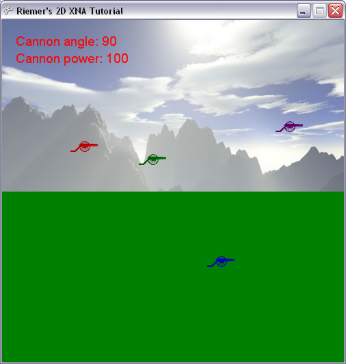

## Defining the colors of a texture per-pixel

At this moment, we have our rocket flying around, but they're not yet colliding with the terrain. Before we can do this, we need to know the exact coordinates of our terrain. In this game this is rather simple: for each X coordinate of our screen, the terrain has a certain Y coordinate.

One terribly wrong approach would be that I give you the 500 Y coordinates for the foreground texture we're using at the moment. A much better approach would be that this chapter, we define the terrain slope ourselves, and from this slope we will create the foreground texture.

This will be done using 2 methods: GenerateTerrainContour which generates the slope, and CreateForeground which creates the foreground texture based on the terrain slope. We'll start with very easy methods so we got the mechanism up and working, in the next chater we'll refine both methods to get a nicer result.

The result of the GenerateTerrainContour will be a simple array of ints, storing one Y coordinate for each X coordinate of our screen. We'll need this quite often in our code later on, so let's add it to the variables at the top of our code:

    int[] terrainContour;

Since Y coordinates are integer numbers, we use an array of ints to store them.

Next in line is the GenerateTerrainContour method, which initializes this array and fills it with values. As said before, we'll start with a very basic version:

    private void GenerateTerrainContour()
    {
        terrainContour = new int[screenWidth];
 
        for (int x = 0; x < screenWidth; x++)
            terrainContour[x] = screenHeight / 2;
    }

The terrainContour will need to contains as many value as there are X coordinates, which can be found in the screenWidth variable defined earlier. Next, for each X coordinate we store the same Y coordinate. Later on, this will result in a horizonally flat terrain, in the middle of our screen.

Let's move on to the CreateForeground method. This method should create the foreground texture, based on the contents of the terrainContour array:

    private void CreateForeground()
    {
        Color[] foregroundColors = new Color[screenWidth * screenHeight];
 
        for (int x = 0; x < screenWidth; x++)
        {
            for (int y = 0; y < screenHeight; y++)
            {
                if (y > terrainContour[x])
                    foregroundColors[x + y * screenWidth] = Color.Green;
                else                        
                    foregroundColors[x + y * screenWidth] = Color.Transparent;
            }
        }
    }

The first line creates an array, capable of storing Colors. We initialize it so it can store one color for each pixel on our screen.

Next, we scroll though each combination of X and Y coordinates, covering each pixel of our screen. For each pixel, we check whether it is above or below the terrain slope. If it is below the terrain (this means the Y coordinate is __larger__ than the Y coordinate stored in the terrainContour array), we store the green color in our foregroundColors array. If the pixel is above the terrain, we store Transparant as color, meaning that the underling color (our background image) will remain visible at those pixels.

At the end of the method, we have an array of colors, but we still need to create a texture out of them. That's pretty easy to do in XNA, all you need to do is put these 2 lines at the end of our CreateForeground method:

    foregroundTexture = new Texture2D(device, screenWidth, screenHeight, false, SurfaceFormat.Color);
    foregroundTexture.SetData(foregroundColors);

The first line creates an empty texture. This means that an amount of memory is being reserved on the graphics card, exactly enough to store one Color for each pixel of our screen. The second and third arguments define how many pixels can be stored in the texture, while the last argument indicates we want to store a Color for each pixel. The mipmapping argument is out of the scope of this tutorial, but you can read more details on them in Recipe 3-7 of my book.

The last line effectively copies the color data from our array into the memory on the graphics card.

Now in our LoadContent method, find the line where we load the foreground texture from a file, and delete it. Instead, add these lines to the very bottom of the LoadContent method:

    GenerateTerrainContour();
    CreateForeground();

Now run this code! You should see the screen shown below. (If it crashes, it's because you didn't put the previous lines at the very end of your LoadContent method)

This is the same as before, only with the foreground gone and the bottom half fully green. This means, that we have successfully created a texture, of which we have defined the color of each pixel.

Next chapter, we will make some changes to the slope of the terrain, and to the colors of our foreground texture to get rid of the solid green color.

Our code:

    using System;
    using System.Collections.Generic;
    using System.Linq;
    using Microsoft.Xna.Framework;
    using Microsoft.Xna.Framework.Audio;
    using Microsoft.Xna.Framework.Content;
    using Microsoft.Xna.Framework.GamerServices;
    using Microsoft.Xna.Framework.Graphics;
    using Microsoft.Xna.Framework.Input;
    using Microsoft.Xna.Framework.Media;

    namespace XNATutorial
    {
        public struct PlayerData
        {
            public Vector2 Position;
            public bool IsAlive;
            public Color Color;
            public float Angle;
            public float Power;
        }

        public class Game1 : Microsoft.Xna.Framework.Game
        {
            GraphicsDeviceManager graphics;
            SpriteBatch spriteBatch;
            GraphicsDevice device;
            Texture2D backgroundTexture;
            Texture2D foregroundTexture;
            Texture2D carriageTexture;
            Texture2D cannonTexture;
            Texture2D rocketTexture;
            Texture2D smokeTexture;
            SpriteFont font;
            int screenWidth;
            int screenHeight;
            PlayerData[] players;
            int numberOfPlayers = 4;
            float playerScaling;
            int currentPlayer = 0;
            bool rocketFlying = false;
            Vector2 rocketPosition;
            Vector2 rocketDirection;
            float rocketAngle;
            float rocketScaling = 0.1f;

            List<Vector2> smokeList = new List<Vector2>();
            Random randomizer = new Random();

            int[] terrainContour;

            public Game1()
            {
                graphics = new GraphicsDeviceManager(this);
                Content.RootDirectory = "Content";
            }

            protected override void Initialize()
            {
                graphics.PreferredBackBufferWidth = 500;
                graphics.PreferredBackBufferHeight = 500;
                graphics.IsFullScreen = false;
                graphics.ApplyChanges();
                Window.Title = "Riemer's 2D XNA Tutorial";

                base.Initialize();
            }

            private void SetUpPlayers()
            {
                Color[] playerColors = new Color[10];
                playerColors[0] = Color.Red;
                playerColors[1] = Color.Green;
                playerColors[2] = Color.Blue;
                playerColors[3] = Color.Purple;
                playerColors[4] = Color.Orange;
                playerColors[5] = Color.Indigo;
                playerColors[6] = Color.Yellow;
                playerColors[7] = Color.SaddleBrown;
                playerColors[8] = Color.Tomato;
                playerColors[9] = Color.Turquoise;

                players = new PlayerData[numberOfPlayers];
                for (int i = 0; i < numberOfPlayers; i++)
                {
                    players[i].IsAlive = true;
                    players[i].Color = playerColors[i];
                    players[i].Angle = MathHelper.ToRadians(90);
                    players[i].Power = 100;
                }

                players[0].Position = new Vector2(100, 193);
                players[1].Position = new Vector2(200, 212);
                players[2].Position = new Vector2(300, 361);
                players[3].Position = new Vector2(400, 164);
            }

            protected override void LoadContent()
            {
                spriteBatch = new SpriteBatch(GraphicsDevice);
                device = graphics.GraphicsDevice;

                backgroundTexture = Content.Load<Texture2D>("background");
                carriageTexture = Content.Load<Texture2D>("carriage");
                cannonTexture = Content.Load<Texture2D>("cannon");
                rocketTexture = Content.Load<Texture2D>("rocket");
                smokeTexture = Content.Load<Texture2D>("smoke");
                font = Content.Load<SpriteFont>("myFont");
                screenWidth = device.PresentationParameters.BackBufferWidth;
                screenHeight = device.PresentationParameters.BackBufferHeight;

                SetUpPlayers();
                playerScaling = 40.0f / (float)carriageTexture.Width;

                GenerateTerrainContour();
                CreateForeground();
            }

            private void GenerateTerrainContour()
            {
                terrainContour = new int[screenWidth];

                for (int x = 0; x < screenWidth; x++)
                    terrainContour[x] = screenHeight / 2;
            }

            private void CreateForeground()
            {
                Color[] foregroundColors = new Color[screenWidth * screenHeight];

                for (int x = 0; x < screenWidth; x++)
                {
                    for (int y = 0; y < screenHeight; y++)
                    {
                        if (y > terrainContour[x])
                            foregroundColors[x + y * screenWidth] = Color.Green;
                        else
                            foregroundColors[x + y * screenWidth] = Color.Transparent;
                    }
                }

                foregroundTexture = new Texture2D(device, screenWidth, screenHeight, false, SurfaceFormat.Color);
                foregroundTexture.SetData(foregroundColors);
            }

            protected override void UnloadContent()
            {
            }

            protected override void Update(GameTime gameTime)
            {
                if (GamePad.GetState(PlayerIndex.One).Buttons.Back == ButtonState.Pressed)
                    this.Exit();

                ProcessKeyboard();
                UpdateRocket();

                base.Update(gameTime);
            }

            private void UpdateRocket()
            {
                if (rocketFlying)
                {
                    Vector2 gravity = new Vector2(0, 1);
                    rocketDirection += gravity / 10.0f;
                    rocketPosition += rocketDirection;
                    rocketAngle = (float)Math.Atan2(rocketDirection.X, -rocketDirection.Y);

                    for (int i = 0; i < 5; i++)
                    {
                        Vector2 smokePos = rocketPosition;
                        smokePos.X += randomizer.Next(10) - 5;
                        smokePos.Y += randomizer.Next(10) - 5;
                        smokeList.Add(smokePos);
                    }
                }
            }

            private void ProcessKeyboard()
            {
                KeyboardState keybState = Keyboard.GetState();
                if (keybState.IsKeyDown(Keys.Left))
                    players[currentPlayer].Angle -= 0.01f;
                if (keybState.IsKeyDown(Keys.Right))
                    players[currentPlayer].Angle += 0.01f;

                if (players[currentPlayer].Angle > MathHelper.PiOver2)
                    players[currentPlayer].Angle = -MathHelper.PiOver2;
                if (players[currentPlayer].Angle < -MathHelper.PiOver2)
                    players[currentPlayer].Angle = MathHelper.PiOver2;

                if (keybState.IsKeyDown(Keys.Down))
                    players[currentPlayer].Power -= 1;
                if (keybState.IsKeyDown(Keys.Up))
                    players[currentPlayer].Power += 1;
                if (keybState.IsKeyDown(Keys.PageDown))
                    players[currentPlayer].Power -= 20;
                if (keybState.IsKeyDown(Keys.PageUp))
                    players[currentPlayer].Power += 20;

                if (players[currentPlayer].Power > 1000)
                    players[currentPlayer].Power = 1000;
                if (players[currentPlayer].Power < 0)
                    players[currentPlayer].Power = 0;

                if (keybState.IsKeyDown(Keys.Enter) || keybState.IsKeyDown(Keys.Space))
                {
                    rocketFlying = true;

                    rocketPosition = players[currentPlayer].Position;
                    rocketPosition.X += 20;
                    rocketPosition.Y -= 10;
                    rocketAngle = players[currentPlayer].Angle;
                    Vector2 up = new Vector2(0, -1);
                    Matrix rotMatrix = Matrix.CreateRotationZ(rocketAngle);
                    rocketDirection = Vector2.Transform(up, rotMatrix);
                    rocketDirection *= players[currentPlayer].Power / 50.0f;
                }
            }

            protected override void Draw(GameTime gameTime)
            {
                GraphicsDevice.Clear(Color.CornflowerBlue);

                spriteBatch.Begin();
                DrawScenery();
                DrawPlayers();
                DrawText();
                DrawRocket();
                DrawSmoke();
                spriteBatch.End();

                base.Draw(gameTime);
            }

            private void DrawScenery()
            {
                Rectangle screenRectangle = new Rectangle(0, 0, screenWidth, screenHeight);
                spriteBatch.Draw(backgroundTexture, screenRectangle, Color.White);
                spriteBatch.Draw(foregroundTexture, screenRectangle, Color.White);
            }

            private void DrawPlayers()
            {
                foreach (PlayerData player in players)
                {
                    if (player.IsAlive)
                    {
                        int xPos = (int)player.Position.X;
                        int yPos = (int)player.Position.Y;
                        Vector2 cannonOrigin = new Vector2(11, 50);

                        spriteBatch.Draw(cannonTexture, new Vector2(xPos + 20, yPos - 10), null, player.Color, player.Angle, cannonOrigin, playerScaling, SpriteEffects.None, 1);
                        spriteBatch.Draw(carriageTexture, player.Position, null, player.Color, 0, new Vector2(0, carriageTexture.Height), playerScaling, SpriteEffects.None, 0);
                    }
                }
            }

            private void DrawText()
            {
                PlayerData player = players[currentPlayer];
                int currentAngle = (int)MathHelper.ToDegrees(player.Angle);
                spriteBatch.DrawString(font, "Cannon angle: " + currentAngle.ToString(), new Vector2(20, 20), player.Color);
                spriteBatch.DrawString(font, "Cannon power: " + player.Power.ToString(), new Vector2(20, 45), player.Color);
            }

            private void DrawRocket()
            {
                if (rocketFlying)
                    spriteBatch.Draw(rocketTexture, rocketPosition, null, players[currentPlayer].Color, rocketAngle, new Vector2(42, 240), 0.1f, SpriteEffects.None, 1);
            }

            private void DrawSmoke()
            {
                foreach (Vector2 smokePos in smokeList)
                    spriteBatch.Draw(smokeTexture, smokePos, null, Color.White, 0, new Vector2(40, 35), 0.2f, SpriteEffects.None, 1);
            }
        }
    }