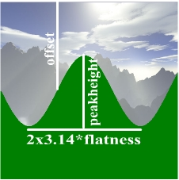
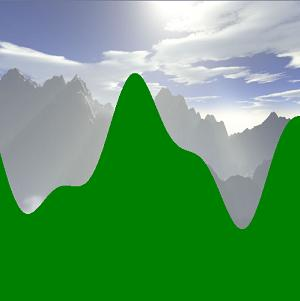
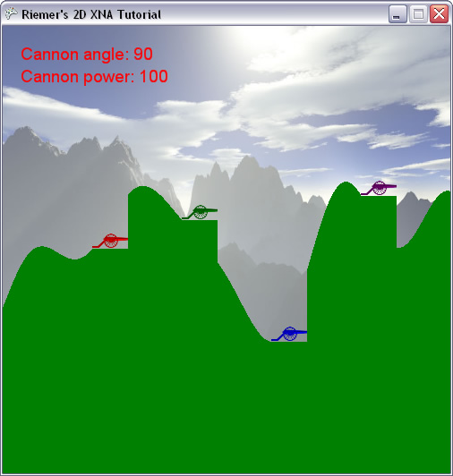

## Random terrain generation
The result of last chapter is not yet quite pleasing. As a first improvement, we're going to change the slope of the terrain. This doesn't introduce any real XNA features, but shows how some randomness can be added to your game.

Instead of a flat terrain, let's change our code so it generates a wave as terrain slope. Replace the GenerateTerrainContour method by this:

    private void GenerateTerrainContour()
    {
        terrainContour = new int[screenWidth];
 
        float offset = screenHeight / 2;
        float peakheight = 100;
        float flatness = 50;
        for (int x = 0; x < screenWidth; x++)
        {
            double height = peakheight * Math.Sin((float)x / flatness)+offset;
            terrainContour[x] = (int)height;
        }
    }

First run this code, you should see a terrain as shown in the image below. The Y coordinates are calculated using the Sine function, which is the mathematical equivalent of a wave. There are a few parameters we can change:

- The offset is the easiest one, as it simply sets the position of the midheight of the wave.
- The peakheight value is multiplied by the output of the Sine function, so it defines how high the wave will be.
- Finally, the flatness value has an impact on the influence of X, which slows down or speeds up the wave. This increases or decreases the wavelength of our wave.

A simple wave like this still looks a bit too artificial. This can be solved by mixing in a second wave. For example, let's say we would add in a wave with a smaller height, and shorter wavelength. The result would look like this:

In our code, we'll even add in a third wave. Also, to make the terrain look differently each time, we're going to influence the 3 parameters of each wave with a random value. This is what our GenerateTerrainContour should finally look like:

    private void GenerateTerrainContour()
    {
        terrainContour = new int[screenWidth];
 
        double rand1 = randomizer.NextDouble() + 1;
        double rand2 = randomizer.NextDouble() + 2;
        double rand3 = randomizer.NextDouble() + 3;
 
        float offset = screenHeight / 2;
        float peakheight = 100;
        float flatness = 70;
 
        for (int x = 0; x < screenWidth; x++)
        {
            double height = peakheight / rand1 * Math.Sin((float)x / flatness * rand1 + rand1);
            height += peakheight / rand2 * Math.Sin((float)x / flatness * rand2 + rand2);
            height += peakheight / rand3 * Math.Sin((float)x / flatness * rand3 + rand3);
            height += offset;
            terrainContour[x] = (int)height;
        }
    }

For each wave, we first draw a random value between 0 and 1. We also offset it a bit, so the first one becomes between the [0,1] range, the second between the [1,2] range and the last one between the [2,3] range. For our 3 waves, these values will divide the peakheight and the flatness, so wave 3 will be lower and shorter than waves 1 and 2. Furthermore, you see we're also adding the random values inside the Sine method. Otherwise, all 3 waves would start exactly at the Y coordinate specified by 'offset', making this point fixed each time we would restart the game.

Now when you try to run this code, you will get a much nicer terrain slope, as shown in the final screenshot of this chapter.

One thing that immediately catches the eye when running this code, is that the players are not positioned on the terrain. This is obviously because we are using fixed positions for our players, based on the fixed foreground texture we used a few chapters ago.

To solve this, find the 4 lines that define the positions at the end of our SetUpPlayers method, and __delete them__. Instead, we will calculate them inside the for-loop of that method, that should look like this:

    for (int i = 0; i < numberOfPlayers; i++)
    {
        players[i].IsAlive = true;
        players[i].Color = playerColors[i];
        players[i].Angle = MathHelper.ToRadians(90);
        players[i].Power = 100;
        players[i].Position = new Vector2();
        players[i].Position.X = screenWidth / (numberOfPlayers + 1) * (i + 1);
        players[i].Position.Y = terrainContour[(int)players[i].Position.X];
    }

The X coordinate of the players can easily be found by dividing the width of our screen by the number of players. The "+ 1"s are needed to make sure no player is positioned at the left or right border of the screen. The Y coordinate is found simply by looking up the terrain heigh at that X coordinate.

However, for this to work, the SetUpPlayers method must have access to the finalized terrainContour array. This means that in our LoadContent method, we need to call the SetUpPlayers method after we call our GenerateTerrainContour method:

    GenerateTerrainContour();
    SetUpPlayers();
    CreateForeground();

When you run this code, you will see the bottom-left point of the cannons are positioned on the terrain, but the terrain underneath them doesn't match. To solve this, we will simply extend the terrain underneath the players, using this simple method:

    private void FlattenTerrainBelowPlayers()
    {
        foreach (PlayerData player in players)
            if (player.IsAlive)
                for (int x = 0; x < 40; x++)
                    terrainContour[(int)player.Position.X + x] = terrainContour[(int)player.Position.X];
    }

For each active player, the terrain underneath the cannon is levelled to the same height as the bottom-left point. We need to call this method from within our LoadContent method, but we need to keep some things in mind: the FlattenTerrainBelowPlayers must be called after the GenerateTerrainContour and SetUpPlayers methods, since it uses data defined in these methods. On the other hand, it must be called before the CreateForeground method is called, as that method uses the terrainContour method, which is changed by the FlattenTerrainBelowPlayers method:

    GenerateTerrainContour();            
    SetUpPlayers();
    FlattenTerrainBelowPlayers();
    CreateForeground();

When you run the code at this moment, the slope of the terrain should look just fine.

Next chapter, we'll do something about the solid green color of our terrain.

Our code thus far:

    using System;
    using System.Collections.Generic;
    using System.Linq;
    using Microsoft.Xna.Framework;
    using Microsoft.Xna.Framework.Audio;
    using Microsoft.Xna.Framework.Content;
    using Microsoft.Xna.Framework.GamerServices;
    using Microsoft.Xna.Framework.Graphics;
    using Microsoft.Xna.Framework.Input;
    using Microsoft.Xna.Framework.Media;

    namespace XNATutorial
    {
        public struct PlayerData
        {
            public Vector2 Position;
            public bool IsAlive;
            public Color Color;
            public float Angle;
            public float Power;
        }

        public class Game1 : Microsoft.Xna.Framework.Game
        {
            GraphicsDeviceManager graphics;
            SpriteBatch spriteBatch;
            GraphicsDevice device;
            Texture2D backgroundTexture;
            Texture2D foregroundTexture;
            Texture2D carriageTexture;
            Texture2D cannonTexture;
            Texture2D rocketTexture;
            Texture2D smokeTexture;
            SpriteFont font;
            int screenWidth;
            int screenHeight;
            PlayerData[] players;
            int numberOfPlayers = 4;
            float playerScaling;
            int currentPlayer = 0;
            bool rocketFlying = false;
            Vector2 rocketPosition;
            Vector2 rocketDirection;
            float rocketAngle;
            float rocketScaling = 0.1f;

            List<Vector2> smokeList = new List<Vector2>();
            Random randomizer = new Random();
            int[] terrainContour;

            public Game1()
            {
                graphics = new GraphicsDeviceManager(this);
                Content.RootDirectory = "Content";
            }

            protected override void Initialize()
            {
                graphics.PreferredBackBufferWidth = 500;
                graphics.PreferredBackBufferHeight = 500;
                graphics.IsFullScreen = false;
                graphics.ApplyChanges();
                Window.Title = "Riemer's 2D XNA Tutorial";

                base.Initialize();
            }

            private void SetUpPlayers()
            {
                Color[] playerColors = new Color[10];
                playerColors[0] = Color.Red;
                playerColors[1] = Color.Green;
                playerColors[2] = Color.Blue;
                playerColors[3] = Color.Purple;
                playerColors[4] = Color.Orange;
                playerColors[5] = Color.Indigo;
                playerColors[6] = Color.Yellow;
                playerColors[7] = Color.SaddleBrown;
                playerColors[8] = Color.Tomato;
                playerColors[9] = Color.Turquoise;

                players = new PlayerData[numberOfPlayers];
                for (int i = 0; i < numberOfPlayers; i++)
                {
                    players[i].IsAlive = true;
                    players[i].Color = playerColors[i];
                    players[i].Angle = MathHelper.ToRadians(90);
                    players[i].Power = 100;

                    players[i].Position = new Vector2();
                    players[i].Position.X = screenWidth / (numberOfPlayers + 1) * (i + 1);
                    players[i].Position.Y = terrainContour[(int)players[i].Position.X];
                }
            }

            protected override void LoadContent()
            {
                spriteBatch = new SpriteBatch(GraphicsDevice);
                device = graphics.GraphicsDevice;

                backgroundTexture = Content.Load<Texture2D>("background");
                carriageTexture = Content.Load<Texture2D>("carriage");
                cannonTexture = Content.Load<Texture2D>("cannon");
                rocketTexture = Content.Load<Texture2D>("rocket");
                smokeTexture = Content.Load<Texture2D>("smoke");
                font = Content.Load<SpriteFont>("myFont");
                screenWidth = device.PresentationParameters.BackBufferWidth;
                screenHeight = device.PresentationParameters.BackBufferHeight;
                playerScaling = 40.0f / (float)carriageTexture.Width;

                GenerateTerrainContour();
                SetUpPlayers();
                FlattenTerrainBelowPlayers();
                CreateForeground();
            }

            private void FlattenTerrainBelowPlayers()
            {
                foreach (PlayerData player in players)
                    if (player.IsAlive)
                        for (int x = 0; x < 40; x++)
                            terrainContour[(int)player.Position.X + x] = terrainContour[(int)player.Position.X];
            }

            private void GenerateTerrainContour()
            {
                terrainContour = new int[screenWidth];

                double rand1 = randomizer.NextDouble() + 1;
                double rand2 = randomizer.NextDouble() + 2;
                double rand3 = randomizer.NextDouble() + 3;

                float offset = screenHeight / 2;
                float peakheight = 100;
                float flatness = 70;

                for (int x = 0; x < screenWidth; x++)
                {
                    double height = peakheight / rand1 * Math.Sin((float)x / flatness * rand1 + rand1);
                    height += peakheight / rand2 * Math.Sin((float)x / flatness * rand2 + rand2);
                    height += peakheight / rand3 * Math.Sin((float)x / flatness * rand3 + rand3);
                    height += offset;
                    terrainContour[x] = (int)height;
                }
            }

            private void CreateForeground()
            {
                Color[] foregroundColors = new Color[screenWidth * screenHeight];

                for (int x = 0; x < screenWidth; x++)
                {
                    for (int y = 0; y < screenHeight; y++)
                    {
                        if (y > terrainContour[x])
                            foregroundColors[x + y * screenWidth] = Color.Green;
                        else
                            foregroundColors[x + y * screenWidth] = Color.Transparent;
                    }
                }

                foregroundTexture = new Texture2D(device, screenWidth, screenHeight, false, SurfaceFormat.Color);
                foregroundTexture.SetData(foregroundColors);
            }

            protected override void UnloadContent()
            {
            }

            protected override void Update(GameTime gameTime)
            {
                if (GamePad.GetState(PlayerIndex.One).Buttons.Back == ButtonState.Pressed)
                    this.Exit();

                ProcessKeyboard();
                UpdateRocket();

                base.Update(gameTime);
            }

            private void UpdateRocket()
            {
                if (rocketFlying)
                {
                    Vector2 gravity = new Vector2(0, 1);
                    rocketDirection += gravity / 10.0f;
                    rocketPosition += rocketDirection;
                    rocketAngle = (float)Math.Atan2(rocketDirection.X, -rocketDirection.Y);

                    for (int i = 0; i < 5; i++)
                    {
                        Vector2 smokePos = rocketPosition;
                        smokePos.X += randomizer.Next(10) - 5;
                        smokePos.Y += randomizer.Next(10) - 5;
                        smokeList.Add(smokePos);
                    }
                }
            }

            private void ProcessKeyboard()
            {
                KeyboardState keybState = Keyboard.GetState();
                if (keybState.IsKeyDown(Keys.Left))
                    players[currentPlayer].Angle -= 0.01f;
                if (keybState.IsKeyDown(Keys.Right))
                    players[currentPlayer].Angle += 0.01f;

                if (players[currentPlayer].Angle > MathHelper.PiOver2)
                    players[currentPlayer].Angle = -MathHelper.PiOver2;
                if (players[currentPlayer].Angle < -MathHelper.PiOver2)
                    players[currentPlayer].Angle = MathHelper.PiOver2;

                if (keybState.IsKeyDown(Keys.Down))
                    players[currentPlayer].Power -= 1;
                if (keybState.IsKeyDown(Keys.Up))
                    players[currentPlayer].Power += 1;
                if (keybState.IsKeyDown(Keys.PageDown))
                    players[currentPlayer].Power -= 20;
                if (keybState.IsKeyDown(Keys.PageUp))
                    players[currentPlayer].Power += 20;

                if (players[currentPlayer].Power > 1000)
                    players[currentPlayer].Power = 1000;
                if (players[currentPlayer].Power < 0)
                    players[currentPlayer].Power = 0;

                if (keybState.IsKeyDown(Keys.Enter) || keybState.IsKeyDown(Keys.Space))
                {
                    rocketFlying = true;

                    rocketPosition = players[currentPlayer].Position;
                    rocketPosition.X += 20;
                    rocketPosition.Y -= 10;
                    rocketAngle = players[currentPlayer].Angle;
                    Vector2 up = new Vector2(0, -1);
                    Matrix rotMatrix = Matrix.CreateRotationZ(rocketAngle);
                    rocketDirection = Vector2.Transform(up, rotMatrix);
                    rocketDirection *= players[currentPlayer].Power / 50.0f;
                }
            }

            protected override void Draw(GameTime gameTime)
            {
                GraphicsDevice.Clear(Color.CornflowerBlue);

                spriteBatch.Begin();
                DrawScenery();
                DrawPlayers();
                DrawText();
                DrawRocket();
                DrawSmoke();
                spriteBatch.End();

                base.Draw(gameTime);
            }

            private void DrawScenery()
            {
                Rectangle screenRectangle = new Rectangle(0, 0, screenWidth, screenHeight);
                spriteBatch.Draw(backgroundTexture, screenRectangle, Color.White);
                spriteBatch.Draw(foregroundTexture, screenRectangle, Color.White);
            }

            private void DrawPlayers()
            {
                foreach (PlayerData player in players)
                {
                    if (player.IsAlive)
                    {
                        int xPos = (int)player.Position.X;
                        int yPos = (int)player.Position.Y;
                        Vector2 cannonOrigin = new Vector2(11, 50);

                        spriteBatch.Draw(cannonTexture, new Vector2(xPos + 20, yPos - 10), null, player.Color, player.Angle, cannonOrigin, playerScaling, SpriteEffects.None, 1);
                        spriteBatch.Draw(carriageTexture, player.Position, null, player.Color, 0, new Vector2(0, carriageTexture.Height), playerScaling, SpriteEffects.None, 0);
                    }
                }
            }

            private void DrawText()
            {
                PlayerData player = players[currentPlayer];
                int currentAngle = (int)MathHelper.ToDegrees(player.Angle);
                spriteBatch.DrawString(font, "Cannon angle: " + currentAngle.ToString(), new Vector2(20, 20), player.Color);
                spriteBatch.DrawString(font, "Cannon power: " + player.Power.ToString(), new Vector2(20, 45), player.Color);
            }

            private void DrawRocket()
            {
                if (rocketFlying)
                    spriteBatch.Draw(rocketTexture, rocketPosition, null, players[currentPlayer].Color, rocketAngle, new Vector2(42, 240), 0.1f, SpriteEffects.None, 1);
            }

            private void DrawSmoke()
            {
                foreach (Vector2 smokePos in smokeList)
                    spriteBatch.Draw(smokeTexture, smokePos, null, Color.White, 0, new Vector2(40, 35), 0.2f, SpriteEffects.None, 1);
            }
        }
    }