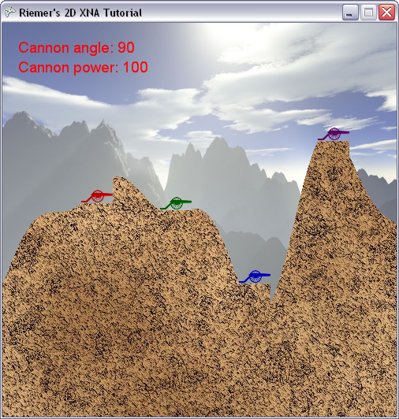

## Texture to array of colors
With the slope finally ready, we can move on and do something about the solid green color of our terrain. Instead of using a fixed color, for each pixel of the terrain we're going to look up the color of an exisiting ground image, and use this color for our own terrain. This might be a problem when our terrain is larger than the exisiting ground image, which is why we need a 'tileable' ground image. This means that you cannot see an edge when you put two of the images next to, on top or below each other.

Such an image can be downloaded [by clicking here](http://www.riemers.net/Downloads/resources/Series2D/ground.jpg).

As always when using an image in XNA: import it into the project, add the variable:

    Texture2D groundTexture;

…and initialize it in our LoadContent method:

    groundTexture = Content.Load<Texture2D> ("ground");

Now, instead of specifying a fixed color, we will transfer the color data from this image into our foregroundTexture. However, to do this, we need access to the color data stored inside the groundTexture. This is much the opposite of what we've done a few chapters ago: there we created a texture from an array of colors, here we need to copy the data from a texture into an array of colors.

This is not that difficult. Let's start by adding this method:

    private Color[,] TextureTo2DArray(Texture2D texture)
    {
        Color[] colors1D = new Color[texture.Width * texture.Height];
        texture.GetData(colors1D);
    }

As described above, we want this method to accept a Texture2D object, extract the color data and return this color data as a 2D array. Having a 2D array makes things easier later on, as each color inside this 2D array corresponds to a pixel in the 2D image.

For now, this method simply creates a 1D array of Colors, capable of storing one color for each pixel in the image (Width*Height pixels in the image). Then, it copies the color data from the texture into the array.

Basically, that's all that needs to be done, except that we want this data as a 2D array, and not as a 1D array. So add this easy code at the end of the method:

    Color[,] colors2D = new Color[texture.Width, texture.Height];
    for (int x = 0; x < texture.Width; x++)
        for (int y = 0; y < texture.Height; y++)
            colors2D[x, y] = colors1D[x + y * texture.Width];
 
    return colors2D;

We first initialize a 2D array, exactly large enough to store one Color for each pixel of the texture. Then we copy the data from our 1D array to the exact location inside our 2D array. At the end, we return this 2D array to the calling code.

Now, in our CreateForeground method we will use the colors inside this 2D array, instead of the solid green color. So go to the CreateForeground method, and add this as first line:

    Color[,] groundColors = TextureTo2DArray(groundTexture);

Now find this line, which sets green for each pixel below the terrain slope:

    foregroundColors[x + y * screenWidth] = Color.Green;

And replace it by this line:

    foregroundColors[x + y * screenWidth] = groundColors[x, y];

Which will copy the color of the same pixel inside the ground texture into our array defining the foregroundTexture.

This will work fine, unless the screen is wider or higher than the width and height of our ground texture. To solve this, we will take the modulo of both: this is the remainder after division, and can be best explained by an example. If groundWidth = 400; then (100 modulo 400) remains 100, while (500 modulo 400) will also be 100. (532 modulo 400) is 132, (389 modulo 400) is 389 and (929 modulo 400) is 129. Which means that it maps all numbers inside the [0,groundWidth] range, exactly what we need.

The modulo operator in C# is '%' so this is how we take (x modulo groundWidth):

    x % groundWidth

We need to do the same for the y coordinate, to make sure it doesn't become larger than the height of the ground image. So this is what we finally get:

    foregroundColors[x + y * screenWidth] = groundColors[x % groundTexture.Width, y % groundTexture.Height];

When you run the code with these adjustments, you should see the following:

Two chapters ago, you learned how to create a Texture2D object from a 2D array of Colors. This chapter, you learned the opposite: how to obtain the 2D array of Colors from a Texture2D. This means you know all there is to know about per-pixel Texture color manipulations.

Our code thus far:

    using System;
    using System.Collections.Generic;
    using System.Linq;
    using Microsoft.Xna.Framework;
    using Microsoft.Xna.Framework.Audio;
    using Microsoft.Xna.Framework.Content;
    using Microsoft.Xna.Framework.GamerServices;
    using Microsoft.Xna.Framework.Graphics;
    using Microsoft.Xna.Framework.Input;
    using Microsoft.Xna.Framework.Media;

    namespace XNATutorial
    {
        public struct PlayerData
        {
            public Vector2 Position;
            public bool IsAlive;
            public Color Color;
            public float Angle;
            public float Power;
        }

        public class Game1 : Microsoft.Xna.Framework.Game
        {
            GraphicsDeviceManager graphics;
            SpriteBatch spriteBatch;
            GraphicsDevice device;
            Texture2D backgroundTexture;
            Texture2D foregroundTexture;
            Texture2D carriageTexture;
            Texture2D cannonTexture;
            Texture2D rocketTexture;
            Texture2D smokeTexture;
            Texture2D groundTexture;
            SpriteFont font;
            int screenWidth;
            int screenHeight;
            PlayerData[] players;
            int numberOfPlayers = 4;
            float playerScaling;
            int currentPlayer = 0;
            bool rocketFlying = false;
            Vector2 rocketPosition;
            Vector2 rocketDirection;
            float rocketAngle;
            float rocketScaling = 0.1f;

            List<Vector2> smokeList = new List<Vector2>();
            Random randomizer = new Random();
            int[] terrainContour;

            public Game1()
            {
                graphics = new GraphicsDeviceManager(this);
                Content.RootDirectory = "Content";
            }

            protected override void Initialize()
            {
                graphics.PreferredBackBufferWidth = 500;
                graphics.PreferredBackBufferHeight = 500;
                graphics.IsFullScreen = false;
                graphics.ApplyChanges();
                Window.Title = "Riemer's 2D XNA Tutorial";

                base.Initialize();
            }

            private void SetUpPlayers()
            {
                Color[] playerColors = new Color[10];
                playerColors[0] = Color.Red;
                playerColors[1] = Color.Green;
                playerColors[2] = Color.Blue;
                playerColors[3] = Color.Purple;
                playerColors[4] = Color.Orange;
                playerColors[5] = Color.Indigo;
                playerColors[6] = Color.Yellow;
                playerColors[7] = Color.SaddleBrown;
                playerColors[8] = Color.Tomato;
                playerColors[9] = Color.Turquoise;

                players = new PlayerData[numberOfPlayers];
                for (int i = 0; i < numberOfPlayers; i++)
                {
                    players[i].IsAlive = true;
                    players[i].Color = playerColors[i];
                    players[i].Angle = MathHelper.ToRadians(90);
                    players[i].Power = 100;
                    players[i].Position = new Vector2();
                    players[i].Position.X = screenWidth / (numberOfPlayers + 1) * (i + 1);
                    players[i].Position.Y = terrainContour[(int)players[i].Position.X];
                }
            }

            protected override void LoadContent()
            {
                spriteBatch = new SpriteBatch(GraphicsDevice);
                device = graphics.GraphicsDevice;

                backgroundTexture = Content.Load<Texture2D>("background");
                carriageTexture = Content.Load<Texture2D>("carriage");
                cannonTexture = Content.Load<Texture2D>("cannon");
                rocketTexture = Content.Load<Texture2D>("rocket");
                smokeTexture = Content.Load<Texture2D>("smoke");

                groundTexture = Content.Load<Texture2D>("ground");

                font = Content.Load<SpriteFont>("myFont");
                screenWidth = device.PresentationParameters.BackBufferWidth;
                screenHeight = device.PresentationParameters.BackBufferHeight;
                playerScaling = 40.0f / (float)carriageTexture.Width;

                GenerateTerrainContour();
                SetUpPlayers();
                FlattenTerrainBelowPlayers();
                CreateForeground();
            }

            private void FlattenTerrainBelowPlayers()
            {
                foreach (PlayerData player in players)
                    if (player.IsAlive)
                        for (int x = 0; x < 40; x++)
                            terrainContour[(int)player.Position.X + x] = terrainContour[(int)player.Position.X];
            }

            private void GenerateTerrainContour()
            {
                terrainContour = new int[screenWidth];

                double rand1 = randomizer.NextDouble() + 1;
                double rand2 = randomizer.NextDouble() + 2;
                double rand3 = randomizer.NextDouble() + 3;

                float offset = screenHeight / 2;
                float peakheight = 100;
                float flatness = 70;

                for (int x = 0; x < screenWidth; x++)
                {
                    double height = peakheight / rand1 * Math.Sin((float)x / flatness * rand1 + rand1);
                    height += peakheight / rand2 * Math.Sin((float)x / flatness * rand2 + rand2);
                    height += peakheight / rand3 * Math.Sin((float)x / flatness * rand3 + rand3);
                    height += offset;
                    terrainContour[x] = (int)height;
                }
            }

            private void CreateForeground()
            {

                Color[,] groundColors = TextureTo2DArray(groundTexture);
                Color[] foregroundColors = new Color[screenWidth * screenHeight];

                for (int x = 0; x < screenWidth; x++)
                {
                    for (int y = 0; y < screenHeight; y++)
                    {
                        if (y > terrainContour[x])
                            foregroundColors[x + y * screenWidth] = groundColors[x % groundTexture.Width, y % groundTexture.Height];
                        else
                            foregroundColors[x + y * screenWidth] = Color.Transparent;
                    }
                }

                foregroundTexture = new Texture2D(device, screenWidth, screenHeight, false, SurfaceFormat.Color);
                foregroundTexture.SetData(foregroundColors);
            }

            private Color[,] TextureTo2DArray(Texture2D texture)
            {
                Color[] colors1D = new Color[texture.Width * texture.Height];
                texture.GetData(colors1D);

                Color[,] colors2D = new Color[texture.Width, texture.Height];
                for (int x = 0; x < texture.Width; x++)
                    for (int y = 0; y < texture.Height; y++)
                        colors2D[x, y] = colors1D[x + y * texture.Width];

                return colors2D;
            }

            protected override void UnloadContent()
            {
            }

            protected override void Update(GameTime gameTime)
            {
                if (GamePad.GetState(PlayerIndex.One).Buttons.Back == ButtonState.Pressed)
                    this.Exit();

                ProcessKeyboard();
                UpdateRocket();

                base.Update(gameTime);
            }

            private void UpdateRocket()
            {
                if (rocketFlying)
                {
                    Vector2 gravity = new Vector2(0, 1);
                    rocketDirection += gravity / 10.0f;
                    rocketPosition += rocketDirection;
                    rocketAngle = (float)Math.Atan2(rocketDirection.X, -rocketDirection.Y);

                    for (int i = 0; i < 5; i++)
                    {
                        Vector2 smokePos = rocketPosition;
                        smokePos.X += randomizer.Next(10) - 5;
                        smokePos.Y += randomizer.Next(10) - 5;
                        smokeList.Add(smokePos);
                    }
                }
            }

            private void ProcessKeyboard()
            {
                KeyboardState keybState = Keyboard.GetState();
                if (keybState.IsKeyDown(Keys.Left))
                    players[currentPlayer].Angle -= 0.01f;
                if (keybState.IsKeyDown(Keys.Right))
                    players[currentPlayer].Angle += 0.01f;

                if (players[currentPlayer].Angle > MathHelper.PiOver2)
                    players[currentPlayer].Angle = -MathHelper.PiOver2;
                if (players[currentPlayer].Angle < -MathHelper.PiOver2)
                    players[currentPlayer].Angle = MathHelper.PiOver2;

                if (keybState.IsKeyDown(Keys.Down))
                    players[currentPlayer].Power -= 1;
                if (keybState.IsKeyDown(Keys.Up))
                    players[currentPlayer].Power += 1;
                if (keybState.IsKeyDown(Keys.PageDown))
                    players[currentPlayer].Power -= 20;
                if (keybState.IsKeyDown(Keys.PageUp))
                    players[currentPlayer].Power += 20;

                if (players[currentPlayer].Power > 1000)
                    players[currentPlayer].Power = 1000;
                if (players[currentPlayer].Power < 0)
                    players[currentPlayer].Power = 0;

                if (keybState.IsKeyDown(Keys.Enter) || keybState.IsKeyDown(Keys.Space))
                {
                    rocketFlying = true;

                    rocketPosition = players[currentPlayer].Position;
                    rocketPosition.X += 20;
                    rocketPosition.Y -= 10;
                    rocketAngle = players[currentPlayer].Angle;
                    Vector2 up = new Vector2(0, -1);
                    Matrix rotMatrix = Matrix.CreateRotationZ(rocketAngle);
                    rocketDirection = Vector2.Transform(up, rotMatrix);
                    rocketDirection *= players[currentPlayer].Power / 50.0f;
                }
            }

            protected override void Draw(GameTime gameTime)
            {
                GraphicsDevice.Clear(Color.CornflowerBlue);

                spriteBatch.Begin();
                DrawScenery();
                DrawPlayers();
                DrawText();
                DrawRocket();
                DrawSmoke();
                spriteBatch.End();

                base.Draw(gameTime);
            }

            private void DrawScenery()
            {
                Rectangle screenRectangle = new Rectangle(0, 0, screenWidth, screenHeight);
                spriteBatch.Draw(backgroundTexture, screenRectangle, Color.White);
                spriteBatch.Draw(foregroundTexture, screenRectangle, Color.White);
            }

            private void DrawPlayers()
            {
                foreach (PlayerData player in players)
                {
                    if (player.IsAlive)
                    {
                        int xPos = (int)player.Position.X;
                        int yPos = (int)player.Position.Y;
                        Vector2 cannonOrigin = new Vector2(11, 50);

                        spriteBatch.Draw(cannonTexture, new Vector2(xPos + 20, yPos - 10), null, player.Color, player.Angle, cannonOrigin, playerScaling, SpriteEffects.None, 1);
                        spriteBatch.Draw(carriageTexture, player.Position, null, player.Color, 0, new Vector2(0, carriageTexture.Height), playerScaling, SpriteEffects.None, 0);
                    }
                }
            }

            private void DrawText()
            {
                PlayerData player = players[currentPlayer];
                int currentAngle = (int)MathHelper.ToDegrees(player.Angle);
                spriteBatch.DrawString(font, "Cannon angle: " + currentAngle.ToString(), new Vector2(20, 20), player.Color);
                spriteBatch.DrawString(font, "Cannon power: " + player.Power.ToString(), new Vector2(20, 45), player.Color);
            }

            private void DrawRocket()
            {
                if (rocketFlying)
                    spriteBatch.Draw(rocketTexture, rocketPosition, null, players[currentPlayer].Color, rocketAngle, new Vector2(42, 240), 0.1f, SpriteEffects.None, 1);
            }

            private void DrawSmoke()
            {
                foreach (Vector2 smokePos in smokeList)
                    spriteBatch.Draw(smokeTexture, smokePos, null, Color.White, 0, new Vector2(40, 35), 0.2f, SpriteEffects.None, 1);
            }
        }
    }