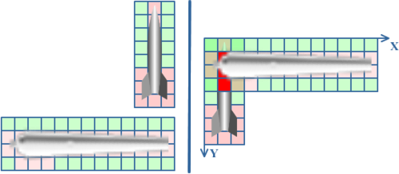
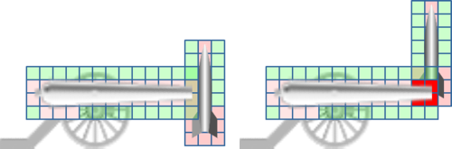
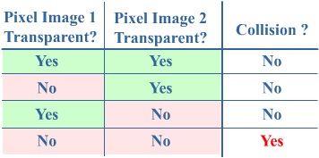
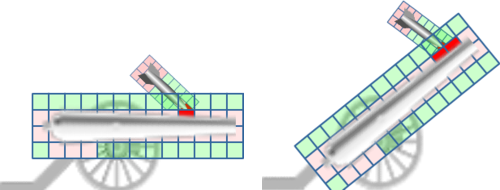

## 2D Collision Detection

With our rockets flying through the screen and each pixel of the terrain known to our code, we're ready for the most challenging, and thus interesting part of this series: collision detection.

The general idea behind collision detection between 2 images is very straightforward: for each pixel of the first image, we will check if it collides with a pixel of the second image.

Remember an image is always a rectangle. Since very few object are really rectangular, most images contain a lot of transparent pixels. This is shown in the left image below. Note that the transparent pixels have a greenish color, while the non-transparent pixels have a soft-red color (don't you dare to call it pink). We'll get back to this later.

Before we can check for collisions between 2 images, we need to make sure they are positioned correctly; that they are moved to the correct position on the screen. If we wouldn't first position them correctly before checking for collisions, the top-left pixels of both images would align and we would almost always have a collision. This is shown in the right part of the image above.

Let's say both images are positioned so the rocket is positioned in front of the cannon, much like shown in the left part of the image below.

Although in the left part the rectangles of both images collide, we see the cannon and rocket actually don't collide. This is because in all pairs of overlapping pixels, at least one of both is transparent.

When comparing 2 colliding pixels, if either of them is transparent, there is no collision between the actually object. Only when both the pixel of the first and of the second image are non-transparent, there is a real collision. This is presented in the table below:

An example of a real collision is shown in the right part of the image above. You see that the final 4 pixels of the cannon are non-transparent, while they collide with 4 non-transparent pixels of the rocket.

This, however, is not all there is to say about 2D collision detection. In the figures above, neither of the 2D images has been scaled or rotated. When our rocket collides with a cannon, it will both be scaled and rotated. This situation is shown in the left part of the image below.

The right part of the image above shows the most complicated case: where both images are scaled and/or rotated. We will meet this case in our game.

The real question of this chapter is how we can check for collisions in such cases. This is some pseudocode of how we will do this:

    For each pixel in image A:
    {
        Find the screen coordinate occupied by this pixel
        Find the pixel in image B that is also rendered to this position
        If both pixels are non-transparent
        {
            COLLISION!
        }
    }

This is illustrated in the image below. The image shows a screen with a rotated cannon and a rotated+scaled rocket. I've added the original images of both in the top-left corner as a reference.

Very nice, but how can we 'Find the screen coordinate occupied by this pixel'? This is done through matrices. Remember, matrices are nothing magical, in fact they're just a grid of 4x4 numbers. But all I want you to know about matrices at this point is this: a matrix can store the position, rotation and scaling of an image.

When a matrix holds the position, rotation and scaling of an image, you can use this matrix to find the final screen coordinate of any pixel of this image. Also important in this case in the other way around: if we take the inverse of this matrix, given any screen coordinate we can find the coordinate of the pixel in the original image.

Now we'll walk through our pseudocode above. Instead of doing this exercise for all pixels of image A, we will only discuss this for the bottom-right pixel (3,8) of image A. As a first step, we want to find to which screen coordinate this pixel will be drawn. We can find this by multiplying (='transforming') the pixel's coordinate (3,8) by the image matrix. This will give us the coordinate of where the pixel will be rendered on the screen!

The next step is the opposite: given the screen coordinate, we want to find which pixel in image B is drawn there. This is done by transforming the screen coordinate by the inverse of the matrix if image B. This will give us the coordinate in the original image B, which is (13,2) in this case.

Next, we see that both the pixel in the original image A and in the original image B have are non-transparent, so both images collide on the screen!

Let's put this in some code. We will create a method, TexturesCollide, which will return whether 2 images collide. The method will need 4 things in order to work properly:

- The 2D array of colors of image 1
- The matrix of image 1
- The 2D array of colors of image 2
- The matrix of image 2

So we can already add this to our code:

    private Vector2 TexturesCollide(Color[,] tex1, Matrix mat1, Color[,] tex2, Matrix mat2)
    {
        return new Vector2(-1, -1);
    }

The method will not only return whether there is a collision, but if there is one it will return the screen position of where the collision occurred. If no collision was detected, (-1,-1) will be returned.

Let's translate "For each pixel in image A" into C# code, add this to the top of the method:

    int width1 = tex1.GetLength(0);
    int height1 = tex1.GetLength(1);
    for (int x1 = 0; x1 < width1; x1++)
    {
        for (int y1 = 0; y1 < height1; y1++)
        {
        }
    }

For each pixel of image 1, we first want to find the corresponding screen coordinate. This is done by transforming the original X,Y coordinate with the matrix of image 1, so add these lines inside the double for-loop:

    Vector2 pos1 = new Vector2(x1,y1);
    Vector2 screenCoord = Vector2.Transform(pos1, mat1);

Now we have the screen coordinate of the current pixel, let's find to which pixel this correspond in the original image 2. This is the opposite of what we've done 2 seconds ago, so now we need to transform the screen coordinate by the inverse of the matrix of image 2:

    Matrix inverseMat2 = Matrix.Invert(mat2);
    Vector2 pos2 = Vector2.Transform(screenCoord, inverseMat2);

OK, so at this moment we have 2 positions in the original images, of which we know they are drawn to the same screen pixel. All we need to do is check whether they are both non-transparent:

    if (tex1[x1, y1].A > 0)
    {
        if (tex2[x2, y2].A > 0)
        {
            return screenCoord;
        }
    }

Which checks whether the Alpha component of both colors is larger than 0. If both colors are non-transparent, we return the screen coordinate.

Now in case no collision is detected, we need to return (-1,-1) to the calling code. Later on, we'll create our program so it interpretes (-1,-1) as 'no collision found'. So put this line at the very end of the method:

    return new Vector2(-1,-1);

This implements the core functionality of the method. While there might be cases that this method survives, in general it will crash, because some pixels of image A will fall outside of image B. In the image above for example: the very first pixel the rocket (to the left of the top of the rocket) does not correspond to a pixel in image B, so this line will cause or program to crash:

    if (tex2[x2, y2].A > 0)

This is easily solvable, by checking whether the coordinate for image B is not outside image B:

    int width2 = tex2.GetLength(0);
    int height2 = tex2.GetLength(1);
    int x2 = (int)pos2.X;
    int y2 = (int)pos2.Y;
    if ((x2 >= 0) && (x2 < width2))
    {
        if ((y2 >= 0) && (y2 < height2))
        {
            if (tex1[x1, y1].A > 0)
            {
                if (tex2[x2, y2].A > 0)
                {
                    return screenCoord;
                }
            }
        }
    }

This should actually work. We will finish this chapter by cleaning up the method a bit, as there are a few things that can easily be optimized. To start with, both the inverseMat2, width2 and height2 variables inside the double for-loop are never changed, so we should put them before the for-loop so they are only calculated once.

There's one more optimization that's easy to do. In our method, for each pixel of image A we're doing two transformations: from image A to screen coordinates, and from these screen coordinates to image B. It would be better to replace them by a single transformation: from image A to image B.

Using matrices, this is rather easy. Now, we're transforming a coordinate by mat1, and then by inverse(mat2). We can obtain the matrix that is the combination of both, simply by multiplying them. Put this line at the top of the method:

    Matrix mat1to2 = mat1 * Matrix.Invert(mat2);

Since the mat1to2 matrix is the combination of the mat1 and the inverse(mat2) matrices, transforming a coordinate from Image 1 by this matrix will immediately give us the coordinate in Image 2!

This allows us to transform pos1 to pos2 using a single transformation! This is shown below, where I've listed our entire TexturesCollide method:

    private Vector2 TexturesCollide(Color[,] tex1, Matrix mat1, Color[,] tex2, Matrix mat2)
    {
        Matrix mat1to2 = mat1 * Matrix.Invert(mat2);
        int width1 = tex1.GetLength(0);
        int height1 = tex1.GetLength(1);
        int width2 = tex2.GetLength(0);
        int height2 = tex2.GetLength(1);
 
        for (int x1 = 0; x1 < width1; x1++)
        {
            for (int y1 = 0; y1 < height1; y1++)
            {
                Vector2 pos1 = new Vector2(x1,y1);
                Vector2 pos2 = Vector2.Transform(pos1, mat1to2);
 
                int x2 = (int)pos2.X;
                int y2 = (int)pos2.Y;
                if ((x2 >= 0) && (x2 < width2))
                {
                    if ((y2 >= 0) && (y2 < height2))
                    {
                        if (tex1[x1, y1].A > 0)
                        {
                            if (tex2[x2, y2].A > 0)
                            {
                                Vector2 screenPos = Vector2.Transform(pos1, mat1);
                                return screenPos;
                            }
                        }
                    }
                }
            }
        }
 
        return new Vector2(-1, -1);
    }

Note also, that we do not use the screen coordinates anymore. As such, when a collision is detected, we still need to transform the current coordinate of Image 1 by mat1 to obtain the screen coordinate, so it can be returned to the calling code.

There's no screenshot for this chapter, although we've added some powerful functionality to our code. In the next chapter we will see how we can use this functionality to detect collisions between any two images.

Our full code thus far:

    using System;
    using System.Collections.Generic;
    using System.Linq;
    using Microsoft.Xna.Framework;
    using Microsoft.Xna.Framework.Audio;
    using Microsoft.Xna.Framework.Content;
    using Microsoft.Xna.Framework.GamerServices;
    using Microsoft.Xna.Framework.Graphics;
    using Microsoft.Xna.Framework.Input;
    using Microsoft.Xna.Framework.Media;

    namespace XNATutorial
    {
        public struct PlayerData
        {
            public Vector2 Position;
            public bool IsAlive;
            public Color Color;
            public float Angle;
            public float Power;
        }

        public class Game1 : Microsoft.Xna.Framework.Game
        {
            GraphicsDeviceManager graphics;
            SpriteBatch spriteBatch;
            GraphicsDevice device;
            Texture2D backgroundTexture;
            Texture2D foregroundTexture;
            Texture2D carriageTexture;
            Texture2D cannonTexture;
            Texture2D rocketTexture;
            Texture2D smokeTexture;
            Texture2D groundTexture;
            SpriteFont font;
            int screenWidth;
            int screenHeight;
            PlayerData[] players;
            int numberOfPlayers = 4;
            float playerScaling;
            int currentPlayer = 0;
            bool rocketFlying = false;
            Vector2 rocketPosition;
            Vector2 rocketDirection;
            float rocketAngle;
            float rocketScaling = 0.1f;

            List<Vector2> smokeList = new List<Vector2>();
            Random randomizer = new Random();
            int[] terrainContour;

            public Game1()
            {
                graphics = new GraphicsDeviceManager(this);
                Content.RootDirectory = "Content";
            }

            protected override void Initialize()
            {
                graphics.PreferredBackBufferWidth = 500;
                graphics.PreferredBackBufferHeight = 500;
                graphics.IsFullScreen = false;
                graphics.ApplyChanges();
                Window.Title = "Riemer's 2D XNA Tutorial";

                base.Initialize();
            }

            private void SetUpPlayers()
            {
                Color[] playerColors = new Color[10];
                playerColors[0] = Color.Red;
                playerColors[1] = Color.Green;
                playerColors[2] = Color.Blue;
                playerColors[3] = Color.Purple;
                playerColors[4] = Color.Orange;
                playerColors[5] = Color.Indigo;
                playerColors[6] = Color.Yellow;
                playerColors[7] = Color.SaddleBrown;
                playerColors[8] = Color.Tomato;
                playerColors[9] = Color.Turquoise;

                players = new PlayerData[numberOfPlayers];
                for (int i = 0; i < numberOfPlayers; i++)
                {
                    players[i].IsAlive = true;
                    players[i].Color = playerColors[i];
                    players[i].Angle = MathHelper.ToRadians(90);
                    players[i].Power = 100;
                    players[i].Position = new Vector2();
                    players[i].Position.X = screenWidth / (numberOfPlayers + 1) * (i + 1);
                    players[i].Position.Y = terrainContour[(int)players[i].Position.X];
                }
            }

            protected override void LoadContent()
            {
                spriteBatch = new SpriteBatch(GraphicsDevice);
                device = graphics.GraphicsDevice;

                backgroundTexture = Content.Load<Texture2D>("background");
                carriageTexture = Content.Load<Texture2D>("carriage");
                cannonTexture = Content.Load<Texture2D>("cannon");
                rocketTexture = Content.Load<Texture2D>("rocket");
                smokeTexture = Content.Load<Texture2D>("smoke");
                groundTexture = Content.Load<Texture2D>("ground");
                font = Content.Load<SpriteFont>("myFont");
                screenWidth = device.PresentationParameters.BackBufferWidth;
                screenHeight = device.PresentationParameters.BackBufferHeight;
                playerScaling = 40.0f / (float)carriageTexture.Width;

                GenerateTerrainContour();
                SetUpPlayers();
                FlattenTerrainBelowPlayers();
                CreateForeground();
            }

            private void FlattenTerrainBelowPlayers()
            {
                foreach (PlayerData player in players)
                    if (player.IsAlive)
                        for (int x = 0; x < 40; x++)
                            terrainContour[(int)player.Position.X + x] = terrainContour[(int)player.Position.X];
            }

            private void GenerateTerrainContour()
            {
                terrainContour = new int[screenWidth];

                double rand1 = randomizer.NextDouble() + 1;
                double rand2 = randomizer.NextDouble() + 2;
                double rand3 = randomizer.NextDouble() + 3;

                float offset = screenHeight / 2;
                float peakheight = 100;
                float flatness = 70;

                for (int x = 0; x < screenWidth; x++)
                {
                    double height = peakheight / rand1 * Math.Sin((float)x / flatness * rand1 + rand1);
                    height += peakheight / rand2 * Math.Sin((float)x / flatness * rand2 + rand2);
                    height += peakheight / rand3 * Math.Sin((float)x / flatness * rand3 + rand3);
                    height += offset;
                    terrainContour[x] = (int)height;
                }
            }

            private void CreateForeground()
            {
                Color[,] groundColors = TextureTo2DArray(groundTexture);
                Color[] foregroundColors = new Color[screenWidth * screenHeight];

                for (int x = 0; x < screenWidth; x++)
                {
                    for (int y = 0; y < screenHeight; y++)
                    {
                        if (y > terrainContour[x])
                            foregroundColors[x + y * screenWidth] = groundColors[x % groundTexture.Width, y % groundTexture.Height];
                        else
                            foregroundColors[x + y * screenWidth] = Color.Transparent;
                    }
                }

                foregroundTexture = new Texture2D(device, screenWidth, screenHeight, false, SurfaceFormat.Color);
                foregroundTexture.SetData(foregroundColors);
            }

            private Color[,] TextureTo2DArray(Texture2D texture)
            {
                Color[] colors1D = new Color[texture.Width * texture.Height];
                texture.GetData(colors1D);

                Color[,] colors2D = new Color[texture.Width, texture.Height];
                for (int x = 0; x < texture.Width; x++)
                    for (int y = 0; y < texture.Height; y++)
                        colors2D[x, y] = colors1D[x + y * texture.Width];

                return colors2D;
            }

            protected override void UnloadContent()
            {
            }

            protected override void Update(GameTime gameTime)
            {
                if (GamePad.GetState(PlayerIndex.One).Buttons.Back == ButtonState.Pressed)
                    this.Exit();

                ProcessKeyboard();
                UpdateRocket();

                base.Update(gameTime);
            }

            private void UpdateRocket()
            {
                if (rocketFlying)
                {
                    Vector2 gravity = new Vector2(0, 1);
                    rocketDirection += gravity / 10.0f;
                    rocketPosition += rocketDirection;
                    rocketAngle = (float)Math.Atan2(rocketDirection.X, -rocketDirection.Y);

                    for (int i = 0; i < 5; i++)
                    {
                        Vector2 smokePos = rocketPosition;
                        smokePos.X += randomizer.Next(10) - 5;
                        smokePos.Y += randomizer.Next(10) - 5;
                        smokeList.Add(smokePos);
                    }
                }
            }

            private void ProcessKeyboard()
            {
                KeyboardState keybState = Keyboard.GetState();
                if (keybState.IsKeyDown(Keys.Left))
                    players[currentPlayer].Angle -= 0.01f;
                if (keybState.IsKeyDown(Keys.Right))
                    players[currentPlayer].Angle += 0.01f;

                if (players[currentPlayer].Angle > MathHelper.PiOver2)
                    players[currentPlayer].Angle = -MathHelper.PiOver2;
                if (players[currentPlayer].Angle < -MathHelper.PiOver2)
                    players[currentPlayer].Angle = MathHelper.PiOver2;

                if (keybState.IsKeyDown(Keys.Down))
                    players[currentPlayer].Power -= 1;
                if (keybState.IsKeyDown(Keys.Up))
                    players[currentPlayer].Power += 1;
                if (keybState.IsKeyDown(Keys.PageDown))
                    players[currentPlayer].Power -= 20;
                if (keybState.IsKeyDown(Keys.PageUp))
                    players[currentPlayer].Power += 20;

                if (players[currentPlayer].Power > 1000)
                    players[currentPlayer].Power = 1000;
                if (players[currentPlayer].Power < 0)
                    players[currentPlayer].Power = 0;

                if (keybState.IsKeyDown(Keys.Enter) || keybState.IsKeyDown(Keys.Space))
                {
                    rocketFlying = true;

                    rocketPosition = players[currentPlayer].Position;
                    rocketPosition.X += 20;
                    rocketPosition.Y -= 10;
                    rocketAngle = players[currentPlayer].Angle;
                    Vector2 up = new Vector2(0, -1);
                    Matrix rotMatrix = Matrix.CreateRotationZ(rocketAngle);
                    rocketDirection = Vector2.Transform(up, rotMatrix);
                    rocketDirection *= players[currentPlayer].Power / 50.0f;
                }
            }

            private Vector2 TexturesCollide(Color[,] tex1, Matrix mat1, Color[,] tex2, Matrix mat2)
            {
                Matrix mat1to2 = mat1 * Matrix.Invert(mat2);
                int width1 = tex1.GetLength(0);
                int height1 = tex1.GetLength(1);
                int width2 = tex2.GetLength(0);
                int height2 = tex2.GetLength(1);

                for (int x1 = 0; x1 < width1; x1++)
                {
                    for (int y1 = 0; y1 < height1; y1++)
                    {
                        Vector2 pos1 = new Vector2(x1, y1);
                        Vector2 pos2 = Vector2.Transform(pos1, mat1to2);

                        int x2 = (int)pos2.X;
                        int y2 = (int)pos2.Y;
                        if ((x2 >= 0) && (x2 < width2))
                        {
                            if ((y2 >= 0) && (y2 < height2))
                            {
                                if (tex1[x1, y1].A > 0)
                                {
                                    if (tex2[x2, y2].A > 0)
                                    {
                                        Vector2 screenPos = Vector2.Transform(pos1, mat1);
                                        return screenPos;
                                    }
                                }
                            }
                        }
                    }
                }

                return new Vector2(-1, -1);
            }

            protected override void Draw(GameTime gameTime)
            {
                GraphicsDevice.Clear(Color.CornflowerBlue);

                spriteBatch.Begin();
                DrawScenery();
                DrawPlayers();
                DrawText();
                DrawRocket();
                DrawSmoke();
                spriteBatch.End();

                base.Draw(gameTime);
            }

            private void DrawScenery()
            {
                Rectangle screenRectangle = new Rectangle(0, 0, screenWidth, screenHeight);
                spriteBatch.Draw(backgroundTexture, screenRectangle, Color.White);
                spriteBatch.Draw(foregroundTexture, screenRectangle, Color.White);
            }

            private void DrawPlayers()
            {
                foreach (PlayerData player in players)
                {
                    if (player.IsAlive)
                    {
                        int xPos = (int)player.Position.X;
                        int yPos = (int)player.Position.Y;
                        Vector2 cannonOrigin = new Vector2(11, 50);

                        spriteBatch.Draw(cannonTexture, new Vector2(xPos + 20, yPos - 10), null, player.Color, player.Angle, cannonOrigin, playerScaling, SpriteEffects.None, 1);
                        spriteBatch.Draw(carriageTexture, player.Position, null, player.Color, 0, new Vector2(0, carriageTexture.Height), playerScaling, SpriteEffects.None, 0);
                    }
                }
            }

            private void DrawText()
            {
                PlayerData player = players[currentPlayer];
                int currentAngle = (int)MathHelper.ToDegrees(player.Angle);
                spriteBatch.DrawString(font, "Cannon angle: " + currentAngle.ToString(), new Vector2(20, 20), player.Color);
                spriteBatch.DrawString(font, "Cannon power: " + player.Power.ToString(), new Vector2(20, 45), player.Color);
            }

            private void DrawRocket()
            {
                if (rocketFlying)
                    spriteBatch.Draw(rocketTexture, rocketPosition, null, players[currentPlayer].Color, rocketAngle, new Vector2(42, 240), 0.1f, SpriteEffects.None, 1);
            }

            private void DrawSmoke()
            {
                foreach (Vector2 smokePos in smokeList)
                    spriteBatch.Draw(smokeTexture, smokePos, null, Color.White, 0, new Vector2(40, 35), 0.2f, SpriteEffects.None, 1);
            }
        }
    }