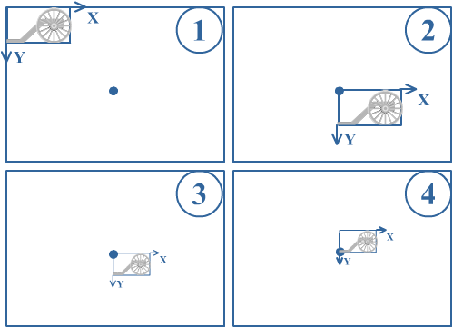
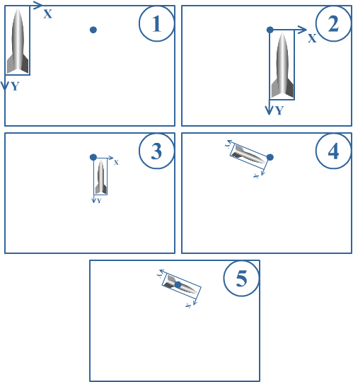
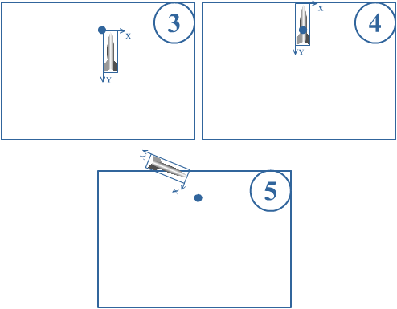
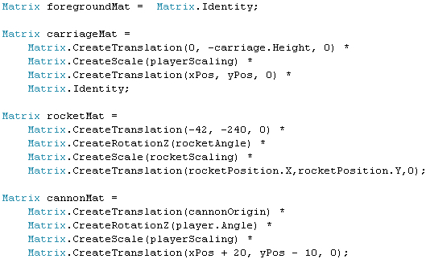

## 2D Transformation matrices
This chapter, we'll see how we can actually make use of the TexturesCollide method, created last chapter. From the method definition, you can see it requires the 2D color array and the transformation matrix of both images.

Let's start with the 2D color array. Since we'll be using the TexturesCollide method quite often, we'll extract the 2D color arrays of our images once using our Textureto2DArray method and store them in a variable. Start by adding these variable to the top of our code:

    Color[,] rocketColorArray;
    Color[,] foregroundColorArray;
    Color[,] carriageColorArray;
    Color[,] cannonColorArray;

Note that these are the only images we need to check for possible collisions between our rocket, the terrain and the players. Load 3 of them at the end of our LoadContent method:

    rocketColorArray = TextureTo2DArray(rocketTexture);
    carriageColorArray = TextureTo2DArray(carriageTexture);
    cannonColorArray = TextureTo2DArray(cannonTexture);

The 2D color array of the foreground needs to be re-extracted each time the CreateForeground method is called, so add this line at the end of the CreateForeground method:

    foregroundColorArray = TextureTo2DArray(foregroundTexture);

Now we have the 2D color arrays of our textures readily available, there's one more thing we need: the transformation matrices of our images. These matrices describe how images are transformed (moved, rotated, scaled) before they are rendered to the screen. We will construct the 4 transformation images, starting with the easiest: the matrix for the foreground image.

For the foreground image, this is rather easy. Remember that we have created this texture so it has exactly the same size as the screen, so the foreground image can be rendered to the screen exactly the way it is. This means we need a transformation that actually does not change the image.

This means that we need to specify the Identity matrix as transformation matrix of our foreground image. The Identity matrix makes sure the image remains identical. You can compare it to the identity element of the "+" operation, which is 0: [a number] + 0 = [a number]. For the "\*" operation, the identity element is 1: [a number] \* 1 = [a number]. Now for matrices: [any image] \* Matrix.Identity = [an image].

So this line creates the matrix for foreground texture:

    Matrix foregroundMat = Matrix.Identity;

Next in line is the matrix for one of the carriages. Before they are rendered to the screen, they are moved to their correct position, scaled down and then moved again to its origin position. For each of these separate transformations, we can construct the matrix. The global transformation matrix is nothing more than the multiplication of all these separate matrices. There is one very important rule that you need to keep in mind: __the order of matrix multiplications is important. In matrix multiplications, you should translate "\*" to "after".__

With this said, let's go over the transformations that XNA does before rendering a carriage to the screen. Very important: these operations happen in the exact order specified here. The steps correspond to the image underneath them.

1. If we would render the image just like it is (or: with the Identity transformation), it would be rendered in its original size in the top-left corner of the screen.
2. First, the carriage image is moved so its top-left point is at the position specified as second argument in the SpriteBatch.Draw method.
3. Then, everything is scaled down. You see this includes the images, __as well as its own X and Y axis__
4. Finally, and this is the most challenging step: the image is moved over the Y axis, since in our SpriteBatch.Draw method we've specified (0, carriageTexture.Height) as origin. Very important: it is moved over __its own Y axis__, which has been scaled down. So instead of being moved over 39 screen pixels, the carriages will be moved vertically over 39*0.4=16 pixels pixels (since carriageTexture.Height = 39 and playerScaling = 0.4).

Note that things would be different if step 2 and step 3 would have be interchanged: first the image would be moved vertically over 39 screen pixels, and AFTER that the image and axis would be scaled down. This would result in our carriages floating in thin air!

Let's rewrite this, in matrices:

1. Matrix.Identity;
2. Matrix.CreateTranslation(xPos, yPos, 0)
3. Matrix.CreateScale(playerScaling)
4. Matrix.CreateTranslation(0, -carriage.Height, 0)

The global transformation matrix is obtained by multiplying them all together:

    Matrix carriageMat = Matrix.CreateTranslation(0, -carriage.Height, 0) * Matrix.CreateScale(playerScaling) * Matrix.CreateTranslation(xPos, yPos, 0) * Matrix.Identity;

Remember our discussion about the Identity matrix being the "1" in multiplication. This means we can also leave it away in the line above (since for example a\*b\*c\*1 = a\*b\*c), which gives us:

Next, and this brings us to the most general example possible, it's time to construct the transformation matrix of the rocket. Let's go over the different transformations that are applied to the rocket, while taking a look at the corresponding image below them:

1. If we would render the image just like it is (or: with the Identity transformation), it would be rendered in its original size in the top-left corner of the screen.
2. First, the rocket image is moved so its top-left point is at the position specified as second argument in the SpriteBatch.Draw method.
3. Then, everything is scaled down. You see this includes the image, __as well as its own X and Y axis__
4. Then, everything is rotated. Again, this includes the image as well as its own X and Y axis.
5. Finally, the resulting image is moved for 42 pixels over its transformed X axis, and 240 pixels over its transformed Y axis. To find out how it will be moved relative to the screen, let's see which transformations already have an impact on the X and Y axis. In step 2, they have been scaled down factor 10 (since rocketScaling is 0.1). In step 3, these downscaled axis are rotated over an angle specified in rocketAngle). This means, that in case rocketAngle=0, the image would be moved over (4.2, 24) pixels. In case of a rotation, the image will be moved

Since this is the most general case, you can find the transformation matrix of __any__ image you draw using this rule.

(42, 240) pixels over the axis, __which has been scaled down and rotated__. As an example: in step 2, we have scaled our rocket image down by factor 10. Let's say we have not set a rotation in step 3. As a result, the image will be moved over (4.2, 24) pixels.

Note that this yields the result we wanted: the rotational center of the rocket is at the position we specified in the SpriteBatch.Draw method, and the rocket is rotated and scaled as we wanted.

I already mentioned the order of transformations is important. As an example, the image below shows what would happen when steps 4 and 5 would be swapped:

Since the coordinate system would first be moved, after the coordinate system is rotated it ends up at a totally different position. This results in the rocket being rendered partially off-screen.

Let's rewrite the correct way of transformations, this time in matrices. Note that we've already left away the Identity matrix as first step:

- First: Matrix.CreateTranslation(rocketPosition.X, rocketPosition.Y, 0)
- Then : Matrix.CreateScale(rocketScaling)
- Then : Matrix.CreateRotationZ(rocketAngle)
- Finally: Matrix.CreateTranslation(-42, -240, 0)

And since we need to combine all of them together, we multiply them. Note that __"\*" means "after"__:

    Matrix rocketMat = Matrix.CreateTranslation(-42, -240, 0) * Matrix.CreateRotationZ(rocketAngle) * Matrix.CreateScale(rocketScaling) * Matrix.CreateTranslation(rocketPosition.X, rocketPosition.Y, 0);

This is the most general transformation you'll find when creating any 2D game. As an example: the matrices of the foreground and carriages are simplifications of the line above. Based on your SpriteBatch.Draw line, you can create this line. The leftmost matrix contains the origin point you specified in the SpriteBatch.Draw method, then the angle, next the scaling and finally the position on the screen, which you specified as second argument in the SpriteBatch.Draw call.

As an example, let's show how easy it is to create the transformation matrix of the cannon, based on this SpriteBatch.Draw call:

    spriteBatch.Draw(cannon, new Vector2(xPos + 20, yPos - 10), null, player.Color, player.Angle, cannonOrigin, playerScaling, SpriteEffects.None, 1);

This is the corresponding matrix:

    Matrix cannonMat = Matrix.CreateTranslation(cannonOrigin) * Matrix.CreateRotationZ(player.Angle) * Matrix.CreateScale(playerScaling) * Matrix.CreateTranslation(xPos + 20, yPos - 10, 0);

That will be all for this chapter. At this moment, we have the 2D arrays of colors of our images, their transformation matrices and the CheckTextures method. We'll put all of them together in the next chapter.

