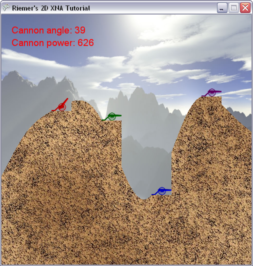

## Putting Collision Detection into practice
This chapter, we'll put all we've learned in the past 2 chapters together, and end up with fully working per-pixel collision detection. We will create 2 methods, which detect collision between our rocket and the terrain and players and another one that detects whether the rocket is still inside the screen.

Given the past 2 chapters, it's fairly easy to detect for collisions between the rocket and the terrain:

    private Vector2 CheckTerrainCollision()
    {
        Matrix rocketMat = Matrix.CreateTranslation(-42, -240, 0) * Matrix.CreateRotationZ(rocketAngle) * Matrix.CreateScale(rocketScaling) * Matrix.CreateTranslation(rocketPosition.X, rocketPosition.Y, 0);
        Matrix terrainMat = Matrix.Identity;
        Vector2 terrainCollisionPoint = TexturesCollide(rocketColorArray, rocketMat, foregroundColorArray, terrainMat);
        return terrainCollisionPoint;
    }

We create the transformation matrices for our rocket and foreground textures, and pass them together with their color arrays to the TexturesCollide method. This method will return (-1,-1) if no collision was detected, otherwise the screen coordinate of the collision will be returned. The result of this method will be returned by the CheckTerrainCollision method.

Next in line is the CheckPlayersCollision method, which promises to be a little more complex as there are multiple players, and some of them might no longer be alive. Start with this code:

    private Vector2 CheckPlayersCollision()
    {
        Matrix rocketMat = Matrix.CreateTranslation(-42, -240, 0) * Matrix.CreateRotationZ(rocketAngle) * Matrix.CreateScale(rocketScaling) * Matrix.CreateTranslation(rocketPosition.X, rocketPosition.Y, 0);
        for (int i = 0; i < numberOfPlayers; i++)
        {
            PlayerData player = players[i];
            if (player.IsAlive)
            {
                if (i != currentPlayer)
                {
                    int xPos = (int)player.Position.X;
                    int yPos = (int)player.Position.Y;
 
                    Matrix carriageMat = Matrix.CreateTranslation(0, -carriageTexture.Height, 0) * Matrix.CreateScale(playerScaling) * Matrix.CreateTranslation(xPos, yPos, 0);
                    Vector2 carriageCollisionPoint = TexturesCollide(carriageColorArray, carriageMat, rocketColorArray, rocketMat);
                }
            }
        }
        return new Vector2(-1, -1);
    }

First, the matrix of the rocket is created, as this remains the same for all players. Next, for each player we check whether the player is alive, and if it is not the player that shot the rocket, as otherwise there would be a collision the very moment the rocket was shot. If all of this is true, we create the matrix for the carriage of the current player, as explained in the previous chapter.

The matrices of the rocket and carriage are passed to the TexturesCollide method, and the result is stored in a the carriageCollisionPoint Vector2. Remember that this contains (-1,-1) if no collision was detected, which is what we check for in the next piece of code, which you should put immediately after the carriageCollisionPoint variable is filled:

    if (carriageCollisionPoint.X > -1)
    {
        players[i].IsAlive = false;
        return carriageCollisionPoint;
    }

If a collision between the rocket and the current carriage is detected, the IsAlive property of the colliding player is set to false and the method returns the collision point, which immediately terminates the method.

If no collision was detected, we should check for collisions between the rocket and the cannon of the current player. This is done exactly the same, only this time we create the matrix for the cannon, instead of for the carriage: (put this code after the previous lines)

    Matrix cannonMat = Matrix.CreateTranslation(-11, -50, 0) * Matrix.CreateRotationZ(player.Angle) * Matrix.CreateScale(playerScaling) * Matrix.CreateTranslation(xPos + 20, yPos - 10, 0);
    Vector2 cannonCollisionPoint = TexturesCollide(cannonColorArray, cannonMat, rocketColorArray, rocketMat);
    if (cannonCollisionPoint.X > -1)
    {
        players[i].IsAlive = false;
        return cannonCollisionPoint;
    }

Again, if a collision between the rocket and the cannon is detected, the screen position of the collision is returned. If no collision was detected, the code continues and the next iteration of the for loop these checks will be done for the next player. In case no collision was found between the rocket and any player, the for loop ends and the CheckPlayersCollision returns (-1,-1).

Finally, we need a method to check whether the rocket is still inside the window. This shouldn't be that difficult:

    private bool CheckOutOfScreen()
    {
        bool rocketOutOfScreen = rocketPosition.Y > screenHeight;
        rocketOutOfScreen |= rocketPosition.X < 0;
        rocketOutOfScreen |= rocketPosition.X > screenWidth;
             
        return rocketOutOfScreen;
    }

This checks whether the rocket is below the lower boundary, OR to the left of our window, OR to the right of our window. The result is true if any of them is true, and is returned to the calling code.

At this moment, we have created 3 methods that allow us to detect any possible collision. All we need is a general method that processes their results:

    private void CheckCollisions(GameTime gameTime)
    {
        Vector2 terrainCollisionPoint = CheckTerrainCollision();
        Vector2 playerCollisionPoint = CheckPlayersCollision();
        bool rocketOutOfScreen = CheckOutOfScreen();

        if (playerCollisionPoint.X > -1)
        {
            rocketFlying = false;

            smokeList = new List<Vector2>();
            NextPlayer();
        }

        if (terrainCollisionPoint.X > -1)
        {
            rocketFlying = false;

            smokeList = new List<Vector2>();
            NextPlayer();
        }

        if (rocketOutOfScreen)
        {
            rocketFlying = false;

            smokeList = new List<Vector2>();
            NextPlayer();
        }
    }

This method calls the three methods, and stores their results in three variables. The three if-blocks check whether any of them returned a collision. If this is the case, the rocket will no longer be drawn, the smokelist is reset and the next player is activated. At this moment, the three if-block do exactly the same, but I keep them separated as in later chapters the different collisions will lead to different explosions.

2 things we need to do: define the NextPlayer method and call this method from our Update method:

    if (rocketFlying)
    {
        UpdateRocket();
        CheckCollisions(gameTime);
    }

The NextPlayer method has to increment the currentPlayer value, and check whether the new player is still alive:

    private void NextPlayer()
    {
        currentPlayer = currentPlayer + 1;
        currentPlayer = currentPlayer % numberOfPlayers;
        while (!players[currentPlayer].IsAlive)
            currentPlayer = ++currentPlayer % numberOfPlayers;
    }

First, the currentPlayer value is incremented. Sinc this must not be larger than numberOfPlayers, we take the modulus. As an example, if numberOfPlayers = 4, when 3 is incremented to 4 this will be reset to 0.
Next, you check whether the new player is alive. If it isn't, you increment it again. The line inside the while loop does actually exactly the same as the first two lines together: the ++ before currentPlayer makes sure the value is incremented BEFORE the line is evaluated.

When this method returns, currentPlayer will hold the next player that is still alive.

Now, when all if this is added to your project in the correct way, your code should be able to detect any collision between the rocket and any objects on its way!

A quick note on the performance of this method: a lot of calculations and checks need to be done for each pixel of image 1. This means, that when checking for collisions between 2 images, you should pass the smallest as tex1 and the largest as tex2. Furthermore, instead of blindly performing this detailed check between all of your images, you should first check whether the images possible overlap by checking whether their outlines collide. If their outlines don't collide, you're sure there is no collision so it's useless to call the calculation-intensive TexturesCollide method on them.

If you're unsure about where some part of the code should be placed, have a look at the code below:

    using System;
    using System.Collections.Generic;
    using System.Linq;
    using Microsoft.Xna.Framework;
    using Microsoft.Xna.Framework.Audio;
    using Microsoft.Xna.Framework.Content;
    using Microsoft.Xna.Framework.GamerServices;
    using Microsoft.Xna.Framework.Graphics;
    using Microsoft.Xna.Framework.Input;
    using Microsoft.Xna.Framework.Media;

    namespace XNATutorial
    {
        public struct PlayerData
        {
            public Vector2 Position;
            public bool IsAlive;
            public Color Color;
            public float Angle;
            public float Power;
        }

        public class Game1 : Microsoft.Xna.Framework.Game
        {
            GraphicsDeviceManager graphics;
            SpriteBatch spriteBatch;
            GraphicsDevice device;
            Texture2D backgroundTexture;
            Texture2D foregroundTexture;
            Texture2D carriageTexture;
            Texture2D cannonTexture;
            Texture2D rocketTexture;
            Texture2D smokeTexture;
            Texture2D groundTexture;
            SpriteFont font;
            int screenWidth;
            int screenHeight;
            PlayerData[] players;
            int numberOfPlayers = 4;
            float playerScaling;
            int currentPlayer = 0;
            bool rocketFlying = false;
            Vector2 rocketPosition;
            Vector2 rocketDirection;
            float rocketAngle;
            float rocketScaling = 0.1f;

            List<Vector2> smokeList = new List<Vector2>();
            Random randomizer = new Random();
            int[] terrainContour;
            Color[,] rocketColorArray;
            Color[,] foregroundColorArray;
            Color[,] carriageColorArray;
            Color[,] cannonColorArray;

            public Game1()
            {
                graphics = new GraphicsDeviceManager(this);
                Content.RootDirectory = "Content";
            }

            protected override void Initialize()
            {
                graphics.PreferredBackBufferWidth = 500;
                graphics.PreferredBackBufferHeight = 500;
                graphics.IsFullScreen = false;
                graphics.ApplyChanges();
                Window.Title = "Riemer's 2D XNA Tutorial";

                base.Initialize();
            }

            private void SetUpPlayers()
            {
                Color[] playerColors = new Color[10];
                playerColors[0] = Color.Red;
                playerColors[1] = Color.Green;
                playerColors[2] = Color.Blue;
                playerColors[3] = Color.Purple;
                playerColors[4] = Color.Orange;
                playerColors[5] = Color.Indigo;
                playerColors[6] = Color.Yellow;
                playerColors[7] = Color.SaddleBrown;
                playerColors[8] = Color.Tomato;
                playerColors[9] = Color.Turquoise;

                players = new PlayerData[numberOfPlayers];
                for (int i = 0; i < numberOfPlayers; i++)
                {
                    players[i].IsAlive = true;
                    players[i].Color = playerColors[i];
                    players[i].Angle = MathHelper.ToRadians(90);
                    players[i].Power = 100;
                    players[i].Position = new Vector2();
                    players[i].Position.X = screenWidth / (numberOfPlayers + 1) * (i + 1);
                    players[i].Position.Y = terrainContour[(int)players[i].Position.X];
                }
            }

            protected override void LoadContent()
            {
                spriteBatch = new SpriteBatch(GraphicsDevice);
                device = graphics.GraphicsDevice;

                backgroundTexture = Content.Load<Texture2D>("background");
                carriageTexture = Content.Load<Texture2D>("carriage");
                cannonTexture = Content.Load<Texture2D>("cannon");
                rocketTexture = Content.Load<Texture2D>("rocket");
                smokeTexture = Content.Load<Texture2D>("smoke");
                groundTexture = Content.Load<Texture2D>("ground");
                font = Content.Load<SpriteFont>("myFont");
                screenWidth = device.PresentationParameters.BackBufferWidth;
                screenHeight = device.PresentationParameters.BackBufferHeight;
                playerScaling = 40.0f / (float)carriageTexture.Width;

                GenerateTerrainContour();
                SetUpPlayers();
                FlattenTerrainBelowPlayers();
                CreateForeground();

                rocketColorArray = TextureTo2DArray(rocketTexture);
                carriageColorArray = TextureTo2DArray(carriageTexture);
                cannonColorArray = TextureTo2DArray(cannonTexture);
            }

            private void FlattenTerrainBelowPlayers()
            {
                foreach (PlayerData player in players)
                    if (player.IsAlive)
                        for (int x = 0; x < 40; x++)
                            terrainContour[(int)player.Position.X + x] = terrainContour[(int)player.Position.X];
            }

            private void GenerateTerrainContour()
            {
                terrainContour = new int[screenWidth];

                double rand1 = randomizer.NextDouble() + 1;
                double rand2 = randomizer.NextDouble() + 2;
                double rand3 = randomizer.NextDouble() + 3;

                float offset = screenHeight / 2;
                float peakheight = 100;
                float flatness = 70;

                for (int x = 0; x < screenWidth; x++)
                {
                    double height = peakheight / rand1 * Math.Sin((float)x / flatness * rand1 + rand1);
                    height += peakheight / rand2 * Math.Sin((float)x / flatness * rand2 + rand2);
                    height += peakheight / rand3 * Math.Sin((float)x / flatness * rand3 + rand3);
                    height += offset;
                    terrainContour[x] = (int)height;
                }
            }

            private void CreateForeground()
            {
                Color[,] groundColors = TextureTo2DArray(groundTexture);
                Color[] foregroundColors = new Color[screenWidth * screenHeight];

                for (int x = 0; x < screenWidth; x++)
                {
                    for (int y = 0; y < screenHeight; y++)
                    {
                        if (y > terrainContour[x])
                            foregroundColors[x + y * screenWidth] = groundColors[x % groundTexture.Width, y % groundTexture.Height];
                        else
                            foregroundColors[x + y * screenWidth] = Color.Transparent;
                    }
                }

                foregroundTexture = new Texture2D(device, screenWidth, screenHeight, false, SurfaceFormat.Color);
                foregroundTexture.SetData(foregroundColors);

                foregroundColorArray = TextureTo2DArray(foregroundTexture);
            }

            private Color[,] TextureTo2DArray(Texture2D texture)
            {
                Color[] colors1D = new Color[texture.Width * texture.Height];
                texture.GetData(colors1D);

                Color[,] colors2D = new Color[texture.Width, texture.Height];
                for (int x = 0; x < texture.Width; x++)
                    for (int y = 0; y < texture.Height; y++)
                        colors2D[x, y] = colors1D[x + y * texture.Width];

                return colors2D;
            }

            protected override void UnloadContent()
            {
            }

            protected override void Update(GameTime gameTime)
            {
                if (GamePad.GetState(PlayerIndex.One).Buttons.Back == ButtonState.Pressed)
                    this.Exit();

                ProcessKeyboard();
                UpdateRocket();

                if (rocketFlying)
                {
                    UpdateRocket();
                    CheckCollisions(gameTime);
                }

                base.Update(gameTime);
            }

            private void UpdateRocket()
            {
                if (rocketFlying)
                {
                    Vector2 gravity = new Vector2(0, 1);
                    rocketDirection += gravity / 10.0f;
                    rocketPosition += rocketDirection;
                    rocketAngle = (float)Math.Atan2(rocketDirection.X, -rocketDirection.Y);

                    for (int i = 0; i < 5; i++)
                    {
                        Vector2 smokePos = rocketPosition;
                        smokePos.X += randomizer.Next(10) - 5;
                        smokePos.Y += randomizer.Next(10) - 5;
                        smokeList.Add(smokePos);
                    }
                }
            }

            private void ProcessKeyboard()
            {
                KeyboardState keybState = Keyboard.GetState();
                if (keybState.IsKeyDown(Keys.Left))
                    players[currentPlayer].Angle -= 0.01f;
                if (keybState.IsKeyDown(Keys.Right))
                    players[currentPlayer].Angle += 0.01f;

                if (players[currentPlayer].Angle > MathHelper.PiOver2)
                    players[currentPlayer].Angle = -MathHelper.PiOver2;
                if (players[currentPlayer].Angle < -MathHelper.PiOver2)
                    players[currentPlayer].Angle = MathHelper.PiOver2;

                if (keybState.IsKeyDown(Keys.Down))
                    players[currentPlayer].Power -= 1;
                if (keybState.IsKeyDown(Keys.Up))
                    players[currentPlayer].Power += 1;
                if (keybState.IsKeyDown(Keys.PageDown))
                    players[currentPlayer].Power -= 20;
                if (keybState.IsKeyDown(Keys.PageUp))
                    players[currentPlayer].Power += 20;

                if (players[currentPlayer].Power > 1000)
                    players[currentPlayer].Power = 1000;
                if (players[currentPlayer].Power < 0)
                    players[currentPlayer].Power = 0;

                if (keybState.IsKeyDown(Keys.Enter) || keybState.IsKeyDown(Keys.Space))
                {
                    rocketFlying = true;

                    rocketPosition = players[currentPlayer].Position;
                    rocketPosition.X += 20;
                    rocketPosition.Y -= 10;
                    rocketAngle = players[currentPlayer].Angle;
                    Vector2 up = new Vector2(0, -1);
                    Matrix rotMatrix = Matrix.CreateRotationZ(rocketAngle);
                    rocketDirection = Vector2.Transform(up, rotMatrix);
                    rocketDirection *= players[currentPlayer].Power / 50.0f;
                }
            }

            private Vector2 TexturesCollide(Color[,] tex1, Matrix mat1, Color[,] tex2, Matrix mat2)
            {
                Matrix mat1to2 = mat1 * Matrix.Invert(mat2);
                int width1 = tex1.GetLength(0);
                int height1 = tex1.GetLength(1);
                int width2 = tex2.GetLength(0);
                int height2 = tex2.GetLength(1);

                for (int x1 = 0; x1 < width1; x1++)
                {
                    for (int y1 = 0; y1 < height1; y1++)
                    {
                        Vector2 pos1 = new Vector2(x1, y1);
                        Vector2 pos2 = Vector2.Transform(pos1, mat1to2);

                        int x2 = (int)pos2.X;
                        int y2 = (int)pos2.Y;
                        if ((x2 >= 0) && (x2 < width2))
                        {
                            if ((y2 >= 0) && (y2 < height2))
                            {
                                if (tex1[x1, y1].A > 0)
                                {
                                    if (tex2[x2, y2].A > 0)
                                    {
                                        Vector2 screenPos = Vector2.Transform(pos1, mat1);
                                        return screenPos;
                                    }
                                }
                            }
                        }
                    }
                }

                return new Vector2(-1, -1);
            }

            private Vector2 CheckTerrainCollision()
            {
                Matrix rocketMat = Matrix.CreateTranslation(-42, -240, 0) * Matrix.CreateRotationZ(rocketAngle) * Matrix.CreateScale(rocketScaling) * Matrix.CreateTranslation(rocketPosition.X, rocketPosition.Y, 0);
                Matrix terrainMat = Matrix.Identity;
                Vector2 terrainCollisionPoint = TexturesCollide(rocketColorArray, rocketMat, foregroundColorArray, terrainMat);
                return terrainCollisionPoint;
            }

            private Vector2 CheckPlayersCollision()
            {
                Matrix rocketMat = Matrix.CreateTranslation(-42, -240, 0) * Matrix.CreateRotationZ(rocketAngle) * Matrix.CreateScale(rocketScaling) * Matrix.CreateTranslation(rocketPosition.X, rocketPosition.Y, 0);
                for (int i = 0; i < numberOfPlayers; i++)
                {
                    PlayerData player = players[i];
                    if (player.IsAlive)
                    {
                        if (i != currentPlayer)
                        {
                            int xPos = (int)player.Position.X;
                            int yPos = (int)player.Position.Y;

                            Matrix carriageMat = Matrix.CreateTranslation(0, -carriageTexture.Height, 0) * Matrix.CreateScale(playerScaling) * Matrix.CreateTranslation(xPos, yPos, 0);
                            Vector2 carriageCollisionPoint = TexturesCollide(carriageColorArray, carriageMat, rocketColorArray, rocketMat);

                            if (carriageCollisionPoint.X > -1)
                            {
                                players[i].IsAlive = false;
                                return carriageCollisionPoint;
                            }

                            Matrix cannonMat = Matrix.CreateTranslation(-11, -50, 0) * Matrix.CreateRotationZ(player.Angle) * Matrix.CreateScale(playerScaling) * Matrix.CreateTranslation(xPos + 20, yPos - 10, 0);
                            Vector2 cannonCollisionPoint = TexturesCollide(cannonColorArray, cannonMat, rocketColorArray, rocketMat);
                            if (cannonCollisionPoint.X > -1)
                            {
                                players[i].IsAlive = false;
                                return cannonCollisionPoint;
                            }
                        }
                    }
                }
                return new Vector2(-1, -1);
            }

            private bool CheckOutOfScreen()
            {
                bool rocketOutOfScreen = rocketPosition.Y > screenHeight;
                rocketOutOfScreen |= rocketPosition.X < 0;
                rocketOutOfScreen |= rocketPosition.X > screenWidth;

                return rocketOutOfScreen;
            }

            private void CheckCollisions(GameTime gameTime)
            {
                Vector2 terrainCollisionPoint = CheckTerrainCollision();
                Vector2 playerCollisionPoint = CheckPlayersCollision();
                bool rocketOutOfScreen = CheckOutOfScreen();

                if (playerCollisionPoint.X > -1)
                {
                    rocketFlying = false;

                    smokeList = new List<Vector2>();
                    NextPlayer();
                }

                if (terrainCollisionPoint.X > -1)
                {
                    rocketFlying = false;

                    smokeList = new List<Vector2>();
                    NextPlayer();
                }

                if (rocketOutOfScreen)
                {
                    rocketFlying = false;

                    smokeList = new List<Vector2>();
                    NextPlayer();
                }
            }

            private void NextPlayer()
            {
                currentPlayer = currentPlayer + 1;
                currentPlayer = currentPlayer % numberOfPlayers;
                while (!players[currentPlayer].IsAlive)
                    currentPlayer = ++currentPlayer % numberOfPlayers;
            }

            protected override void Draw(GameTime gameTime)
            {
                GraphicsDevice.Clear(Color.CornflowerBlue);

                spriteBatch.Begin();
                DrawScenery();
                DrawPlayers();
                DrawText();
                DrawRocket();
                DrawSmoke();
                spriteBatch.End();

                base.Draw(gameTime);
            }

            private void DrawScenery()
            {
                Rectangle screenRectangle = new Rectangle(0, 0, screenWidth, screenHeight);
                spriteBatch.Draw(backgroundTexture, screenRectangle, Color.White);
                spriteBatch.Draw(foregroundTexture, screenRectangle, Color.White);
            }

            private void DrawPlayers()
            {
                foreach (PlayerData player in players)
                {
                    if (player.IsAlive)
                    {
                        int xPos = (int)player.Position.X;
                        int yPos = (int)player.Position.Y;
                        Vector2 cannonOrigin = new Vector2(11, 50);

                        spriteBatch.Draw(cannonTexture, new Vector2(xPos + 20, yPos - 10), null, player.Color, player.Angle, cannonOrigin, playerScaling, SpriteEffects.None, 1);
                        spriteBatch.Draw(carriageTexture, player.Position, null, player.Color, 0, new Vector2(0, carriageTexture.Height), playerScaling, SpriteEffects.None, 0);
                    }
                }
            }

            private void DrawText()
            {
                PlayerData player = players[currentPlayer];
                int currentAngle = (int)MathHelper.ToDegrees(player.Angle);
                spriteBatch.DrawString(font, "Cannon angle: " + currentAngle.ToString(), new Vector2(20, 20), player.Color);
                spriteBatch.DrawString(font, "Cannon power: " + player.Power.ToString(), new Vector2(20, 45), player.Color);
            }

            private void DrawRocket()
            {
                if (rocketFlying)
                    spriteBatch.Draw(rocketTexture, rocketPosition, null, players[currentPlayer].Color, rocketAngle, new Vector2(42, 240), 0.1f, SpriteEffects.None, 1);
            }

            private void DrawSmoke()
            {
                foreach (Vector2 smokePos in smokeList)
                    spriteBatch.Draw(smokeTexture, smokePos, null, Color.White, 0, new Vector2(40, 35), 0.2f, SpriteEffects.None, 1);
            }
        }
    }