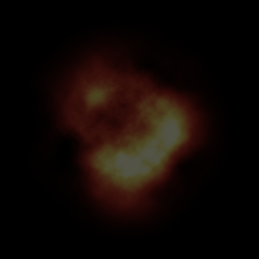
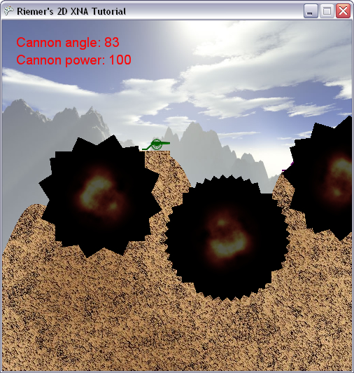

## Particles
With collision detection added to our project, the functionality of our game is almost complete. There are, however, some things lacking, such as a nice explosion whenever the rocket hits the terrain or another cannon.

A few years ago, 2D explosions were nothing else than pre-defined animations. Much like .gif sequences, these contained a number of frames which were being cycled through.

Today, since the available processing power has increased dramatically, both 2D as 3D explosions are built up from many small, very faint fireball images that are being put on top of each other. These small images all start at the explosion origin, and travel in a random direction while they fade away over time. These small images are called particles, and the engine that updates them is the particle system.

The particle we're going to use as building block for our explosions is shown below, and can be downloaded by [right-clicking here](http://www.riemers.net/Downloads/resources/Series2D/explosion.png) ([MS Permissive License applies](http://www.riemers.net/Downloads/resources/Series2D/Microsoft%20Permissive%20License.rtf)). Import it into our project, add a variable:

    Texture2D explosionTexture;

And load it in our LoadContent method:

    explosionTexture = Content.Load<Texture2D> ("explosion");

Notice that the image is mainly black, with a faint fireball image in the center. This will be further discussed at the end of this chapter.

Before we can render the particles, there are a few things about them that we need to keep track of. For example, we need to store their current positions and scaling factors. In order to calculate their next position, we'll need their direction. But that's not all. We want the particles to grow larger and fade out as time goes by, which means for each particle we need to store when it was created, and how long the particle should stay alive before totally disappearing. Finally, since the particles should move very fast in the beginning and slow down at the end, we'll store an acceleration.

To store this data in a nice way, we'll define new struct, ParticleData, which can store all of this data. Add this at the very top of our namespace:

    public struct ParticleData
    {
        public float BirthTime;
        public float MaxAge;        
        public Vector2 OrginalPosition;
        public Vector2 Accelaration;
        public Vector2 Direction;        
        public Vector2 Position;
        public float Scaling;
        public Color ModColor;
    }

We will need a List, capable of storing all active particles, so add this variable to our code:

    List<ParticleData> particleList = new List<ParticleData> ();

Next, we will create a small method, AddExplosion, which will generate a few particles:

    private void AddExplosion(Vector2 explosionPos, int numberOfParticles, float size, float maxAge, GameTime gameTime)
    {
        for (int i = 0; i < numberOfParticles; i++)
            AddExplosionParticle(explosionPos, size, maxAge, gameTime);
    }

Whenever we start a new explosion, there are a few things we want to control. The approach explained in this series gives us full control over the explosion: we will be able to determine where the explosion starts, how many particles we want for one explosion, the maximum size of the explosion, and how long the explosion should take!

The method above simply calls the AddExplosionParticle method a couple of times, which is where the particles are actually being added to the List:

    private void AddExplosionParticle(Vector2 explosionPos, float explosionSize, float maxAge, GameTime gameTime)
    {
        ParticleData particle = new ParticleData();
 
        particle.OrginalPosition = explosionPos;
        particle.Position = particle.OrginalPosition;
 
        particle.BirthTime = (float)gameTime.TotalGameTime.TotalMilliseconds;
        particle.MaxAge = maxAge;
        particle.Scaling = 0.25f;
        particle.ModColor = Color.White;
    }

The method starts by creating a new, empty ParticleData object. There are a few things we can immediately store inside this object. The center position of the explosion can be stored in the OriginalPosition property, and the current (first) position of the particle should be the same center of the explosion.

Next, we can store the birthtime of the particle, which will be needed each frame when we need to determine the age of the particle. The maximum age will determine when the particle should be completely gone. The scaling property will determine the size of the particle, while the ModColor will allow us to make the particle fade away towards the end of its life.

There is one very important property missing: the direction of the particle. If you want to make a realistic particle system, there is one very important word: randomness. Although all particles of one explosion should start at the same position, they should move towards different directions. The only way to obtain a nice result, is to make these directions totally random.

The following code will generate a random direction. Not only the direction itself is random, but also the length:

    float particleDistance = (float)randomizer.NextDouble() * explosionSize;
    Vector2 displacement = new Vector2(particleDistance, 0);
    float angle = MathHelper.ToRadians(randomizer.Next(360));
    displacement = Vector2.Transform(displacement, Matrix.CreateRotationZ(angle));
 
    particle.Direction = displacement;
    particle.Accelaration = 3.0f*particle.Direction;

First, we will start by determining how far the current particle should have travelled at the end of its life. We want a random value, between 0 and the maximum size of the explosion. Such a number is obtained using the first line.

We will use this as length of our direction, the only thing we need to do is rotate this over a random angle. This is done with the next three lines: first we define a Down vector of the length found in the first line. Next, we generate a random angle, and use this random angle to create a rotation matrix, as explained in the "Angle to Direction" chapter. This matrix is used to rotate the Down vector over the random angle.

At this moment, we know exactly how the particle should be displaced at the end of its life. For now, we use this displacement vector as Direction and Accelaration, which is totally wrong as we will see in the next chapter.

Finally, this new particle should be added to the particleList:

    particleList.Add(particle);

That's it for the AddExplosionParticle method. Remember this method is called by the AddExplosion method, which we should call whenever the rocket collides with the terrain or a player. This means the ideal place to call the AddExplosion method is inside our CheckCollisions method, where we've already defined 3 separate if-blocks, each corresponding to a different type of rocket collision.

Go to our CheckCollisions method, and find the first if-block, which is executed in case a collision between the rocket and a player was detected. Inside this if-block, add this line:

    AddExplosion(playerCollisionPoint, 10, 80.0f, 2000.0f, gameTime);

This will cause 10 new particles to be added to our particleList. The size and duration of the explosion don't really matter in this chapter, as we'll be updating our particles in the next chapter.

In the second if-block, add the following line which will start a smaller explosion each time the rocket hits the terrain:

    AddExplosion(terrainCollisionPoint, 4, 30.0f, 1000.0f, gameTime);

In this chapter, we will simply draw our particles to the screen. Since we're not yet updating their positions, they will remain fixed at the collision point. Add the following method to the very end of our code:

    private void DrawExplosion()
    {
        for (int i = 0; i < particleList.Count; i++)
        {
            ParticleData particle = particleList[i];
            spriteBatch.Draw(explosionTexture, particle.Position, null, particle.ModColor, i, new Vector2(256, 256), particle.Scaling, SpriteEffects.None, 1);
        }
    }

Since we are not changing anything inside the particleList, we could also have used a nicer-looking foreach loop. However, the advantage of using a for loop is that we have a variable "i" which is different for each particle. We specify this "i" value as rotation angle for the images, so each explosion particle will be rendered with a different rotation. (Note that 2\*pi=2\*3.14=6.28 radians equals 360 degrees, so 1 radian corresponds to 57 degrees => this means each next particle will be rotated 57 degrees relative to the previous particle.)

Let's not forget to call this from our Draw method, immediately before our call to SpriteBatch.End:

    DrawExplosion();

Now run this code! Whenever your rocket hits the terrain or a player, you should see the particles being rendered to your screen. Note that the result depends on whether you hit the terrain or a player, which is exactly as we defined in our CheckCollisions method.

I agree that this final image is not really what we expect of an explosion. But we're definitely on the right track, and the result will be refined in the next 2 chapters.

Our code thus far:

    using System;
    using System.Collections.Generic;
    using System.Linq;
    using Microsoft.Xna.Framework;
    using Microsoft.Xna.Framework.Audio;
    using Microsoft.Xna.Framework.Content;
    using Microsoft.Xna.Framework.GamerServices;
    using Microsoft.Xna.Framework.Graphics;
    using Microsoft.Xna.Framework.Input;
    using Microsoft.Xna.Framework.Media;

    namespace XNATutorial
    {
        public struct PlayerData
        {
            public Vector2 Position;
            public bool IsAlive;
            public Color Color;
            public float Angle;
            public float Power;
        }

        public struct ParticleData
        {
            public float BirthTime;
            public float MaxAge;
            public Vector2 OrginalPosition;
            public Vector2 Accelaration;
            public Vector2 Direction;
            public Vector2 Position;
            public float Scaling;
            public Color ModColor;
        }

        public class Game1 : Microsoft.Xna.Framework.Game
        {
            GraphicsDeviceManager graphics;
            SpriteBatch spriteBatch;
            GraphicsDevice device;
            Texture2D backgroundTexture;
            Texture2D foregroundTexture;
            Texture2D carriageTexture;
            Texture2D cannonTexture;
            Texture2D rocketTexture;
            Texture2D smokeTexture;
            Texture2D groundTexture;
            Texture2D explosionTexture;
            SpriteFont font;
            int screenWidth;
            int screenHeight;
            PlayerData[] players;
            int numberOfPlayers = 4;
            float playerScaling;
            int currentPlayer = 0;
            bool rocketFlying = false;
            Vector2 rocketPosition;
            Vector2 rocketDirection;
            float rocketAngle;
            float rocketScaling = 0.1f;

            List<Vector2> smokeList = new List<Vector2>();
            Random randomizer = new Random();
            int[] terrainContour;
            Color[,] rocketColorArray;
            Color[,] foregroundColorArray;
            Color[,] carriageColorArray;
            Color[,] cannonColorArray;

            List<ParticleData> particleList = new List<ParticleData>();

            public Game1()
            {
                graphics = new GraphicsDeviceManager(this);
                Content.RootDirectory = "Content";
            }

            protected override void Initialize()
            {
                graphics.PreferredBackBufferWidth = 500;
                graphics.PreferredBackBufferHeight = 500;
                graphics.IsFullScreen = false;
                graphics.ApplyChanges();
                Window.Title = "Riemer's 2D XNA Tutorial";

                base.Initialize();
            }

            private void SetUpPlayers()
            {
                Color[] playerColors = new Color[10];
                playerColors[0] = Color.Red;
                playerColors[1] = Color.Green;
                playerColors[2] = Color.Blue;
                playerColors[3] = Color.Purple;
                playerColors[4] = Color.Orange;
                playerColors[5] = Color.Indigo;
                playerColors[6] = Color.Yellow;
                playerColors[7] = Color.SaddleBrown;
                playerColors[8] = Color.Tomato;
                playerColors[9] = Color.Turquoise;

                players = new PlayerData[numberOfPlayers];
                for (int i = 0; i < numberOfPlayers; i++)
                {
                    players[i].IsAlive = true;
                    players[i].Color = playerColors[i];
                    players[i].Angle = MathHelper.ToRadians(90);
                    players[i].Power = 100;
                    players[i].Position = new Vector2();
                    players[i].Position.X = screenWidth / (numberOfPlayers + 1) * (i + 1);
                    players[i].Position.Y = terrainContour[(int)players[i].Position.X];
                }
            }

            protected override void LoadContent()
            {
                spriteBatch = new SpriteBatch(GraphicsDevice);
                device = graphics.GraphicsDevice;

                backgroundTexture = Content.Load<Texture2D>("background");
                carriageTexture = Content.Load<Texture2D>("carriage");
                cannonTexture = Content.Load<Texture2D>("cannon");
                rocketTexture = Content.Load<Texture2D>("rocket");
                smokeTexture = Content.Load<Texture2D>("smoke");
                groundTexture = Content.Load<Texture2D>("ground");

                explosionTexture = Content.Load<Texture2D>("explosion");

                font = Content.Load<SpriteFont>("myFont");
                screenWidth = device.PresentationParameters.BackBufferWidth;
                screenHeight = device.PresentationParameters.BackBufferHeight;
                playerScaling = 40.0f / (float)carriageTexture.Width;

                GenerateTerrainContour();
                SetUpPlayers();
                FlattenTerrainBelowPlayers();
                CreateForeground();

                rocketColorArray = TextureTo2DArray(rocketTexture);
                carriageColorArray = TextureTo2DArray(carriageTexture);
                cannonColorArray = TextureTo2DArray(cannonTexture);
            }

            private void FlattenTerrainBelowPlayers()
            {
                foreach (PlayerData player in players)
                    if (player.IsAlive)
                        for (int x = 0; x < 40; x++)
                            terrainContour[(int)player.Position.X + x] = terrainContour[(int)player.Position.X];
            }

            private void GenerateTerrainContour()
            {
                terrainContour = new int[screenWidth];

                double rand1 = randomizer.NextDouble() + 1;
                double rand2 = randomizer.NextDouble() + 2;
                double rand3 = randomizer.NextDouble() + 3;

                float offset = screenHeight / 2;
                float peakheight = 100;
                float flatness = 70;

                for (int x = 0; x < screenWidth; x++)
                {
                    double height = peakheight / rand1 * Math.Sin((float)x / flatness * rand1 + rand1);
                    height += peakheight / rand2 * Math.Sin((float)x / flatness * rand2 + rand2);
                    height += peakheight / rand3 * Math.Sin((float)x / flatness * rand3 + rand3);
                    height += offset;
                    terrainContour[x] = (int)height;
                }
            }

            private void CreateForeground()
            {
                Color[,] groundColors = TextureTo2DArray(groundTexture);
                Color[] foregroundColors = new Color[screenWidth * screenHeight];

                for (int x = 0; x < screenWidth; x++)
                {
                    for (int y = 0; y < screenHeight; y++)
                    {
                        if (y > terrainContour[x])
                            foregroundColors[x + y * screenWidth] = groundColors[x % groundTexture.Width, y % groundTexture.Height];
                        else
                            foregroundColors[x + y * screenWidth] = Color.Transparent;
                    }
                }

                foregroundTexture = new Texture2D(device, screenWidth, screenHeight, false, SurfaceFormat.Color);
                foregroundTexture.SetData(foregroundColors);

                foregroundColorArray = TextureTo2DArray(foregroundTexture);
            }

            private Color[,] TextureTo2DArray(Texture2D texture)
            {
                Color[] colors1D = new Color[texture.Width * texture.Height];
                texture.GetData(colors1D);

                Color[,] colors2D = new Color[texture.Width, texture.Height];
                for (int x = 0; x < texture.Width; x++)
                    for (int y = 0; y < texture.Height; y++)
                        colors2D[x, y] = colors1D[x + y * texture.Width];

                return colors2D;
            }

            protected override void UnloadContent()
            {
            }

            protected override void Update(GameTime gameTime)
            {
                if (GamePad.GetState(PlayerIndex.One).Buttons.Back == ButtonState.Pressed)
                    this.Exit();

                ProcessKeyboard();
                UpdateRocket();

                if (rocketFlying)
                {
                    UpdateRocket();
                    CheckCollisions(gameTime);
                }

                base.Update(gameTime);
            }

            private void AddExplosion(Vector2 explosionPos, int numberOfParticles, float size, float maxAge, GameTime gameTime)
            {
                for (int i = 0; i < numberOfParticles; i++)
                    AddExplosionParticle(explosionPos, size, maxAge, gameTime);
            }

            private void AddExplosionParticle(Vector2 explosionPos, float explosionSize, float maxAge, GameTime gameTime)
            {
                ParticleData particle = new ParticleData();

                particle.OrginalPosition = explosionPos;
                particle.Position = particle.OrginalPosition;

                particle.BirthTime = (float)gameTime.TotalGameTime.TotalMilliseconds;
                particle.MaxAge = maxAge;
                particle.Scaling = 0.25f;
                particle.ModColor = Color.White;

                float particleDistance = (float)randomizer.NextDouble() * explosionSize;
                Vector2 displacement = new Vector2(particleDistance, 0);
                float angle = MathHelper.ToRadians(randomizer.Next(360));
                displacement = Vector2.Transform(displacement, Matrix.CreateRotationZ(angle));

                particle.Direction = displacement;
                particle.Accelaration = 3.0f * particle.Direction;

                particleList.Add(particle);
            }

            private void UpdateRocket()
            {
                if (rocketFlying)
                {
                    Vector2 gravity = new Vector2(0, 1);
                    rocketDirection += gravity / 10.0f;
                    rocketPosition += rocketDirection;
                    rocketAngle = (float)Math.Atan2(rocketDirection.X, -rocketDirection.Y);

                    for (int i = 0; i < 5; i++)
                    {
                        Vector2 smokePos = rocketPosition;
                        smokePos.X += randomizer.Next(10) - 5;
                        smokePos.Y += randomizer.Next(10) - 5;
                        smokeList.Add(smokePos);
                    }
                }
            }

            private void ProcessKeyboard()
            {
                KeyboardState keybState = Keyboard.GetState();
                if (keybState.IsKeyDown(Keys.Left))
                    players[currentPlayer].Angle -= 0.01f;
                if (keybState.IsKeyDown(Keys.Right))
                    players[currentPlayer].Angle += 0.01f;

                if (players[currentPlayer].Angle > MathHelper.PiOver2)
                    players[currentPlayer].Angle = -MathHelper.PiOver2;
                if (players[currentPlayer].Angle < -MathHelper.PiOver2)
                    players[currentPlayer].Angle = MathHelper.PiOver2;

                if (keybState.IsKeyDown(Keys.Down))
                    players[currentPlayer].Power -= 1;
                if (keybState.IsKeyDown(Keys.Up))
                    players[currentPlayer].Power += 1;
                if (keybState.IsKeyDown(Keys.PageDown))
                    players[currentPlayer].Power -= 20;
                if (keybState.IsKeyDown(Keys.PageUp))
                    players[currentPlayer].Power += 20;

                if (players[currentPlayer].Power > 1000)
                    players[currentPlayer].Power = 1000;
                if (players[currentPlayer].Power < 0)
                    players[currentPlayer].Power = 0;

                if (keybState.IsKeyDown(Keys.Enter) || keybState.IsKeyDown(Keys.Space))
                {
                    rocketFlying = true;

                    rocketPosition = players[currentPlayer].Position;
                    rocketPosition.X += 20;
                    rocketPosition.Y -= 10;
                    rocketAngle = players[currentPlayer].Angle;
                    Vector2 up = new Vector2(0, -1);
                    Matrix rotMatrix = Matrix.CreateRotationZ(rocketAngle);
                    rocketDirection = Vector2.Transform(up, rotMatrix);
                    rocketDirection *= players[currentPlayer].Power / 50.0f;
                }
            }

            private Vector2 TexturesCollide(Color[,] tex1, Matrix mat1, Color[,] tex2, Matrix mat2)
            {
                Matrix mat1to2 = mat1 * Matrix.Invert(mat2);
                int width1 = tex1.GetLength(0);
                int height1 = tex1.GetLength(1);
                int width2 = tex2.GetLength(0);
                int height2 = tex2.GetLength(1);

                for (int x1 = 0; x1 < width1; x1++)
                {
                    for (int y1 = 0; y1 < height1; y1++)
                    {
                        Vector2 pos1 = new Vector2(x1, y1);
                        Vector2 pos2 = Vector2.Transform(pos1, mat1to2);

                        int x2 = (int)pos2.X;
                        int y2 = (int)pos2.Y;
                        if ((x2 >= 0) && (x2 < width2))
                        {
                            if ((y2 >= 0) && (y2 < height2))
                            {
                                if (tex1[x1, y1].A > 0)
                                {
                                    if (tex2[x2, y2].A > 0)
                                    {
                                        Vector2 screenPos = Vector2.Transform(pos1, mat1);
                                        return screenPos;
                                    }
                                }
                            }
                        }
                    }
                }

                return new Vector2(-1, -1);
            }

            private Vector2 CheckTerrainCollision()
            {
                Matrix rocketMat = Matrix.CreateTranslation(-42, -240, 0) * Matrix.CreateRotationZ(rocketAngle) * Matrix.CreateScale(rocketScaling) * Matrix.CreateTranslation(rocketPosition.X, rocketPosition.Y, 0);
                Matrix terrainMat = Matrix.Identity;
                Vector2 terrainCollisionPoint = TexturesCollide(rocketColorArray, rocketMat, foregroundColorArray, terrainMat);
                return terrainCollisionPoint;
            }

            private Vector2 CheckPlayersCollision()
            {
                Matrix rocketMat = Matrix.CreateTranslation(-42, -240, 0) * Matrix.CreateRotationZ(rocketAngle) * Matrix.CreateScale(rocketScaling) * Matrix.CreateTranslation(rocketPosition.X, rocketPosition.Y, 0);
                for (int i = 0; i < numberOfPlayers; i++)
                {
                    PlayerData player = players[i];
                    if (player.IsAlive)
                    {
                        if (i != currentPlayer)
                        {
                            int xPos = (int)player.Position.X;
                            int yPos = (int)player.Position.Y;

                            Matrix carriageMat = Matrix.CreateTranslation(0, -carriageTexture.Height, 0) * Matrix.CreateScale(playerScaling) * Matrix.CreateTranslation(xPos, yPos, 0);
                            Vector2 carriageCollisionPoint = TexturesCollide(carriageColorArray, carriageMat, rocketColorArray, rocketMat);

                            if (carriageCollisionPoint.X > -1)
                            {
                                players[i].IsAlive = false;
                                return carriageCollisionPoint;
                            }

                            Matrix cannonMat = Matrix.CreateTranslation(-11, -50, 0) * Matrix.CreateRotationZ(player.Angle) * Matrix.CreateScale(playerScaling) * Matrix.CreateTranslation(xPos + 20, yPos - 10, 0);
                            Vector2 cannonCollisionPoint = TexturesCollide(cannonColorArray, cannonMat, rocketColorArray, rocketMat);
                            if (cannonCollisionPoint.X > -1)
                            {
                                players[i].IsAlive = false;
                                return cannonCollisionPoint;
                            }
                        }
                    }
                }
                return new Vector2(-1, -1);
            }

            private bool CheckOutOfScreen()
            {
                bool rocketOutOfScreen = rocketPosition.Y > screenHeight;
                rocketOutOfScreen |= rocketPosition.X < 0;
                rocketOutOfScreen |= rocketPosition.X > screenWidth;

                return rocketOutOfScreen;
            }

            private void CheckCollisions(GameTime gameTime)
            {
                Vector2 terrainCollisionPoint = CheckTerrainCollision();
                Vector2 playerCollisionPoint = CheckPlayersCollision();
                bool rocketOutOfScreen = CheckOutOfScreen();

                if (playerCollisionPoint.X > -1)
                {
                    rocketFlying = false;

                    smokeList = new List<Vector2>(); AddExplosion(playerCollisionPoint, 10, 80.0f, 2000.0f, gameTime);

                    NextPlayer();
                }

                if (terrainCollisionPoint.X > -1)
                {
                    rocketFlying = false;

                    smokeList = new List<Vector2>(); AddExplosion(terrainCollisionPoint, 4, 30.0f, 1000.0f, gameTime);

                    NextPlayer();
                }

                if (rocketOutOfScreen)
                {
                    rocketFlying = false;

                    smokeList = new List<Vector2>();
                    NextPlayer();
                }
            }

            private void NextPlayer()
            {
                currentPlayer = currentPlayer + 1;
                currentPlayer = currentPlayer % numberOfPlayers;
                while (!players[currentPlayer].IsAlive)
                    currentPlayer = ++currentPlayer % numberOfPlayers;
            }

            protected override void Draw(GameTime gameTime)
            {
                GraphicsDevice.Clear(Color.CornflowerBlue);

                spriteBatch.Begin();
                DrawScenery();
                DrawPlayers();
                DrawText();
                DrawRocket();
                DrawSmoke();

                DrawExplosion();
                spriteBatch.End();

                base.Draw(gameTime);
            }

            private void DrawScenery()
            {
                Rectangle screenRectangle = new Rectangle(0, 0, screenWidth, screenHeight);
                spriteBatch.Draw(backgroundTexture, screenRectangle, Color.White);
                spriteBatch.Draw(foregroundTexture, screenRectangle, Color.White);
            }

            private void DrawPlayers()
            {
                foreach (PlayerData player in players)
                {
                    if (player.IsAlive)
                    {
                        int xPos = (int)player.Position.X;
                        int yPos = (int)player.Position.Y;
                        Vector2 cannonOrigin = new Vector2(11, 50);

                        spriteBatch.Draw(cannonTexture, new Vector2(xPos + 20, yPos - 10), null, player.Color, player.Angle, cannonOrigin, playerScaling, SpriteEffects.None, 1);
                        spriteBatch.Draw(carriageTexture, player.Position, null, player.Color, 0, new Vector2(0, carriageTexture.Height), playerScaling, SpriteEffects.None, 0);
                    }
                }
            }

            private void DrawText()
            {
                PlayerData player = players[currentPlayer];
                int currentAngle = (int)MathHelper.ToDegrees(player.Angle);
                spriteBatch.DrawString(font, "Cannon angle: " + currentAngle.ToString(), new Vector2(20, 20), player.Color);
                spriteBatch.DrawString(font, "Cannon power: " + player.Power.ToString(), new Vector2(20, 45), player.Color);
            }

            private void DrawRocket()
            {
                if (rocketFlying)
                    spriteBatch.Draw(rocketTexture, rocketPosition, null, players[currentPlayer].Color, rocketAngle, new Vector2(42, 240), 0.1f, SpriteEffects.None, 1);
            }

            private void DrawSmoke()
            {
                foreach (Vector2 smokePos in smokeList)
                    spriteBatch.Draw(smokeTexture, smokePos, null, Color.White, 0, new Vector2(40, 35), 0.2f, SpriteEffects.None, 1);
            }

            private void DrawExplosion()
            {
                for (int i = 0; i < particleList.Count; i++)
                {
                    ParticleData particle = particleList[i];
                    spriteBatch.Draw(explosionTexture, particle.Position, null, particle.ModColor, i, new Vector2(256, 256), particle.Scaling, SpriteEffects.None, 1);
                }
            }
        }
    }