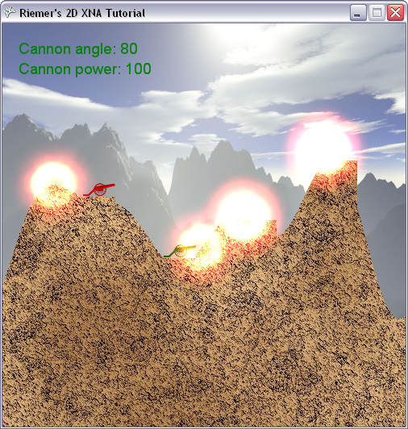

## Additive alpha blending
The major issue with the result of last chapter is that the explosion images are rendered in full to the screen, exactly as they are defined in the image file. As a result, their black borders are rendered on top of the contents already present in the backbuffer of our graphics card. This chapter, we will fix this by turning additive alpha blending on before the particles are rendered.

First a few words about alpha blending. In alpha blending, you are interested in obtaining the new color for a pixel, given the following 2 colors:

- The SourceColor: The new color, coming from the image that is currently being drawn.
- The DestinationColor: The color for that pixel that was already present in the backbuffer and is about to be overwritten.

Both colors are mixed together to obtain the new color for the pixel. In XNA, both the SourceColor and DestinationColor are multiplied by a factor:

__NewColor = SrcBlend\*SrcColor + DestBlend\*DestColor__

Both SrcBlend and DestBlend can be defined by us. By default, XNA expects the images to contain transparency information for each pixel. Next to the R,G and B channel, each color has the A (Alpha) channel, which contains the transparency information. Some image formats (like PNG) store this information, other (like JPG) don't.

Which brings us to the __default alpha blending in XNA__. By default, the SpriteBatch uses this Alpha value as SrcBlend factor. The inverse value, (1-SrcBlend) is used as DestBlend:

__NewColor = SrcAlpha\*SrcColor + (1-SrcAlpha)\*DestColor__

An example is the image of our carriage, which is not transparent in each pixel of the carriage, and is fully transparent in each other pixel. So for the pixels of our carriage, we get this:

__NewColor = 1\*SrcColor + 0\*DestColor__

__NewColor = SrcColor__

Which means that the carriage pixels will completely overwrite the colors already present in the backbuffer, exactly as it should be.

For the other pixels of the image, where A=0, we get this:

__NewColor = 0\*SrcColor + 1\*DestColor__

__NewColor = DestColor__

So these pixels will not change anything to the backbuffer. The pixels with Alpha values between 0 and 1 will receive a mix of new (source) and old (destination) colors.

Enough about alpha blending for now, let's discuss the case of our explosion particles. Before rendering them, we will change our SrcBlend and DestBlend in such a way that XNA will add the colors inside the explosion images to the colors already present in the backbuffer.

Let's see how this works. Note the large black sections in our explosion image. Black is actually not a color at all, it is a total lack of colors: R,G,B = 0,0,0. So when we add this color to the color already in the backbuffer, this will have no impact. The more we get to the center of the image, the more red-yellow the image becomes. These pixels, when rendered, will add their R,G,B values to the colors already present in the backbuffer. When we render a lot of them on top of each other, in the center we will end up with a bright white-yellow spot in the center, caused by the colors of all explosion images added together!

The only question that remains is: how do we add all the colors of all images together? The answer is in setting both blending factors to 1:

__NewColor = 1\*SrcColor + 1\*DestColor__

__NewColor = SrcColor + DestColor__

Let's see what happens. The moment before rendering the explosion images, the backbuffer already contains the scenery and cannons. Now when the first image is drawn, its colors are added to the corresponding pixels in the backbuffer. As a result, a region in the backbuffer corresponding to the center of the explosion will have gained some yellow and red.

Now when the second particle is rendered, its colors are once again added to the backbuffer. After the second particle has been rendered, the backbuffer will already show a visible increase in yellow and red. This yellow-red glow will be increased after each particle is rendered.

So how do we set these blending factors to 1? We can set these values in XNA by setting these lines before rendering anything: (you don't have to put this code)

    BlendState blendState = new BlendState();
    blendState.AlphaSourceBlend = Blend.One;
    blendState.AlphaDestinationBlend = Blend.One;
    blendState.ColorBlendFunction = BlendFunction.Add;
    device.BlendState = blendState;

However, the SpriteBatch has built-in Additive Blending functionality, since this is used quite often in 2D game programming. It can be enabled in the SpriteBatch.Begin method. However, once you specify Additive Blending in the SpriteBatch.Begin method, all images you render will be drawn this way (unless you specify SpriteSortMode.Deferred, as explained in Recipe 3-4), while we only want to enable Additive Blending for our explosion images.

This can be solved using a second SpriteBatch. Or, since we want to render our explosion particles as last element of our scene, we will render our explosion images in a separate SpriteBatch.Begin … SpriteBatch.End block:

    spriteBatch.Begin();
    DrawScenery();
    DrawPlayers();
    DrawText();
    DrawRocket();
    DrawSmoke();
    spriteBatch.End();
 
    spriteBatch.Begin(SpriteSortMode.Deferred, BlendState.Additive);
    DrawExplosion();
    spriteBatch.End();

After our SpriteBatch has finished rendering our main scene with the default settings, we start it again with Additive Blending enabled. Using this setting, we only render our explosion particles, effectively adding the colors of all our explosion images to the scene that was already present in the backbuffer. More information about the other options of all arguments would require a lot more pages, which I've written in the first 4 Recipes of Chapter 3 of my book.

When you run this code, your explosions should look a lot smoother, as shown in the image below:

Our code at this moment:

    using System;
    using System.Collections.Generic;
    using System.Linq;
    using Microsoft.Xna.Framework;
    using Microsoft.Xna.Framework.Audio;
    using Microsoft.Xna.Framework.Content;
    using Microsoft.Xna.Framework.GamerServices;
    using Microsoft.Xna.Framework.Graphics;
    using Microsoft.Xna.Framework.Input;
    using Microsoft.Xna.Framework.Media;

    namespace XNATutorial
    {
        public struct PlayerData
        {
            public Vector2 Position;
            public bool IsAlive;
            public Color Color;
            public float Angle;
            public float Power;
        }

        public struct ParticleData
        {
            public float BirthTime;
            public float MaxAge;
            public Vector2 OrginalPosition;
            public Vector2 Accelaration;
            public Vector2 Direction;
            public Vector2 Position;
            public float Scaling;
            public Color ModColor;
        }

        public class Game1 : Microsoft.Xna.Framework.Game
        {
            GraphicsDeviceManager graphics;
            SpriteBatch spriteBatch;
            GraphicsDevice device;
            Texture2D backgroundTexture;
            Texture2D foregroundTexture;
            Texture2D carriageTexture;
            Texture2D cannonTexture;
            Texture2D rocketTexture;
            Texture2D smokeTexture;
            Texture2D groundTexture;
            Texture2D explosionTexture;
            SpriteFont font;
            int screenWidth;
            int screenHeight;
            PlayerData[] players;
            int numberOfPlayers = 4;
            float playerScaling;
            int currentPlayer = 0;
            bool rocketFlying = false;
            Vector2 rocketPosition;
            Vector2 rocketDirection;
            float rocketAngle;
            float rocketScaling = 0.1f;

            List<Vector2> smokeList = new List<Vector2>();
            Random randomizer = new Random();
            int[] terrainContour;
            Color[,] rocketColorArray;
            Color[,] foregroundColorArray;
            Color[,] carriageColorArray;
            Color[,] cannonColorArray;

            List<ParticleData> particleList = new List<ParticleData>();
            public Game1()
            {
                graphics = new GraphicsDeviceManager(this);
                Content.RootDirectory = "Content";
            }

            protected override void Initialize()
            {
                graphics.PreferredBackBufferWidth = 500;
                graphics.PreferredBackBufferHeight = 500;
                graphics.IsFullScreen = false;
                graphics.ApplyChanges();
                Window.Title = "Riemer's 2D XNA Tutorial";

                base.Initialize();
            }

            private void SetUpPlayers()
            {
                Color[] playerColors = new Color[10];
                playerColors[0] = Color.Red;
                playerColors[1] = Color.Green;
                playerColors[2] = Color.Blue;
                playerColors[3] = Color.Purple;
                playerColors[4] = Color.Orange;
                playerColors[5] = Color.Indigo;
                playerColors[6] = Color.Yellow;
                playerColors[7] = Color.SaddleBrown;
                playerColors[8] = Color.Tomato;
                playerColors[9] = Color.Turquoise;

                players = new PlayerData[numberOfPlayers];
                for (int i = 0; i < numberOfPlayers; i++)
                {
                    players[i].IsAlive = true;
                    players[i].Color = playerColors[i];
                    players[i].Angle = MathHelper.ToRadians(90);
                    players[i].Power = 100;
                    players[i].Position = new Vector2();
                    players[i].Position.X = screenWidth / (numberOfPlayers + 1) * (i + 1);
                    players[i].Position.Y = terrainContour[(int)players[i].Position.X];
                }
            }

            protected override void LoadContent()
            {
                spriteBatch = new SpriteBatch(GraphicsDevice);
                device = graphics.GraphicsDevice;

                backgroundTexture = Content.Load<Texture2D>("background");
                carriageTexture = Content.Load<Texture2D>("carriage");
                cannonTexture = Content.Load<Texture2D>("cannon");
                rocketTexture = Content.Load<Texture2D>("rocket");
                smokeTexture = Content.Load<Texture2D>("smoke");
                groundTexture = Content.Load<Texture2D>("ground");
                explosionTexture = Content.Load<Texture2D>("explosion");
                font = Content.Load<SpriteFont>("myFont");
                screenWidth = device.PresentationParameters.BackBufferWidth;
                screenHeight = device.PresentationParameters.BackBufferHeight;
                playerScaling = 40.0f / (float)carriageTexture.Width;

                GenerateTerrainContour();
                SetUpPlayers();
                FlattenTerrainBelowPlayers();
                CreateForeground();

                rocketColorArray = TextureTo2DArray(rocketTexture);
                carriageColorArray = TextureTo2DArray(carriageTexture);
                cannonColorArray = TextureTo2DArray(cannonTexture);
            }

            private void FlattenTerrainBelowPlayers()
            {
                foreach (PlayerData player in players)
                    if (player.IsAlive)
                        for (int x = 0; x < 40; x++)
                            terrainContour[(int)player.Position.X + x] = terrainContour[(int)player.Position.X];
            }

            private void GenerateTerrainContour()
            {
                terrainContour = new int[screenWidth];

                double rand1 = randomizer.NextDouble() + 1;
                double rand2 = randomizer.NextDouble() + 2;
                double rand3 = randomizer.NextDouble() + 3;

                float offset = screenHeight / 2;
                float peakheight = 100;
                float flatness = 70;

                for (int x = 0; x < screenWidth; x++)
                {
                    double height = peakheight / rand1 * Math.Sin((float)x / flatness * rand1 + rand1);
                    height += peakheight / rand2 * Math.Sin((float)x / flatness * rand2 + rand2);
                    height += peakheight / rand3 * Math.Sin((float)x / flatness * rand3 + rand3);
                    height += offset;
                    terrainContour[x] = (int)height;
                }
            }

            private void CreateForeground()
            {
                Color[,] groundColors = TextureTo2DArray(groundTexture);
                Color[] foregroundColors = new Color[screenWidth * screenHeight];

                for (int x = 0; x < screenWidth; x++)
                {
                    for (int y = 0; y < screenHeight; y++)
                    {
                        if (y > terrainContour[x])
                            foregroundColors[x + y * screenWidth] = groundColors[x % groundTexture.Width, y % groundTexture.Height];
                        else
                            foregroundColors[x + y * screenWidth] = Color.Transparent;
                    }
                }

                foregroundTexture = new Texture2D(device, screenWidth, screenHeight, false, SurfaceFormat.Color);
                foregroundTexture.SetData(foregroundColors);

                foregroundColorArray = TextureTo2DArray(foregroundTexture);
            }

            private Color[,] TextureTo2DArray(Texture2D texture)
            {
                Color[] colors1D = new Color[texture.Width * texture.Height];
                texture.GetData(colors1D);

                Color[,] colors2D = new Color[texture.Width, texture.Height];
                for (int x = 0; x < texture.Width; x++)
                    for (int y = 0; y < texture.Height; y++)
                        colors2D[x, y] = colors1D[x + y * texture.Width];

                return colors2D;
            }

            protected override void UnloadContent()
            {
            }

            protected override void Update(GameTime gameTime)
            {
                if (GamePad.GetState(PlayerIndex.One).Buttons.Back == ButtonState.Pressed)
                    this.Exit();

                ProcessKeyboard();
                UpdateRocket();

                if (rocketFlying)
                {
                    UpdateRocket();
                    CheckCollisions(gameTime);
                }

                base.Update(gameTime);
            }

            private void AddExplosion(Vector2 explosionPos, int numberOfParticles, float size, float maxAge, GameTime gameTime)
            {
                for (int i = 0; i < numberOfParticles; i++)
                    AddExplosionParticle(explosionPos, size, maxAge, gameTime);
            }

            private void AddExplosionParticle(Vector2 explosionPos, float explosionSize, float maxAge, GameTime gameTime)
            {
                ParticleData particle = new ParticleData();

                particle.OrginalPosition = explosionPos;
                particle.Position = particle.OrginalPosition;

                particle.BirthTime = (float)gameTime.TotalGameTime.TotalMilliseconds;
                particle.MaxAge = maxAge;
                particle.Scaling = 0.25f;
                particle.ModColor = Color.White;

                float particleDistance = (float)randomizer.NextDouble() * explosionSize;
                Vector2 displacement = new Vector2(particleDistance, 0);
                float angle = MathHelper.ToRadians(randomizer.Next(360));
                displacement = Vector2.Transform(displacement, Matrix.CreateRotationZ(angle));

                particle.Direction = displacement;
                particle.Accelaration = 3.0f * particle.Direction;

                particleList.Add(particle);
            }

            private void UpdateRocket()
            {
                if (rocketFlying)
                {
                    Vector2 gravity = new Vector2(0, 1);
                    rocketDirection += gravity / 10.0f;
                    rocketPosition += rocketDirection;
                    rocketAngle = (float)Math.Atan2(rocketDirection.X, -rocketDirection.Y);

                    for (int i = 0; i < 5; i++)
                    {
                        Vector2 smokePos = rocketPosition;
                        smokePos.X += randomizer.Next(10) - 5;
                        smokePos.Y += randomizer.Next(10) - 5;
                        smokeList.Add(smokePos);
                    }
                }
            }

            private void ProcessKeyboard()
            {
                KeyboardState keybState = Keyboard.GetState();
                if (keybState.IsKeyDown(Keys.Left))
                    players[currentPlayer].Angle -= 0.01f;
                if (keybState.IsKeyDown(Keys.Right))
                    players[currentPlayer].Angle += 0.01f;

                if (players[currentPlayer].Angle > MathHelper.PiOver2)
                    players[currentPlayer].Angle = -MathHelper.PiOver2;
                if (players[currentPlayer].Angle < -MathHelper.PiOver2)
                    players[currentPlayer].Angle = MathHelper.PiOver2;

                if (keybState.IsKeyDown(Keys.Down))
                    players[currentPlayer].Power -= 1;
                if (keybState.IsKeyDown(Keys.Up))
                    players[currentPlayer].Power += 1;
                if (keybState.IsKeyDown(Keys.PageDown))
                    players[currentPlayer].Power -= 20;
                if (keybState.IsKeyDown(Keys.PageUp))
                    players[currentPlayer].Power += 20;

                if (players[currentPlayer].Power > 1000)
                    players[currentPlayer].Power = 1000;
                if (players[currentPlayer].Power < 0)
                    players[currentPlayer].Power = 0;

                if (keybState.IsKeyDown(Keys.Enter) || keybState.IsKeyDown(Keys.Space))
                {
                    rocketFlying = true;

                    rocketPosition = players[currentPlayer].Position;
                    rocketPosition.X += 20;
                    rocketPosition.Y -= 10;
                    rocketAngle = players[currentPlayer].Angle;
                    Vector2 up = new Vector2(0, -1);
                    Matrix rotMatrix = Matrix.CreateRotationZ(rocketAngle);
                    rocketDirection = Vector2.Transform(up, rotMatrix);
                    rocketDirection *= players[currentPlayer].Power / 50.0f;
                }
            }

            private Vector2 TexturesCollide(Color[,] tex1, Matrix mat1, Color[,] tex2, Matrix mat2)
            {
                Matrix mat1to2 = mat1 * Matrix.Invert(mat2);
                int width1 = tex1.GetLength(0);
                int height1 = tex1.GetLength(1);
                int width2 = tex2.GetLength(0);
                int height2 = tex2.GetLength(1);

                for (int x1 = 0; x1 < width1; x1++)
                {
                    for (int y1 = 0; y1 < height1; y1++)
                    {
                        Vector2 pos1 = new Vector2(x1, y1);
                        Vector2 pos2 = Vector2.Transform(pos1, mat1to2);

                        int x2 = (int)pos2.X;
                        int y2 = (int)pos2.Y;
                        if ((x2 >= 0) && (x2 < width2))
                        {
                            if ((y2 >= 0) && (y2 < height2))
                            {
                                if (tex1[x1, y1].A > 0)
                                {
                                    if (tex2[x2, y2].A > 0)
                                    {
                                        Vector2 screenPos = Vector2.Transform(pos1, mat1);
                                        return screenPos;
                                    }
                                }
                            }
                        }
                    }
                }

                return new Vector2(-1, -1);
            }

            private Vector2 CheckTerrainCollision()
            {
                Matrix rocketMat = Matrix.CreateTranslation(-42, -240, 0) * Matrix.CreateRotationZ(rocketAngle) * Matrix.CreateScale(rocketScaling) * Matrix.CreateTranslation(rocketPosition.X, rocketPosition.Y, 0);
                Matrix terrainMat = Matrix.Identity;
                Vector2 terrainCollisionPoint = TexturesCollide(rocketColorArray, rocketMat, foregroundColorArray, terrainMat);
                return terrainCollisionPoint;
            }

            private Vector2 CheckPlayersCollision()
            {
                Matrix rocketMat = Matrix.CreateTranslation(-42, -240, 0) * Matrix.CreateRotationZ(rocketAngle) * Matrix.CreateScale(rocketScaling) * Matrix.CreateTranslation(rocketPosition.X, rocketPosition.Y, 0);
                for (int i = 0; i < numberOfPlayers; i++)
                {
                    PlayerData player = players[i];
                    if (player.IsAlive)
                    {
                        if (i != currentPlayer)
                        {
                            int xPos = (int)player.Position.X;
                            int yPos = (int)player.Position.Y;

                            Matrix carriageMat = Matrix.CreateTranslation(0, -carriageTexture.Height, 0) * Matrix.CreateScale(playerScaling) * Matrix.CreateTranslation(xPos, yPos, 0);
                            Vector2 carriageCollisionPoint = TexturesCollide(carriageColorArray, carriageMat, rocketColorArray, rocketMat);

                            if (carriageCollisionPoint.X > -1)
                            {
                                players[i].IsAlive = false;
                                return carriageCollisionPoint;
                            }

                            Matrix cannonMat = Matrix.CreateTranslation(-11, -50, 0) * Matrix.CreateRotationZ(player.Angle) * Matrix.CreateScale(playerScaling) * Matrix.CreateTranslation(xPos + 20, yPos - 10, 0);
                            Vector2 cannonCollisionPoint = TexturesCollide(cannonColorArray, cannonMat, rocketColorArray, rocketMat);
                            if (cannonCollisionPoint.X > -1)
                            {
                                players[i].IsAlive = false;
                                return cannonCollisionPoint;
                            }
                        }
                    }
                }
                return new Vector2(-1, -1);
            }

            private bool CheckOutOfScreen()
            {
                bool rocketOutOfScreen = rocketPosition.Y > screenHeight;
                rocketOutOfScreen |= rocketPosition.X < 0;
                rocketOutOfScreen |= rocketPosition.X > screenWidth;

                return rocketOutOfScreen;
            }

            private void CheckCollisions(GameTime gameTime)
            {
                Vector2 terrainCollisionPoint = CheckTerrainCollision();
                Vector2 playerCollisionPoint = CheckPlayersCollision();
                bool rocketOutOfScreen = CheckOutOfScreen();

                if (playerCollisionPoint.X > -1)
                {
                    rocketFlying = false;

                    smokeList = new List<Vector2>(); AddExplosion(playerCollisionPoint, 10, 80.0f, 2000.0f, gameTime);

                    NextPlayer();
                }

                if (terrainCollisionPoint.X > -1)
                {
                    rocketFlying = false;

                    smokeList = new List<Vector2>(); AddExplosion(terrainCollisionPoint, 4, 30.0f, 1000.0f, gameTime);

                    NextPlayer();
                }

                if (rocketOutOfScreen)
                {
                    rocketFlying = false;

                    smokeList = new List<Vector2>();
                    NextPlayer();
                }
            }

            private void NextPlayer()
            {
                currentPlayer = currentPlayer + 1;
                currentPlayer = currentPlayer % numberOfPlayers;
                while (!players[currentPlayer].IsAlive)
                    currentPlayer = ++currentPlayer % numberOfPlayers;
            }

            protected override void Draw(GameTime gameTime)
            {
                GraphicsDevice.Clear(Color.CornflowerBlue);

                spriteBatch.Begin();
                DrawScenery();
                DrawPlayers();
                DrawText();
                DrawRocket();
                DrawSmoke();
                spriteBatch.End();

                spriteBatch.Begin(SpriteSortMode.Deferred, BlendState.Additive);
                DrawExplosion();
                spriteBatch.End();

                base.Draw(gameTime);
            }

            private void DrawScenery()
            {
                Rectangle screenRectangle = new Rectangle(0, 0, screenWidth, screenHeight);
                spriteBatch.Draw(backgroundTexture, screenRectangle, Color.White);
                spriteBatch.Draw(foregroundTexture, screenRectangle, Color.White);
            }

            private void DrawPlayers()
            {
                foreach (PlayerData player in players)
                {
                    if (player.IsAlive)
                    {
                        int xPos = (int)player.Position.X;
                        int yPos = (int)player.Position.Y;
                        Vector2 cannonOrigin = new Vector2(11, 50);

                        spriteBatch.Draw(cannonTexture, new Vector2(xPos + 20, yPos - 10), null, player.Color, player.Angle, cannonOrigin, playerScaling, SpriteEffects.None, 1);
                        spriteBatch.Draw(carriageTexture, player.Position, null, player.Color, 0, new Vector2(0, carriageTexture.Height), playerScaling, SpriteEffects.None, 0);
                    }
                }
            }

            private void DrawText()
            {
                PlayerData player = players[currentPlayer];
                int currentAngle = (int)MathHelper.ToDegrees(player.Angle);
                spriteBatch.DrawString(font, "Cannon angle: " + currentAngle.ToString(), new Vector2(20, 20), player.Color);
                spriteBatch.DrawString(font, "Cannon power: " + player.Power.ToString(), new Vector2(20, 45), player.Color);
            }

            private void DrawRocket()
            {
                if (rocketFlying)
                    spriteBatch.Draw(rocketTexture, rocketPosition, null, players[currentPlayer].Color, rocketAngle, new Vector2(42, 240), 0.1f, SpriteEffects.None, 1);
            }

            private void DrawSmoke()
            {
                foreach (Vector2 smokePos in smokeList)
                    spriteBatch.Draw(smokeTexture, smokePos, null, Color.White, 0, new Vector2(40, 35), 0.2f, SpriteEffects.None, 1);
            }

            private void DrawExplosion()
            {
                for (int i = 0; i < particleList.Count; i++)
                {
                    ParticleData particle = particleList[i];
                    spriteBatch.Draw(explosionTexture, particle.Position, null, particle.ModColor, i, new Vector2(256, 256), particle.Scaling, SpriteEffects.None, 1);
                }
            }
        }
    }