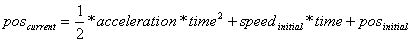
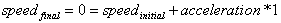
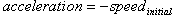
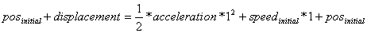
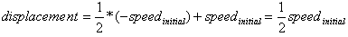
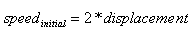
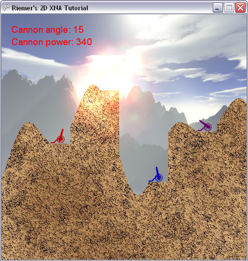

## Particle engine
At this moment, whenever the rocket hits the terrain or a player, some particles are created, added to a list and rendered to the screen using additive alpha blending. However, the particles aren't moving yet, which is what we're going to solve this chapter.

60 times per second, we're going to re-calculate the current position of each particle. The current position of any object can be calculated from 3 properties:

- __The initial position__: this is the position of the particle at the very beginning of its life.
- __The initial speed__ (in 2D also called __direction__ or velocity): the speed defines _how much the position should be changed each second_.
- __The acceleration__: the acceleration defines __how much the speed should be changed each second__.

Very nice, let's go over this list again and apply it to the particles of our explosion:

- The initial position: this is the center of our explosion, the position on the screen where the collision happened
- The initial speed (direction): for an explosion, the speed of the particles should be very at the beginning. In a 2D game, since the position has an X and Y component, the speed also has an X and Y component.
- __The acceleration__: since the particles start at a high speed, we want them to slow down over time so their speed reaches 0 at the end of the particle's life. As you should feel, and as shown later, this means that the direction of the speed should be the opposite of the direction of the speed.

As I told you, based on the initial position, the initial speed and the acceleration you can find the current position. This is done using the formula below:

We will code a new method, UpdateParticles, which scrolls through our List of particles and updates their positions accordingly. Start with this code:

    private void UpdateParticles(GameTime gameTime)
    {
        float now = (float)gameTime.TotalGameTime.TotalMilliseconds;
        for (int i = particleList.Count - 1; i >= 0; i--)
        {
            ParticleData particle = particleList[i];
            float timeAlive = now - particle.BirthTime;

            if (timeAlive > particle.MaxAge)
            {
                particleList.RemoveAt(i);
            }
            else
            {
                //update current particle
            }
        }
    }

This method first stores the current game time in 'now'. Next, it scrolls through all particles, and finds the current age of each particle. If the particle is older than its maximum age, we delete it from our List.

Note that the List is scrolled backwards. This has to do with deleting an object in a List: if you delete an object i, all objects following i jump one place forward, so i+1 becomes i and i+2 becomes i+1. Now, if you would be scrolling forward, the next iteration you check object i+1, which means you have skipped one object.

Let's now replace that line of comment with some actual code. In case the particle is not too old, we should update its position. Using the formula above, this is rather simple. However, when working with time, we usually want to scale the time to a value between 0 and 1, where 0 means 'begin' and 1 means 'end'. This will make a lot of the calculations a lot easier as you'll see at the end of the chapter. We'll call this value between 0 and 1 the 'relative time', relTime in short. It can be found quite easily, as follows:

    float relAge = timeAlive / particle.MaxAge;

Check for yourself that this is 0 at timeAlive = 0 and 1 when timeAlive = MaxAge.

We'll use this value as the time in the formula above, which becomes:

    particle.Position = 0.5f * particle.Accelaration * relAge * relAge + particle.Direction * relAge + particle.OrginalPosition;

Check for yourself that this is exactly the formula shown above. This code will correctly update the position of each particle, every time the method is called. But that's not all we want to change: we also want to update the transparency and scale of our image. As the particle gets closer to its end, we want the particle to fade away, and to grow larger. Both effect combined together will make sure the particles fade smoothly away.

We can made the particles fade away by reducing their color strength. Remember that the colors of our particles are all added together and added to the scene. Now, before this is being done, we will decrease their color values, by multiplying them with a value smaller than 1, between 1 and 0.

Remember from one of the first chapters that they are already being multiplied by the modulation color. This is exactly what we're going to use: in the beginning of a particle, we will multiply its colors by the modulation color (1,1,1,1) white. When it's halfway, we will multiply it by color (0.5, 0.5, 0.5, 0.5) and at the very end we will multiply it by color (0,0,0,0), which makes sure the effect has absolutely zero effect in the final screen.

For this, we need to find this value that starts at 1 and ends at 0. This is easy to find, since we already have a time value that starts at 0 and ends at 1:

    float invAge = 1.0f - relAge;
    particle.ModColor = new Color(new Vector4(invAge, invAge, invAge, invAge));

Check in our DrawExplosion method that each particle is using this color as modulation color:

    spriteBatch.Draw(explosionTexture, particle.Position, null, particle.ModColor, i, new Vector2(256, 256), particle.Scaling, SpriteEffects.None, 1);

Next, we need to make sure the particle grows as it nears its end. We will make its size depend on its distance from the origin: the further away from the origin, the larger the particle should be.

    Vector2 positionFromCenter = particle.Position - particle.OrginalPosition;
    float distance = positionFromCenter.Length();
    particle.Scaling = (50.0f + distance) / 200.0f;

The first 2 lines calculate the distance between the current and the original position of the particle. This distance is used to determine the current size of the particle. The 50.0f pixels offset is required, otherwise the scaling would be 0 at the beginning where distance equals 0. The actual values of 50 and 200 were found by experimenting. When the distance is 150 pixels, the scaling will be equal 1.

That's it for the logic of our UpdateParticles method! Each time the method is called, the position, modulation color and size of each particle is updated. We still need to save the updated particle back into our List:

    particleList[i] = particle;

Let's also call this method from within our Update method, so the particles are updated exactly 60 times each second:

    if (particleList.Count > 0)
        UpdateParticles(gameTime);

And as a minor adjustment, let's read out our keyboard only when the rocket is not flying and when there is no explosion active. This will make sure the player cannot change his cannon angle or power after he's launched the rocket.

When you run this code, your explosions should look finished!

However, when you take a close look at them (especially the larger explosions), you'll notice some things are not 100% correct: towards the end of the explosion, your particles are going faster and faster! Even worse, their final positions don't respect the explosion size you specified.

This is because in our AddExplosionParticle method, we chose the Direction and Acceleration of our particles without thinking about them. We just need to think them over again, and everything will be nice.

There are 2 constraints that help us find the correct values. At the end of our explosions (when relAge=1), we want:

- the final speed to be exactly 0
- the final position should be the starting position + the "displacement" vector calculated in our AddExplosionParticle

Let's put this in some formulas. Since acceleration defines the change in speed over time, and relAge = 1 at the end of the particle, we can write the first constraint like this:

Or

Which means we just need to find the initial speed. Let's write the second constraint in a formula:

We can drop the posInitial at both sides, and replace the acceleration with our first constraint:

Or

That's all we needed to know! Go to our AddExplosionParticle, and replace these lines so they reflect what we just calculated:

    particle.Direction = displacement * 2.0f;
    particle.Accelaration = -particle.Direction;

Now when you run this code, you'll notice your explosion grows as large as we defined in the explosionSize variable, and slows down until its speed reaches 0 at the end of its life!

Our code thus far:

    using System;
    using System.Collections.Generic;
    using System.Linq;
    using Microsoft.Xna.Framework;
    using Microsoft.Xna.Framework.Audio;
    using Microsoft.Xna.Framework.Content;
    using Microsoft.Xna.Framework.GamerServices;
    using Microsoft.Xna.Framework.Graphics;
    using Microsoft.Xna.Framework.Input;
    using Microsoft.Xna.Framework.Media;

    namespace XNATutorial
    {
        public struct PlayerData
        {
            public Vector2 Position;
            public bool IsAlive;
            public Color Color;
            public float Angle;
            public float Power;
        }

        public struct ParticleData
        {
            public float BirthTime;
            public float MaxAge;
            public Vector2 OrginalPosition;
            public Vector2 Accelaration;
            public Vector2 Direction;
            public Vector2 Position;
            public float Scaling;
            public Color ModColor;
        }

        public class Game1 : Microsoft.Xna.Framework.Game
        {
            GraphicsDeviceManager graphics;
            SpriteBatch spriteBatch;
            GraphicsDevice device;
            Texture2D backgroundTexture;
            Texture2D foregroundTexture;
            Texture2D carriageTexture;
            Texture2D cannonTexture;
            Texture2D rocketTexture;
            Texture2D smokeTexture;
            Texture2D groundTexture;
            Texture2D explosionTexture;
            SpriteFont font;
            int screenWidth;
            int screenHeight;
            PlayerData[] players;
            int numberOfPlayers = 4;
            float playerScaling;
            int currentPlayer = 0;
            bool rocketFlying = false;
            Vector2 rocketPosition;
            Vector2 rocketDirection;
            float rocketAngle;
            float rocketScaling = 0.1f;

            List<Vector2> smokeList = new List<Vector2>();
            Random randomizer = new Random();
            int[] terrainContour;
            Color[,] rocketColorArray;
            Color[,] foregroundColorArray;
            Color[,] carriageColorArray;
            Color[,] cannonColorArray;

            List<ParticleData> particleList = new List<ParticleData>();
            public Game1()
            {
                graphics = new GraphicsDeviceManager(this);
                Content.RootDirectory = "Content";
            }

            protected override void Initialize()
            {
                graphics.PreferredBackBufferWidth = 500;
                graphics.PreferredBackBufferHeight = 500;
                graphics.IsFullScreen = false;
                graphics.ApplyChanges();
                Window.Title = "Riemer's 2D XNA Tutorial";

                base.Initialize();
            }

            private void SetUpPlayers()
            {
                Color[] playerColors = new Color[10];
                playerColors[0] = Color.Red;
                playerColors[1] = Color.Green;
                playerColors[2] = Color.Blue;
                playerColors[3] = Color.Purple;
                playerColors[4] = Color.Orange;
                playerColors[5] = Color.Indigo;
                playerColors[6] = Color.Yellow;
                playerColors[7] = Color.SaddleBrown;
                playerColors[8] = Color.Tomato;
                playerColors[9] = Color.Turquoise;

                players = new PlayerData[numberOfPlayers];
                for (int i = 0; i < numberOfPlayers; i++)
                {
                    players[i].IsAlive = true;
                    players[i].Color = playerColors[i];
                    players[i].Angle = MathHelper.ToRadians(90);
                    players[i].Power = 100;
                    players[i].Position = new Vector2();
                    players[i].Position.X = screenWidth / (numberOfPlayers + 1) * (i + 1);
                    players[i].Position.Y = terrainContour[(int)players[i].Position.X];
                }
            }

            protected override void LoadContent()
            {
                spriteBatch = new SpriteBatch(GraphicsDevice);
                device = graphics.GraphicsDevice;

                backgroundTexture = Content.Load<Texture2D>("background");
                carriageTexture = Content.Load<Texture2D>("carriage");
                cannonTexture = Content.Load<Texture2D>("cannon");
                rocketTexture = Content.Load<Texture2D>("rocket");
                smokeTexture = Content.Load<Texture2D>("smoke");
                groundTexture = Content.Load<Texture2D>("ground");
                explosionTexture = Content.Load<Texture2D>("explosion");
                font = Content.Load<SpriteFont>("myFont");
                screenWidth = device.PresentationParameters.BackBufferWidth;
                screenHeight = device.PresentationParameters.BackBufferHeight;
                playerScaling = 40.0f / (float)carriageTexture.Width;

                GenerateTerrainContour();
                SetUpPlayers();
                FlattenTerrainBelowPlayers();
                CreateForeground();

                rocketColorArray = TextureTo2DArray(rocketTexture);
                carriageColorArray = TextureTo2DArray(carriageTexture);
                cannonColorArray = TextureTo2DArray(cannonTexture);
            }

            private void FlattenTerrainBelowPlayers()
            {
                foreach (PlayerData player in players)
                    if (player.IsAlive)
                        for (int x = 0; x < 40; x++)
                            terrainContour[(int)player.Position.X + x] = terrainContour[(int)player.Position.X];
            }

            private void GenerateTerrainContour()
            {
                terrainContour = new int[screenWidth];

                double rand1 = randomizer.NextDouble() + 1;
                double rand2 = randomizer.NextDouble() + 2;
                double rand3 = randomizer.NextDouble() + 3;

                float offset = screenHeight / 2;
                float peakheight = 100;
                float flatness = 70;

                for (int x = 0; x < screenWidth; x++)
                {
                    double height = peakheight / rand1 * Math.Sin((float)x / flatness * rand1 + rand1);
                    height += peakheight / rand2 * Math.Sin((float)x / flatness * rand2 + rand2);
                    height += peakheight / rand3 * Math.Sin((float)x / flatness * rand3 + rand3);
                    height += offset;
                    terrainContour[x] = (int)height;
                }
            }

            private void CreateForeground()
            {
                Color[,] groundColors = TextureTo2DArray(groundTexture);
                Color[] foregroundColors = new Color[screenWidth * screenHeight];

                for (int x = 0; x < screenWidth; x++)
                {
                    for (int y = 0; y < screenHeight; y++)
                    {
                        if (y > terrainContour[x])
                            foregroundColors[x + y * screenWidth] = groundColors[x % groundTexture.Width, y % groundTexture.Height];
                        else
                            foregroundColors[x + y * screenWidth] = Color.Transparent;
                    }
                }

                foregroundTexture = new Texture2D(device, screenWidth, screenHeight, false, SurfaceFormat.Color);
                foregroundTexture.SetData(foregroundColors);

                foregroundColorArray = TextureTo2DArray(foregroundTexture);
            }

            private Color[,] TextureTo2DArray(Texture2D texture)
            {
                Color[] colors1D = new Color[texture.Width * texture.Height];
                texture.GetData(colors1D);

                Color[,] colors2D = new Color[texture.Width, texture.Height];
                for (int x = 0; x < texture.Width; x++)
                    for (int y = 0; y < texture.Height; y++)
                        colors2D[x, y] = colors1D[x + y * texture.Width];

                return colors2D;
            }

            protected override void UnloadContent()
            {
            }

            protected override void Update(GameTime gameTime)
            {
                if (GamePad.GetState(PlayerIndex.One).Buttons.Back == ButtonState.Pressed)
                    this.Exit();

                ProcessKeyboard();
                UpdateRocket();

                if (rocketFlying)
                {
                    UpdateRocket();
                    CheckCollisions(gameTime);
                }

                if (particleList.Count > 0)
                    UpdateParticles(gameTime);

                base.Update(gameTime);
            }

            private void UpdateParticles(GameTime gameTime)
            {
                float now = (float)gameTime.TotalGameTime.TotalMilliseconds;
                for (int i = particleList.Count - 1; i >= 0; i--)
                {
                    ParticleData particle = particleList[i];
                    float timeAlive = now - particle.BirthTime;

                    if (timeAlive > particle.MaxAge)
                    {
                        particleList.RemoveAt(i);
                    }
                    else
                    {
                        float relAge = timeAlive / particle.MaxAge;
                        particle.Position = 0.5f * particle.Accelaration * relAge * relAge + particle.Direction * relAge + particle.OrginalPosition;

                        float invAge = 1.0f - relAge;
                        particle.ModColor = new Color(new Vector4(invAge, invAge, invAge, invAge));

                        Vector2 positionFromCenter = particle.Position - particle.OrginalPosition;
                        float distance = positionFromCenter.Length();
                        particle.Scaling = (50.0f + distance) / 200.0f;

                        particleList[i] = particle;
                    }
                }
            }

            private void AddExplosion(Vector2 explosionPos, int numberOfParticles, float size, float maxAge, GameTime gameTime)
            {
                for (int i = 0; i < numberOfParticles; i++)
                    AddExplosionParticle(explosionPos, size, maxAge, gameTime);
            }

            private void AddExplosionParticle(Vector2 explosionPos, float explosionSize, float maxAge, GameTime gameTime)
            {
                ParticleData particle = new ParticleData();

                particle.OrginalPosition = explosionPos;
                particle.Position = particle.OrginalPosition;

                particle.BirthTime = (float)gameTime.TotalGameTime.TotalMilliseconds;
                particle.MaxAge = maxAge;
                particle.Scaling = 0.25f;
                particle.ModColor = Color.White;

                float particleDistance = (float)randomizer.NextDouble() * explosionSize;
                Vector2 displacement = new Vector2(particleDistance, 0);
                float angle = MathHelper.ToRadians(randomizer.Next(360));
                displacement = Vector2.Transform(displacement, Matrix.CreateRotationZ(angle));

                particle.Direction = displacement * 2.0f;
                particle.Accelaration = -particle.Direction;

                particleList.Add(particle);
            }

            private void UpdateRocket()
            {
                if (rocketFlying)
                {
                    Vector2 gravity = new Vector2(0, 1);
                    rocketDirection += gravity / 10.0f;
                    rocketPosition += rocketDirection;
                    rocketAngle = (float)Math.Atan2(rocketDirection.X, -rocketDirection.Y);

                    for (int i = 0; i < 5; i++)
                    {
                        Vector2 smokePos = rocketPosition;
                        smokePos.X += randomizer.Next(10) - 5;
                        smokePos.Y += randomizer.Next(10) - 5;
                        smokeList.Add(smokePos);
                    }
                }
            }

            private void ProcessKeyboard()
            {
                KeyboardState keybState = Keyboard.GetState();
                if (keybState.IsKeyDown(Keys.Left))
                    players[currentPlayer].Angle -= 0.01f;
                if (keybState.IsKeyDown(Keys.Right))
                    players[currentPlayer].Angle += 0.01f;

                if (players[currentPlayer].Angle > MathHelper.PiOver2)
                    players[currentPlayer].Angle = -MathHelper.PiOver2;
                if (players[currentPlayer].Angle < -MathHelper.PiOver2)
                    players[currentPlayer].Angle = MathHelper.PiOver2;

                if (keybState.IsKeyDown(Keys.Down))
                    players[currentPlayer].Power -= 1;
                if (keybState.IsKeyDown(Keys.Up))
                    players[currentPlayer].Power += 1;
                if (keybState.IsKeyDown(Keys.PageDown))
                    players[currentPlayer].Power -= 20;
                if (keybState.IsKeyDown(Keys.PageUp))
                    players[currentPlayer].Power += 20;

                if (players[currentPlayer].Power > 1000)
                    players[currentPlayer].Power = 1000;
                if (players[currentPlayer].Power < 0)
                    players[currentPlayer].Power = 0;

                if (keybState.IsKeyDown(Keys.Enter) || keybState.IsKeyDown(Keys.Space))
                {
                    rocketFlying = true;

                    rocketPosition = players[currentPlayer].Position;
                    rocketPosition.X += 20;
                    rocketPosition.Y -= 10;
                    rocketAngle = players[currentPlayer].Angle;
                    Vector2 up = new Vector2(0, -1);
                    Matrix rotMatrix = Matrix.CreateRotationZ(rocketAngle);
                    rocketDirection = Vector2.Transform(up, rotMatrix);
                    rocketDirection *= players[currentPlayer].Power / 50.0f;
                }
            }

            private Vector2 TexturesCollide(Color[,] tex1, Matrix mat1, Color[,] tex2, Matrix mat2)
            {
                Matrix mat1to2 = mat1 * Matrix.Invert(mat2);
                int width1 = tex1.GetLength(0);
                int height1 = tex1.GetLength(1);
                int width2 = tex2.GetLength(0);
                int height2 = tex2.GetLength(1);

                for (int x1 = 0; x1 < width1; x1++)
                {
                    for (int y1 = 0; y1 < height1; y1++)
                    {
                        Vector2 pos1 = new Vector2(x1, y1);
                        Vector2 pos2 = Vector2.Transform(pos1, mat1to2);

                        int x2 = (int)pos2.X;
                        int y2 = (int)pos2.Y;
                        if ((x2 >= 0) && (x2 < width2))
                        {
                            if ((y2 >= 0) && (y2 < height2))
                            {
                                if (tex1[x1, y1].A > 0)
                                {
                                    if (tex2[x2, y2].A > 0)
                                    {
                                        Vector2 screenPos = Vector2.Transform(pos1, mat1);
                                        return screenPos;
                                    }
                                }
                            }
                        }
                    }
                }

                return new Vector2(-1, -1);
            }

            private Vector2 CheckTerrainCollision()
            {
                Matrix rocketMat = Matrix.CreateTranslation(-42, -240, 0) * Matrix.CreateRotationZ(rocketAngle) * Matrix.CreateScale(rocketScaling) * Matrix.CreateTranslation(rocketPosition.X, rocketPosition.Y, 0);
                Matrix terrainMat = Matrix.Identity;
                Vector2 terrainCollisionPoint = TexturesCollide(rocketColorArray, rocketMat, foregroundColorArray, terrainMat);
                return terrainCollisionPoint;
            }

            private Vector2 CheckPlayersCollision()
            {
                Matrix rocketMat = Matrix.CreateTranslation(-42, -240, 0) * Matrix.CreateRotationZ(rocketAngle) * Matrix.CreateScale(rocketScaling) * Matrix.CreateTranslation(rocketPosition.X, rocketPosition.Y, 0);
                for (int i = 0; i < numberOfPlayers; i++)
                {
                    PlayerData player = players[i];
                    if (player.IsAlive)
                    {
                        if (i != currentPlayer)
                        {
                            int xPos = (int)player.Position.X;
                            int yPos = (int)player.Position.Y;

                            Matrix carriageMat = Matrix.CreateTranslation(0, -carriageTexture.Height, 0) * Matrix.CreateScale(playerScaling) * Matrix.CreateTranslation(xPos, yPos, 0);
                            Vector2 carriageCollisionPoint = TexturesCollide(carriageColorArray, carriageMat, rocketColorArray, rocketMat);

                            if (carriageCollisionPoint.X > -1)
                            {
                                players[i].IsAlive = false;
                                return carriageCollisionPoint;
                            }

                            Matrix cannonMat = Matrix.CreateTranslation(-11, -50, 0) * Matrix.CreateRotationZ(player.Angle) * Matrix.CreateScale(playerScaling) * Matrix.CreateTranslation(xPos + 20, yPos - 10, 0);
                            Vector2 cannonCollisionPoint = TexturesCollide(cannonColorArray, cannonMat, rocketColorArray, rocketMat);
                            if (cannonCollisionPoint.X > -1)
                            {
                                players[i].IsAlive = false;
                                return cannonCollisionPoint;
                            }
                        }
                    }
                }
                return new Vector2(-1, -1);
            }

            private bool CheckOutOfScreen()
            {
                bool rocketOutOfScreen = rocketPosition.Y > screenHeight;
                rocketOutOfScreen |= rocketPosition.X < 0;
                rocketOutOfScreen |= rocketPosition.X > screenWidth;

                return rocketOutOfScreen;
            }

            private void CheckCollisions(GameTime gameTime)
            {
                Vector2 terrainCollisionPoint = CheckTerrainCollision();
                Vector2 playerCollisionPoint = CheckPlayersCollision();
                bool rocketOutOfScreen = CheckOutOfScreen();

                if (playerCollisionPoint.X > -1)
                {
                    rocketFlying = false;

                    smokeList = new List<Vector2>(); AddExplosion(playerCollisionPoint, 10, 80.0f, 2000.0f, gameTime);

                    NextPlayer();
                }

                if (terrainCollisionPoint.X > -1)
                {
                    rocketFlying = false;

                    smokeList = new List<Vector2>(); AddExplosion(terrainCollisionPoint, 4, 30.0f, 1000.0f, gameTime);

                    NextPlayer();
                }

                if (rocketOutOfScreen)
                {
                    rocketFlying = false;

                    smokeList = new List<Vector2>();
                    NextPlayer();
                }
            }

            private void NextPlayer()
            {
                currentPlayer = currentPlayer + 1;
                currentPlayer = currentPlayer % numberOfPlayers;
                while (!players[currentPlayer].IsAlive)
                    currentPlayer = ++currentPlayer % numberOfPlayers;
            }

            protected override void Draw(GameTime gameTime)
            {
                GraphicsDevice.Clear(Color.CornflowerBlue);

                spriteBatch.Begin();
                DrawScenery();
                DrawPlayers();
                DrawText();
                DrawRocket();
                DrawSmoke();
                spriteBatch.End();

                spriteBatch.Begin(SpriteSortMode.Deferred, BlendState.Additive);
                DrawExplosion();
                spriteBatch.End();

                base.Draw(gameTime);
            }

            private void DrawScenery()
            {
                Rectangle screenRectangle = new Rectangle(0, 0, screenWidth, screenHeight);
                spriteBatch.Draw(backgroundTexture, screenRectangle, Color.White);
                spriteBatch.Draw(foregroundTexture, screenRectangle, Color.White);
            }

            private void DrawPlayers()
            {
                foreach (PlayerData player in players)
                {
                    if (player.IsAlive)
                    {
                        int xPos = (int)player.Position.X;
                        int yPos = (int)player.Position.Y;
                        Vector2 cannonOrigin = new Vector2(11, 50);

                        spriteBatch.Draw(cannonTexture, new Vector2(xPos + 20, yPos - 10), null, player.Color, player.Angle, cannonOrigin, playerScaling, SpriteEffects.None, 1);
                        spriteBatch.Draw(carriageTexture, player.Position, null, player.Color, 0, new Vector2(0, carriageTexture.Height), playerScaling, SpriteEffects.None, 0);
                    }
                }
            }

            private void DrawText()
            {
                PlayerData player = players[currentPlayer];
                int currentAngle = (int)MathHelper.ToDegrees(player.Angle);
                spriteBatch.DrawString(font, "Cannon angle: " + currentAngle.ToString(), new Vector2(20, 20), player.Color);
                spriteBatch.DrawString(font, "Cannon power: " + player.Power.ToString(), new Vector2(20, 45), player.Color);
            }

            private void DrawRocket()
            {
                if (rocketFlying)
                    spriteBatch.Draw(rocketTexture, rocketPosition, null, players[currentPlayer].Color, rocketAngle, new Vector2(42, 240), 0.1f, SpriteEffects.None, 1);
            }

            private void DrawSmoke()
            {
                foreach (Vector2 smokePos in smokeList)
                    spriteBatch.Draw(smokeTexture, smokePos, null, Color.White, 0, new Vector2(40, 35), 0.2f, SpriteEffects.None, 1);
            }

            private void DrawExplosion()
            {
                for (int i = 0; i < particleList.Count; i++)
                {
                    ParticleData particle = particleList[i];
                    spriteBatch.Draw(explosionTexture, particle.Position, null, particle.ModColor, i, new Vector2(256, 256), particle.Scaling, SpriteEffects.None, 1);
                }
            }
        }
    }