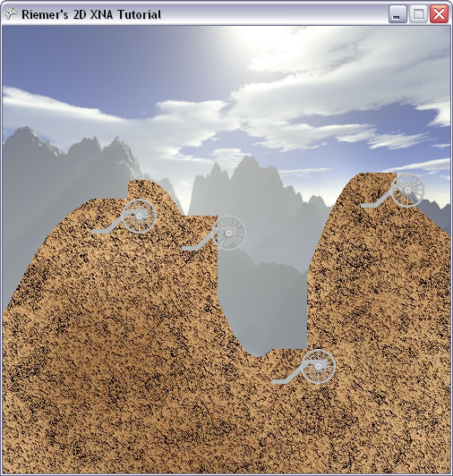

## Specifying the position of an image on the screen
Last chapter we've rendered 2 full-screen images. Obviously, to create a game we'll also need to be able to render smaller images to the screen, at the position we define. That's what we're going to do in this chapter.

This chapter, we're going to render the carriages and cannons of our players. Before we move on to the drawing code, we should define some data about our players, such as their position, color and whether they're still alive. To store all this data nicely together, we should create a struct, which is nothing more than a container able to store some data we define. Add this struct to the very top of our code, immediately beneath the namespace definition (if you're unsure where this is, have a look at the bottom of this page):

    public struct PlayerData
    {
        public Vector2 Position;
        public bool IsAlive;
        public Color Color;
        public float Angle;
        public float Power;
    }

As you can see, an object of the PlayerData type will be able to store a Position, which is a Vector2. A Vector2 can store 2 values, which we will use to store the X and Y coordinate of where we want to render the player's carriage and cannon. Next, we keep a boolean (true/false) indicating whether the player is alive (and thus whether it should be drawn or not), as well as the color we should draw the carriage and cannon in. Finally, for each player we keep track of the current angle of the cannon and of the power the cannonball will be shot with.

We will keep track of an array of PlayerData objects. An array can be thought of as a list of objects, allowing us to look at a certain object in the list, or make changes to an object in that list. So add these 2 variables above the Game1() method:

    PlayerData[] players;
    int numberOfPlayers = 4;

When the code is finished, we want to be able to easily adjust the number of players, which the last variable allows.

Now let's create a method, SetUpPlayers, which initializes our array of PlayerData objects:

    private void SetUpPlayers()
    {
        Color[] playerColors = new Color[10];
        playerColors[0] = Color.Red;
        playerColors[1] = Color.Green;
        playerColors[2] = Color.Blue;
        playerColors[3] = Color.Purple;
        playerColors[4] = Color.Orange;
        playerColors[5] = Color.Indigo;
        playerColors[6] = Color.Yellow;
        playerColors[7] = Color.SaddleBrown;
        playerColors[8] = Color.Tomato;
        playerColors[9] = Color.Turquoise;

        players = new PlayerData[numberOfPlayers];
        for (int i = 0; i < numberOfPlayers; i++)
        {
            players[i].IsAlive = true;
            players[i].Color = playerColors[i];
            players[i].Angle = MathHelper.ToRadians(90);
            players[i].Power = 100;
        }
    }

We start by defining an array of Color objects, defining 10 colors I chose at will. Next, the line before the for loop actually creates an array of empty PlayerData objects. Since I defined numberOfPlayers to be 4, this line will create an array holding 4 empty PlayerData objects.

The for loop scrolls through each PlayerData object in the array. For each of them, we set IsAlive to true and assign it a color we defined above. In game programming, and thus also in XNA, all angles are defined in radians. This might sound difficult, but if you know that pi (=3.14) radians correspond to 180 degrees, you can find how many radians correspond to any given number of degrees. Even better, XNA does the calculations for us: we just need to pass in the number of degrees to the MathHelper.ToRadians method, and XNA will convert it to radians for us.

Since the image of the cannon is vertically upwards and I want to start our game with all cannons lying vertically to the right, we need to rotate them over 90 degrees. (FYI, this corresponds to pi/2, so MathHelper.ToRadians(90) is the same as MathHelper.PiOver2). Finally we set the initial cannon power to 100.

There's one important thing we still need to initialize: the position of players on the terrain. As you can see, the foreground image has 4 flat areas, perfectly suited to place a cannon. When we will create the foreground image ourselves in a later chapter, we will know the position of these flat areas. For now, we will have to code them by hard. These are the 4 positions of the 4 flat areas of the terrain (put this code at the end of the SetUpPlayers method):

    players[0].Position = new Vector2(100, 193);
    players[1].Position = new Vector2(200, 212);
    players[2].Position = new Vector2(300, 361);
    players[3].Position = new Vector2(400, 164);

Now let's not forget to call this method from the end of our LoadContent method:

    SetUpPlayers();

Now all data is known about our players, it's time to render them to the screen. You can download the carriage image [by clicking here](http://www.riemers.net/Downloads/resources/Series2D/carriage.png) and the cannon image [by clicking here](http://www.riemers.net/Downloads/resources/Series2D/cannon.png). The first 3 steps are exactly the same as in the previous chapter:

1)import both images into the Content entry of your Solution Explorer

2) add these variables to the top of our code:

    Texture2D carriageTexture;
    Texture2D cannonTexture;

3) and initialize them in our LoadContent method:

    carriageTexture = Content.Load<Texture2D> ("carriage");
    cannonTexture = Content.Load<Texture2D> ("cannon");

Finally, we should add these images to the to-do list of the SpriteBatch. To keep our Draw method clean, we will create a new method, DrawPlayers, which is fairly easy:

    private void DrawPlayers()
    {
        foreach (PlayerData player in players)
        {
            if (player.IsAlive)
            {
                spriteBatch.Draw(carriageTexture, player.Position, Color.White);
            }
        }
    }

An array can be scrolled through in 2 ways. If you want to change any of the data inside the array, you need to use a for loop, as done in the SetUpPlayers method. However, this time we only need to look up a few things from our player data (such as their position), so we can use a foreach loop, which looks a bit more intuitive than a for loop. The code in this method simply says: for each of our players, check if it's still alive. If it is, draw the carriage texture at the player's position.

Now let's not forget to call this method from our Draw method. Since we're adding images to the SpriteBatch, we need to do this between the calls to SpriteBatch.Begin() and SpriteBatch.End() methods. Since the background image is fully opaque (=not-transparent), we need to do this after the call to the DrawScenery method, so our carriages are rendered over the scenery and not the other way around:

    protected override void Draw(GameTime gameTime)
    {
        graphics.GraphicsDevice.Clear(Color.CornflowerBlue);

        spriteBatch.Begin();
        DrawScenery();
        DrawPlayers();
        spriteBatch.End();

        base.Draw(gameTime);
    }

Now try to run this code! You should see the image below:

While the X coordinates of the carriages seem to be OK, you should notice 3 large errors:

- The carriages are drawn below the terrain, instead of on top of it.
- The carriage are far too big.
- They're grey.

We will solve them in the next chapter.

Our code so far:

    using System;
    using System.Collections.Generic;
    using System.Linq;
    using Microsoft.Xna.Framework;
    using Microsoft.Xna.Framework.Audio;
    using Microsoft.Xna.Framework.Content;
    using Microsoft.Xna.Framework.GamerServices;
    using Microsoft.Xna.Framework.Graphics;
    using Microsoft.Xna.Framework.Input;
    using Microsoft.Xna.Framework.Media;

    namespace XNATutorial
    {
        public struct PlayerData
        {
            public Vector2 Position;
            public bool IsAlive;
            public Color Color;
            public float Angle;
            public float Power;
        }

        public class Game1 : Microsoft.Xna.Framework.Game
        {
            GraphicsDeviceManager graphics;
            SpriteBatch spriteBatch;
            GraphicsDevice device;
            Texture2D backgroundTexture;
            Texture2D foregroundTexture;
            Texture2D carriageTexture;
            Texture2D cannonTexture;
            int screenWidth;
            int screenHeight;
            PlayerData[] players;
            int numberOfPlayers = 4;

            public Game1()
            {
                graphics = new GraphicsDeviceManager(this);
                Content.RootDirectory = "Content";
            }

            protected override void Initialize()
            {
                graphics.PreferredBackBufferWidth = 500;
                graphics.PreferredBackBufferHeight = 500;
                graphics.IsFullScreen = false;
                graphics.ApplyChanges();
                Window.Title = "Riemer's 2D XNA Tutorial";

                base.Initialize();
            }

            private void SetUpPlayers()
            {
                Color[] playerColors = new Color[10];
                playerColors[0] = Color.Red;
                playerColors[1] = Color.Green;
                playerColors[2] = Color.Blue;
                playerColors[3] = Color.Purple;
                playerColors[4] = Color.Orange;
                playerColors[5] = Color.Indigo;
                playerColors[6] = Color.Yellow;
                playerColors[7] = Color.SaddleBrown;
                playerColors[8] = Color.Tomato;
                playerColors[9] = Color.Turquoise;

                players = new PlayerData[numberOfPlayers];
                for (int i = 0; i < numberOfPlayers; i++)
                {
                    players[i].IsAlive = true;
                    players[i].Color = playerColors[i];
                    players[i].Angle = MathHelper.ToRadians(90);
                    players[i].Power = 100;
                }

                players[0].Position = new Vector2(100, 193);
                players[1].Position = new Vector2(200, 212);
                players[2].Position = new Vector2(300, 361);
                players[3].Position = new Vector2(400, 164);
            }

            protected override void LoadContent()
            {
                spriteBatch = new SpriteBatch(GraphicsDevice);
                device = graphics.GraphicsDevice;

                backgroundTexture = Content.Load<Texture2D>("background");
                foregroundTexture = Content.Load<Texture2D>("foreground");

                carriageTexture = Content.Load<Texture2D>("carriage");
                cannonTexture = Content.Load<Texture2D>("cannon");

                screenWidth = device.PresentationParameters.BackBufferWidth;
                screenHeight = device.PresentationParameters.BackBufferHeight;

                SetUpPlayers();
            }

            protected override void UnloadContent()
            {
            }

            protected override void Update(GameTime gameTime)
            {
                if (GamePad.GetState(PlayerIndex.One).Buttons.Back == ButtonState.Pressed)
                    this.Exit();

                base.Update(gameTime);
            }

            protected override void Draw(GameTime gameTime)
            {
                GraphicsDevice.Clear(Color.CornflowerBlue);

                spriteBatch.Begin();
                DrawScenery();
                DrawPlayers();
                spriteBatch.End();

                base.Draw(gameTime);
            }

            private void DrawScenery()
            {
                Rectangle screenRectangle = new Rectangle(0, 0, screenWidth, screenHeight);
                spriteBatch.Draw(backgroundTexture, screenRectangle, Color.White);
                spriteBatch.Draw(foregroundTexture, screenRectangle, Color.White);
            }

            private void DrawPlayers()
            {
                foreach (PlayerData player in players)
                {
                    if (player.IsAlive)
                    {
                        spriteBatch.Draw(carriageTexture, player.Position, Color.White);
                    }
                }
            }
        }
    }