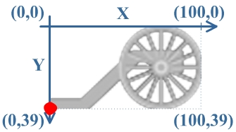
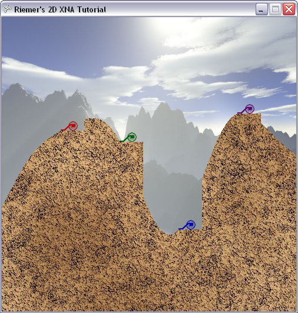

## More powerful features of the SpriteBatch
The final image of the previous chapter showed 3 large flaws, which we will solve now:

- The carriages are drawn below the terrain, instead of on top of it.
- The carriage are far too big.
- They’re gray.

Let’s start by the first issue. When you use the SpriteBatch.Draw() method, XNA will render the top-left corner of the image at the position you specify. When you run the program again, check that this is true.

This can be solved in two ways:

- We could specify the image should be drawn at a higher Y coordinate.
- We could specify the bottom-left corner should be put at the position we specify, instead of the default top-left corner.

In this case, we’re going for the latter. The SpriteBatch.Draw() method has a lot of different shapes (=overloads) that support more arguments. Replace the line of interest in the DrawPlayers method with this line:

    spriteBatch.Draw(carriageTexture, player.Position, null, Color.White, 0, new Vector2(0, carriageTexture.Height), 1, SpriteEffects.None, 0);

Let’s discuss the multiple arguments in short:

1. The image to draw

2. The target screen pixel position

3. This argument allows us to specify which part of the image should be drawn. This is useful in case you have stored multiple images inside one large image. By specifying null, we indicate we want to render the whole image.

4. The modulation color will be discussed below when dealing with the player colors.

5. The 5th argument allows us to rotate the image before it is rendered to the screen. It will be used in the next chapter to render the cannon.

6. We’ll use the 6th argument to solve our positioning issue. The 6th argument allows us to specify what XNA calls the ‘origin’ of the image. By default, this is the top-left corner of the image. XNA will render the image so that this ‘origin’ point of the images is positioned on the screen position specified as 2nd argument.

7. The 7th argument allows us to scale the image. We specify 1, indicating we want to render the image at the original size.

8. The 8th argument can be used to mirror the image horizontally or vertically before drawing it to the screen.

9. The final argument can be used to specify the layer the image should be drawn on. This is useful for advanced games having multiple transparent images stacked on top of each other. More information and examples in Recipe 3-3.

As sixth argument, we’re specifying the bottom-left corner of the image by specifying Vector2(0, carriageTexture.height). This position is indicated by the red dot in the image below. XNA will make sure this pixel is positioned at the position stored in player.Position.

Now when you run this code you should see the bottom-left corners of the carriage are better positioned!

Let’s move on and try to correctly scale the carriage. This is fairly easy, as we simply need to set the scaling factor as 7th argument of the SpriteBatch.Begin method. You can try to set for example 0.5f, which will cut the size in 2. However, since we will need this scaling factor later on thoughout our code, we will store it as another variable at the top of our code:

    float playerScaling;

And initialize it at the bottom of the LoadContent method:

    playerScaling = 40.0f / (float)carriageTexture.Width;

Since the width of each flat area on the terrain is 40 pixels, this scaling factor should scale the carriage so it fits on the flat area.

Now use this as scaling argument of our SpriteBatch.Draw method:

    spriteBatch.Draw(carriageTexture, player.Position, null, Color.White, 0, new Vector2(0, carriageTexture.Height), playerScaling, SpriteEffects.None, 0);

Now when you run this code, the carriage will be scaled down a lot so they fit on the flat areas. We just need to add some color to them!

Or actually: remove some color, as in graphics programming the color ‘white’ is the combination of all colors together. Every possible color is made up of 3 components: the Red, Green and Blue (RGB) components. If you add all of them together, you get white. If you only mix red an blue together, you get purple. If you use none of them, you get black.

This is useful to introduce the Color argument in the SpriteBatch.Draw() method. Before the image is rendered to the screen, for each pixel XNA looks up the color of the image, and the color you specified in the SpriteBatch.Draw() method. Next, the Red components of both colors are multiplied with each other. The same is true for both Green components and both Blue components. The resulting color is rendered to the screen!

Let’s say you want to render a white pixel to the screen, which has full Red, Green and Blue components: RGB = 1,1,1. Furthermore, say you’ve specified Blue as Color argument of the SpriteBatch.Draw method, having RGB = 0,0,1. The resulting color will be 1\*0,1\*0,1\*1 = 0,0,1 = Blue.

Second example: say you want to render the color 0.8,0.6,1 to the screen and you have specified 0.5,0.2,0.4 as Color argument. The resulting color would be 0.8\*0.5, 0.6\*0.2, 1\*0.4 = 0.4, 0.12, 0.4

Sounds very complicated, but our example will show it’s not. The image of our carriage contains only white or grey pixels. Now try to set the Color argument to Color.Blue like this:

    spriteBatch.Draw(carriageTexture, player.Position, null, Color.Blue, 0, new Vector2(0, carriageTexture.Height), playerScaling, SpriteEffects.None, 0);

Now if you run this code, you will notice the cannons have been rendered in blue. As explained above, this is simply because the Red and Green color components have been stripped away from the original colors. The completely white pixels have been replaced by fully blue pixels, while the grey pixels have been replaced by dark-blue pixels: Grey = 0.5,0.5,0.5 becomes 0,0,0.5 = darkblue.

Now since we don’t want all our carriages to be rendered in blue, we retrieve the correct color from our PlayerData array:

    spriteBatch.Draw(carriageTexture, player.Position, null, player.Color, 0, new Vector2(0, carriageTexture.Height), playerScaling, SpriteEffects.None, 0);

Now if you run this code, all of the carriages should be drawn at the correct position, scaled nicely and in the correct color!

You can try these exercises to practice what you've learned:

- Try to mirror the carriages horizontally by changing SpriteEffects.None in the SpriteBatch.Draw method.

Our code:

    using System;
    using System.Collections.Generic;
    using System.Linq;
    using Microsoft.Xna.Framework;
    using Microsoft.Xna.Framework.Audio;
    using Microsoft.Xna.Framework.Content;
    using Microsoft.Xna.Framework.GamerServices;
    using Microsoft.Xna.Framework.Graphics;
    using Microsoft.Xna.Framework.Input;
    using Microsoft.Xna.Framework.Media;

    namespace XNATutorial
    {
        public struct PlayerData
        {
            public Vector2 Position;
            public bool IsAlive;
            public Color Color;
            public float Angle;
            public float Power;
        }

        public class Game1 : Microsoft.Xna.Framework.Game
        {
            GraphicsDeviceManager graphics;
            SpriteBatch spriteBatch;
            GraphicsDevice device;
            Texture2D backgroundTexture;
            Texture2D foregroundTexture;
            Texture2D carriageTexture;
            Texture2D cannonTexture;
            int screenWidth;
            int screenHeight;
            PlayerData[] players;
            int numberOfPlayers = 4;
            float playerScaling;

            public Game1()
            {
                graphics = new GraphicsDeviceManager(this);
                Content.RootDirectory = "Content";
            }

            protected override void Initialize()
            {
                graphics.PreferredBackBufferWidth = 500;
                graphics.PreferredBackBufferHeight = 500;
                graphics.IsFullScreen = false;
                graphics.ApplyChanges();
                Window.Title = "Riemer's 2D XNA Tutorial";

                base.Initialize();
            }

            private void SetUpPlayers()
            {
                Color[] playerColors = new Color[10];
                playerColors[0] = Color.Red;
                playerColors[1] = Color.Green;
                playerColors[2] = Color.Blue;
                playerColors[3] = Color.Purple;
                playerColors[4] = Color.Orange;
                playerColors[5] = Color.Indigo;
                playerColors[6] = Color.Yellow;
                playerColors[7] = Color.SaddleBrown;
                playerColors[8] = Color.Tomato;
                playerColors[9] = Color.Turquoise;

                players = new PlayerData[numberOfPlayers];
                for (int i = 0; i < numberOfPlayers; i++)
                {
                    players[i].IsAlive = true;
                    players[i].Color = playerColors[i];
                    players[i].Angle = MathHelper.ToRadians(90);
                    players[i].Power = 100;
                }

                players[0].Position = new Vector2(100, 193);
                players[1].Position = new Vector2(200, 212);
                players[2].Position = new Vector2(300, 361);
                players[3].Position = new Vector2(400, 164);
            }

            protected override void LoadContent()
            {
                spriteBatch = new SpriteBatch(GraphicsDevice);
                device = graphics.GraphicsDevice;

                backgroundTexture = Content.Load<Texture2D>("background");
                foregroundTexture = Content.Load<Texture2D>("foreground");
                carriageTexture = Content.Load<Texture2D>("carriage");
                cannonTexture = Content.Load<Texture2D>("cannon");
                screenWidth = device.PresentationParameters.BackBufferWidth;
                screenHeight = device.PresentationParameters.BackBufferHeight;

                SetUpPlayers();

                playerScaling = 40.0f / (float)carriageTexture.Width;
            }

            protected override void UnloadContent()
            {
            }

            protected override void Update(GameTime gameTime)
            {
                if (GamePad.GetState(PlayerIndex.One).Buttons.Back == ButtonState.Pressed)
                    this.Exit();

                base.Update(gameTime);
            }

            protected override void Draw(GameTime gameTime)
            {
                GraphicsDevice.Clear(Color.CornflowerBlue);

                spriteBatch.Begin();
                DrawScenery();
                DrawPlayers();
                spriteBatch.End();

                base.Draw(gameTime);
            }

            private void DrawScenery()
            {
                Rectangle screenRectangle = new Rectangle(0, 0, screenWidth, screenHeight);
                spriteBatch.Draw(backgroundTexture, screenRectangle, Color.White);
                spriteBatch.Draw(foregroundTexture, screenRectangle, Color.White);
            }

            private void DrawPlayers()
            {
                foreach (PlayerData player in players)
                {
                    if (player.IsAlive)
                    {
                        spriteBatch.Draw(carriageTexture, player.Position, null, player.Color, 0, new Vector2(0, carriageTexture.Height), playerScaling, SpriteEffects.None, 0);
                }
            }
        }
    }
}