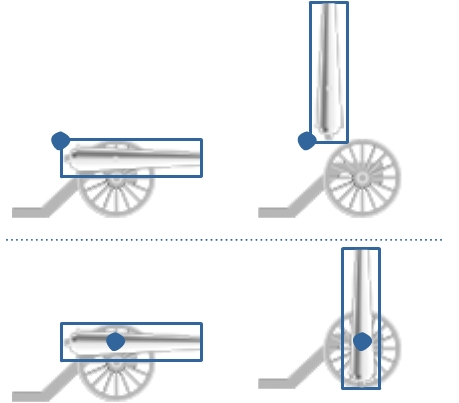
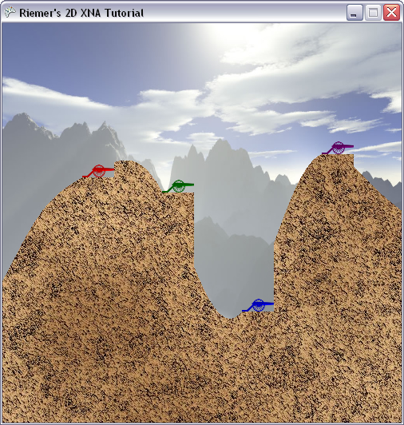

## Rotation – Drawing the cannon
We’ve almost covered all aspects about 2D rendering but one: rotation. In this chapter we will render our cannons on top of the carriages, according to the rotation angle stored in the PlayerData array.

You should already have imported the cannon image and linked them to the cannonTexture variable two chapters ago. Let’s discuss how we should rotate the cannons.

As mentioned in the previous chapters, by default XNA takes the top-left corner of the 2D image as origin. This is important for 2 reasons, of which we’ve covered the first one in the previous chapter:

- XNA will position the image on the screen so the origin point is at the position you specify in the SpriteBatch.Draw method.
- When you rotate the image, XNA rotates the image around its origin point. This is a direct consequence of the previous one: this way, the origin point stays at the position you specify, no matter what the rotation of the image is.

The image below illustrates this:

In the upper case, the cannon is rendered with the top-left corner as origin. Now when we would apply a rotation to the cannon, such as in the upper-right image, the cannon would be rotated around this origin point. Now imagine the cannon is rotated over 90 degrees as in the upper-right image, and the cannon would be totally outside the carriage!

What we need to do is specify the origin point in the center of rotation, which is the one point that should remain fixed while being rotated. This point is illustrated by the blue dot in the bottom part of the image. Now when the cannon is rotated over 90 degrees, the result would be much nicer, as shown in the bottom-right image.

So how can we code this in XNA? Fairly easy. Find the line that renders the carriage, and add this code immediately before it:

    int xPos = (int)player.Position.X;
    int yPos = (int)player.Position.Y;
    Vector2 cannonOrigin = new Vector2(11, 50);

    spriteBatch.Draw(cannonTexture, new Vector2(xPos + 20, yPos - 10), null, player.Color, player.Angle, cannonOrigin, playerScaling, SpriteEffects.None, 1);

We need to specify 2 positions:

- The new origin point of the cannon image
- And the screen position indicating where this origin point should be positioned.

The cannon image is an image of 70x20 pixels, so I chose (11,50) as origin point. Try to open the image and locate this position, you’ll see it is at the rotational center of the cannon. Note that this position needs to be defined at the original size of the image.

Next, we need to define where on the screen this cannon origin should be position. We want to position it 20 pixels to the right and 10 pixels up, relative to the player’s position, which was the top-left pixel of the carriage.

Finally, we set the rotation angle different than 0. You should try some values for yourself, using the MathHelper.ToRadians() method. In the final line, we pick the angle and color stored in our PlayerData array.

Now when you run this code, all cannons should be pointing to the right as shown in the image below, as originally the cannon is drawn upward and we initialized all of the angles to 90 degrees.

Next chapter we’ll learn how we can read in keyboard input, so we can adjust the angles while our program is running!

The code so far:

    using System;
    using System.Collections.Generic;
    using System.Linq;
    using Microsoft.Xna.Framework;
    using Microsoft.Xna.Framework.Audio;
    using Microsoft.Xna.Framework.Content;
    using Microsoft.Xna.Framework.GamerServices;
    using Microsoft.Xna.Framework.Graphics;
    using Microsoft.Xna.Framework.Input;
    using Microsoft.Xna.Framework.Media;

    namespace XNATutorial
    {
        public struct PlayerData
        {
            public Vector2 Position;
            public bool IsAlive;
            public Color Color;
            public float Angle;
            public float Power;
        }

        public class Game1 : Microsoft.Xna.Framework.Game
        {
            GraphicsDeviceManager graphics;
            SpriteBatch spriteBatch;
            GraphicsDevice device;
            Texture2D backgroundTexture;
            Texture2D foregroundTexture;
            Texture2D carriageTexture;
            Texture2D cannonTexture;
            int screenWidth;
            int screenHeight;
            PlayerData[] players;
            int numberOfPlayers = 4;
            float playerScaling;

            public Game1()
            {
                graphics = new GraphicsDeviceManager(this);
                Content.RootDirectory = "Content";
            }

            protected override void Initialize()
            {
                graphics.PreferredBackBufferWidth = 500;
                graphics.PreferredBackBufferHeight = 500;
                graphics.IsFullScreen = false;
                graphics.ApplyChanges();
                Window.Title = "Riemer's 2D XNA Tutorial";

                base.Initialize();
            }

            private void SetUpPlayers()
            {
                Color[] playerColors = new Color[10];
                playerColors[0] = Color.Red;
                playerColors[1] = Color.Green;
                playerColors[2] = Color.Blue;
                playerColors[3] = Color.Purple;
                playerColors[4] = Color.Orange;
                playerColors[5] = Color.Indigo;
                playerColors[6] = Color.Yellow;
                playerColors[7] = Color.SaddleBrown;
                playerColors[8] = Color.Tomato;
                playerColors[9] = Color.Turquoise;

                players = new PlayerData[numberOfPlayers];
                for (int i = 0; i < numberOfPlayers; i++)
                {
                    players[i].IsAlive = true;
                    players[i].Color = playerColors[i];
                    players[i].Angle = MathHelper.ToRadians(90);
                    players[i].Power = 100;
                }

                players[0].Position = new Vector2(100, 193);
                players[1].Position = new Vector2(200, 212);
                players[2].Position = new Vector2(300, 361);
                players[3].Position = new Vector2(400, 164);
            }

            protected override void LoadContent()
            {
                spriteBatch = new SpriteBatch(GraphicsDevice);
                device = graphics.GraphicsDevice;

                backgroundTexture = Content.Load<Texture2D>("background");
                foregroundTexture = Content.Load<Texture2D>("foreground");
                carriageTexture = Content.Load<Texture2D>("carriage");
                cannonTexture = Content.Load<Texture2D>("cannon");
                screenWidth = device.PresentationParameters.BackBufferWidth;
                screenHeight = device.PresentationParameters.BackBufferHeight;

                SetUpPlayers();
                playerScaling = 40.0f / (float)carriageTexture.Width;
            }

            protected override void UnloadContent()
            {
            }

            protected override void Update(GameTime gameTime)
            {
                if (GamePad.GetState(PlayerIndex.One).Buttons.Back == ButtonState.Pressed)
                    this.Exit();

                base.Update(gameTime);
            }

            protected override void Draw(GameTime gameTime)
            {
                GraphicsDevice.Clear(Color.CornflowerBlue);

                spriteBatch.Begin();
                DrawScenery();
                DrawPlayers();
                spriteBatch.End();

                base.Draw(gameTime);
            }

            private void DrawScenery()
            {
                Rectangle screenRectangle = new Rectangle(0, 0, screenWidth, screenHeight);
                spriteBatch.Draw(backgroundTexture, screenRectangle, Color.White);
                spriteBatch.Draw(foregroundTexture, screenRectangle, Color.White);
            }

            private void DrawPlayers()
            {
                foreach (PlayerData player in players)
                {
                    if (player.IsAlive)
                    {

                        int xPos = (int)player.Position.X;
                        int yPos = (int)player.Position.Y;
                        Vector2 cannonOrigin = new Vector2(11, 50);

                        spriteBatch.Draw(cannonTexture, new Vector2(xPos + 20, yPos - 10), null, player.Color, player.Angle, cannonOrigin, playerScaling, SpriteEffects.None, 1);
                        spriteBatch.Draw(carriageTexture, player.Position, null, player.Color, 0, new Vector2(0, carriageTexture.Height), playerScaling, SpriteEffects.None, 0);
                    }
                }
            }
        }
    }