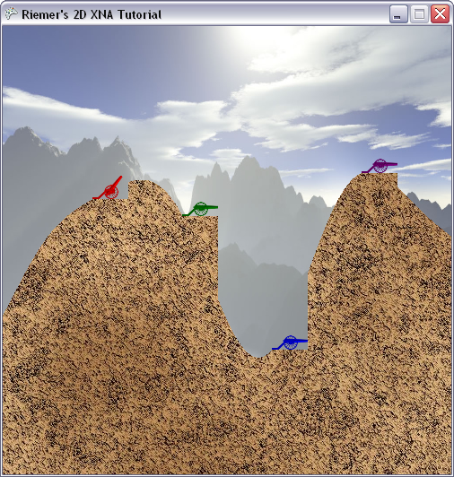

## Reading out the Keyboard
In this chapter, we'll see how easy it is in XNA to read the keyboard input. As an example, whenever the user presses the left or right button, the angle of the cannon of the current player will be adjusted. Let's start by adding this variable at the top of our code, so we know which cannon to adjust:

    int currentPlayer = 0;

Reading out the keyboard should be done quite frequently, as it is used to update our game logic such as the angles of the cannon. Therefore, we should do this in the Update method. To keep our Update method clean, we will code a method ProcessKeyboard which we will call from the Update method.

    private void ProcessKeyboard()
    {
        KeyboardState keybState = Keyboard.GetState();
        if (keybState.IsKeyDown(Keys.Left))
            players[currentPlayer].Angle -= 0.01f;
        if (keybState.IsKeyDown(Keys.Right))
            players[currentPlayer].Angle += 0.01f;
    }

This code is basically all we need! The first line retrieves the current state of the keyboard, holding which keys are current pressed. We use this KeyboardState object to the whether the Left and Right arrow keys are currently down, and if this is the case we change the angle of the current player.

Now let's not forget to call this method from our Update method, ensuring the keyboard is read out exactly 60 times each second:

This code is basically all we need! The first line retrieves the current state of the keyboard, holding which keys are current pressed. We use this KeyboardState object to the whether the Left and Right arrow keys are currently down, and if this is the case we change the angle of the current player.

Now let's not forget to call this method from our Update method, ensuring the keyboard is read out exactly 60 times each second:

    ProcessKeyboard();

Now run this code! When you press the left and right arrow keys, the cannon of the first (red) player will rotate. However, at this moment you are able to rotate the cannon so it's colliding with the terrain, so we should add this little logic to the end of the ProcessKeyboard method:

    if (players[currentPlayer].Angle > MathHelper.PiOver2)
        players[currentPlayer].Angle = -MathHelper.PiOver2;
    if (players[currentPlayer].Angle < -MathHelper.PiOver2)
        players[currentPlayer].Angle = MathHelper.PiOver2;

In this code, you need to remember that Pi (=3.14) radians correspond to 180 degrees, so PiOver2 radians correspond to 90 degrees. Then it's easy: if the cannon is at 90 degrees (meaning horizontally to the right), and the right button is pressed, the angle changes to -90 degrees so it is pointing to the left. The last 2 lines make this true for the other way around. Try what this gives when running the code!

Now we will add a last block of code to our ProcessKeyboard method, which allows the player to adjust the Power of the cannon:

    if (keybState.IsKeyDown(Keys.Down))
        players[currentPlayer].Power -= 1;
    if (keybState.IsKeyDown(Keys.Up))
        players[currentPlayer].Power += 1;
    if (keybState.IsKeyDown(Keys.PageDown))
        players[currentPlayer].Power -= 20;
    if (keybState.IsKeyDown(Keys.PageUp))
        players[currentPlayer].Power += 20;

    if (players[currentPlayer].Power > 1000)
        players[currentPlayer].Power = 1000;
    if (players[currentPlayer].Power < 0)
        players[currentPlayer].Power = 0;

When the Up or Down arrows are pressed, the power is incremented or decremented by one. Since this way it can take a while to reach a high power, if the PageUp or PageDown keys are pressed the incrementation and decrementation will be done at much larger steps. The last 4 lines simply limit the Power value between 0 and 1000.

That's it for this chapter! You can see the cannon rotate on your keyboard input, but it's hard to see the Power is changing. Therefore, next chapter we will see how to render text to the screen, so we can print the Angle and Power of the current player to the screen!

The code thus far:

    using System;
    using System.Collections.Generic;
    using System.Linq;
    using Microsoft.Xna.Framework;
    using Microsoft.Xna.Framework.Audio;
    using Microsoft.Xna.Framework.Content;
    using Microsoft.Xna.Framework.GamerServices;
    using Microsoft.Xna.Framework.Graphics;
    using Microsoft.Xna.Framework.Input;
    using Microsoft.Xna.Framework.Media;

    namespace XNATutorial
    {
        public struct PlayerData
        {
            public Vector2 Position;
            public bool IsAlive;
            public Color Color;
            public float Angle;
            public float Power;
        }

        public class Game1 : Microsoft.Xna.Framework.Game
        {
            GraphicsDeviceManager graphics;
            SpriteBatch spriteBatch;
            GraphicsDevice device;
            Texture2D backgroundTexture;
            Texture2D foregroundTexture;
            Texture2D carriageTexture;
            Texture2D cannonTexture;
            int screenWidth;
            int screenHeight;
            PlayerData[] players;
            int numberOfPlayers = 4;
            float playerScaling;
            int currentPlayer = 0;

            public Game1()
            {
                graphics = new GraphicsDeviceManager(this);
                Content.RootDirectory = "Content";
            }

            protected override void Initialize()
            {
                graphics.PreferredBackBufferWidth = 500;
                graphics.PreferredBackBufferHeight = 500;
                graphics.IsFullScreen = false;
                graphics.ApplyChanges();
                Window.Title = "Riemer's 2D XNA Tutorial";

                base.Initialize();
            }

            private void SetUpPlayers()
            {
                Color[] playerColors = new Color[10];
                playerColors[0] = Color.Red;
                playerColors[1] = Color.Green;
                playerColors[2] = Color.Blue;
                playerColors[3] = Color.Purple;
                playerColors[4] = Color.Orange;
                playerColors[5] = Color.Indigo;
                playerColors[6] = Color.Yellow;
                playerColors[7] = Color.SaddleBrown;
                playerColors[8] = Color.Tomato;
                playerColors[9] = Color.Turquoise;

                players = new PlayerData[numberOfPlayers];
                for (int i = 0; i < numberOfPlayers; i++)
                {
                    players[i].IsAlive = true;
                    players[i].Color = playerColors[i];
                    players[i].Angle = MathHelper.ToRadians(90);
                    players[i].Power = 100;
                }

                players[0].Position = new Vector2(100, 193);
                players[1].Position = new Vector2(200, 212);
                players[2].Position = new Vector2(300, 361);
                players[3].Position = new Vector2(400, 164);
            }

            protected override void LoadContent()
            {
                spriteBatch = new SpriteBatch(GraphicsDevice);
                device = graphics.GraphicsDevice;

                backgroundTexture = Content.Load<Texture2D>("background");
                foregroundTexture = Content.Load<Texture2D>("foreground");
                carriageTexture = Content.Load<Texture2D>("carriage");
                cannonTexture = Content.Load<Texture2D>("cannon");
                screenWidth = device.PresentationParameters.BackBufferWidth;
                screenHeight = device.PresentationParameters.BackBufferHeight;

                SetUpPlayers();
                playerScaling = 40.0f / (float)carriageTexture.Width;
            }

            protected override void UnloadContent()
            {
            }

            protected override void Update(GameTime gameTime)
            {
                if (GamePad.GetState(PlayerIndex.One).Buttons.Back == ButtonState.Pressed)
                    this.Exit();

                ProcessKeyboard();

                base.Update(gameTime);
            }

            private void ProcessKeyboard()
            {
                KeyboardState keybState = Keyboard.GetState();
                if (keybState.IsKeyDown(Keys.Left))
                    players[currentPlayer].Angle -= 0.01f;
                if (keybState.IsKeyDown(Keys.Right))
                    players[currentPlayer].Angle += 0.01f;

                if (players[currentPlayer].Angle > MathHelper.PiOver2)
                    players[currentPlayer].Angle = -MathHelper.PiOver2;
                if (players[currentPlayer].Angle < -MathHelper.PiOver2)
                    players[currentPlayer].Angle = MathHelper.PiOver2;

                if (keybState.IsKeyDown(Keys.Down))
                    players[currentPlayer].Power -= 1;
                if (keybState.IsKeyDown(Keys.Up))
                    players[currentPlayer].Power += 1;
                if (keybState.IsKeyDown(Keys.PageDown))
                    players[currentPlayer].Power -= 20;
                if (keybState.IsKeyDown(Keys.PageUp))
                    players[currentPlayer].Power += 20;

                if (players[currentPlayer].Power > 1000)
                    players[currentPlayer].Power = 1000;
                if (players[currentPlayer].Power < 0)
                    players[currentPlayer].Power = 0;
            }

            protected override void Draw(GameTime gameTime)
            {
                GraphicsDevice.Clear(Color.CornflowerBlue);

                spriteBatch.Begin();
                DrawScenery();
                DrawPlayers();
                spriteBatch.End();

                base.Draw(gameTime);
            }

            private void DrawScenery()
            {
                Rectangle screenRectangle = new Rectangle(0, 0, screenWidth, screenHeight);
                spriteBatch.Draw(backgroundTexture, screenRectangle, Color.White);
                spriteBatch.Draw(foregroundTexture, screenRectangle, Color.White);
            }

            private void DrawPlayers()
            {
                foreach (PlayerData player in players)
                {
                    if (player.IsAlive)
                    {
                        int xPos = (int)player.Position.X;
                        int yPos = (int)player.Position.Y;
                        Vector2 cannonOrigin = new Vector2(11, 50);

                        spriteBatch.Draw(cannonTexture, new Vector2(xPos + 20, yPos - 10), null, player.Color, player.Angle, cannonOrigin, playerScaling, SpriteEffects.None, 1);
                        spriteBatch.Draw(carriageTexture, player.Position, null, player.Color, 0, new Vector2(0, carriageTexture.Height), playerScaling, SpriteEffects.None, 0);
                    }
                }
            }
        }
    }