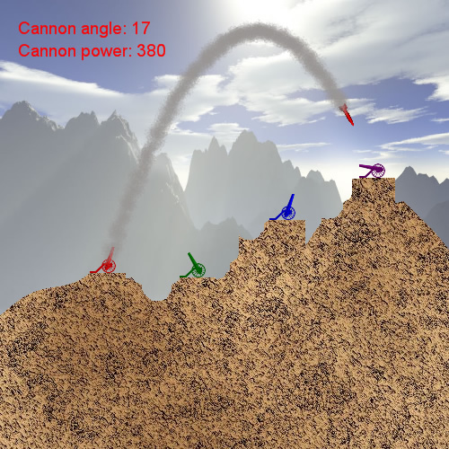
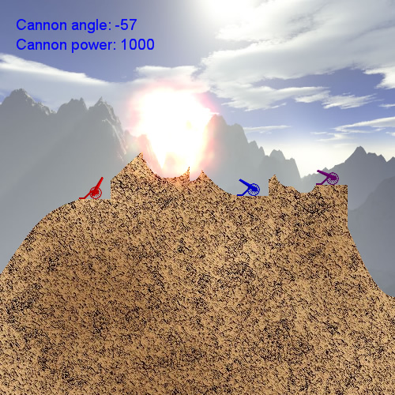

## 2D XNA Tutorial for C# overview
This part of the site shows you how easy it is to get a 2D XNA program up and running! This tutorial is aimed at people who would to start game programming in XNA and see some nice results in the shortest possible time. To this end, XNA is an ideal programming environment. Using C# as programming language, the code looks very much like Java, so anyone having some notions of Java should be able to start right away. Even more, this tutorial is written in such a way that anyone who has any programming experience should be able to completely understand and complete it!

Each chapter of this series starts by explaining a 2D game programming concept, which is then put to practice by adding the code to our project. This helps you gradually building up your XNA skills, and in the end you’ll have created a complete 2D game!

The game we will create looks pretty simple, but don’t be mistaken: at the end of the series you’ll know enough to create almost any 2D game!

Below I have listed some of the concepts you’ll learn in this series of tutorials:

- Installing XNA and opening your first XNA project
- Rendering 2D images to the screen
- Scaling, rotating and positioning 2D images
- Keyboard input
- Playing sound effects in XNA
- Per-pixel texture manipulations
- Random terrain slope generation
- Alpha blending
- Collision detection (the most complex case is covered: per-pixel transformed)
- And even a complete 2D particle engine for the explosions!

During this series you will need to download the following resources:
- This section will be updated once the entire series has been uploaded!

Below you can find some screenshots of this series of 2D XNA Tutorials. The code is written in such a way that you can easily adjust the resolution. For an example of a larger screenshot, click [here](http://www.riemers.net/images).

