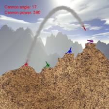
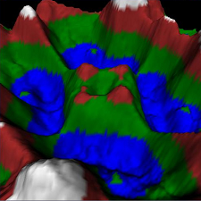
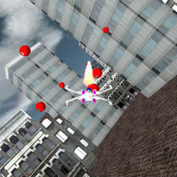
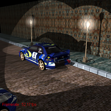
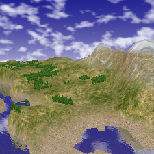
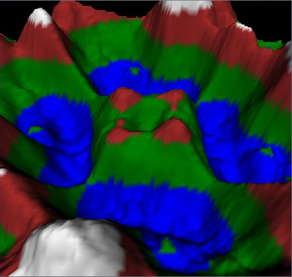
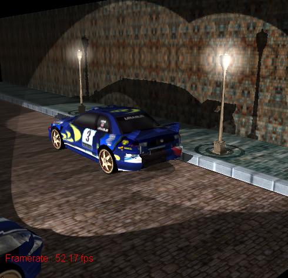

### WORK IN PROGRESS
This is a MonoGame port of Riemer's series of XNA tutorials, which can be found [here](http://riemers.net/). It is currently a work in progress.

## Riemer's 2D and 3D XNA Tutorials
Welcome to my XNA Tutorials. On these pages you can find everything you need to start programming your own games in XNA! The aim of these XNA Tutorials is to __kickstart your XNA programming in the shortest possible time__. If you have some basic programming experience, whether it be using C#, Microsoft Visual Basic or Java, you will have no problems to start coding your XNA project right away. __All the software you need__ to start writing your XNA application __is completely free!__ On the first page of Series 1 you can find the link where you can download Microsoft’s Game Studio 2.0.

The XNA Tutorials are presented in series of tutorials. Instead of writing small stand-alone chapters, I've opted to introduce you to the various XNA concepts one at a time, and gradually integrate the new concepts into our project as we move on. This way, you can see a real-world example in practice of all the features explained in the chapters. The major aim of these XNA Tutorials is to __produce nice-looking results within the shortest possible time__.

At this moment, you can find 5 series of XNA Tutorials on this site: one series on 2D game programming and 4 series on 3D game programming. Let me show you the final screens of the 5 projects we create during the Tutorials:

-----

[2D Series 1: Shooters!](riemer_2D_intro.md)

-----

3D Series 1: Terrain

-----

3D Series 1: Terrain

-----

3D Series 3: HLSL Intro

-----

3D Series 4: Advanced Terrain

-----

If you’re interested in beginning game programming in XNA, you can start with the 2D series. In this series, you’ll learn enough techniques to create almost any 2D game you can think of! This is a screenshot of the game we’ll create in this series:

If you’re ready for some 3D programming, you should give the first Series of 3D programming a try. In this first Series of 3D programming you’ll create a true three-dimensional landscape. Linking to your graphics card, drawing a few triangles and lighting basics will be introduced here.

In this second series of 3D XNA Tutorials, you'll learn how to create a complete flight simulator! This will include flying your aircraft in a true 3D city and firing bullets at objects! Including basic collision detection, this series already contains enough content to write your own 3D game!!

In the 3rd Series of 3D XNA Tutorials, we’ll start exploring Shaders. Shaders are used to improve the visual quality of the displayed image, so it’s clear you should start with the first 2 Series before moving on to this more advanced Series. As a final goal to demonstrate the strength of shaders, I have chosen my example of real lighting. Our scene is lit by a light, and all objects cast real shadows. Series 3 is used to show you how you can master some of the power inside your NVidia or ATI graphics board.

Taking these tutorials to the next level in this fourth Series of 3D XNA Tutorials, we’ll see some more advanced techniques that will allow us to create a real 3D world that you can use as a start for your own game. Multitexturing and reflective water are just a few of the techniques covered. Of course, since this Series relies heavily on HLSL, an understanding of the first three 3D Series are mandatory.

You can also find how to code these series using DirectX for C#, and the first series has also been ported to DirectX for C++ and DirectX for VB. You can find these DirectX Tutorials in the Contents menu, on the rights side of the page.

Any comments on grammatical errors, errors in the code, or on anything else are greatly appreciated. I will update the site as soon as I see your post [here](http://www.riemers.net/Forum). Also, if you have any questions, feel free to ask them there!