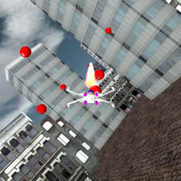

### WORK IN PROGRESS
This is a MonoGame port of Riemer's series of XNA tutorials, which can be found [here](http://riemers.net/). It is currently a work in progress.

## Riemer's 2D and 3D XNA Tutorials
Welcome to my XNA Tutorials. On these pages you can find everything you need to start programming your own games in XNA! The aim of these XNA Tutorials is to __kickstart your XNA programming in the shortest possible time__. If you have some basic programming experience, whether it be using C#, Microsoft Visual Basic or Java, you will have no problems to start coding your XNA project right away. __All the software you need__ to start writing your XNA application __is completely free!__ On the first page of Series 1 you can find the link where you can download Microsoft’s Game Studio 2.0.

The XNA Tutorials are presented in series of tutorials. Instead of writing small stand-alone chapters, I've opted to introduce you to the various XNA concepts one at a time, and gradually integrate the new concepts into our project as we move on. This way, you can see a real-world example in practice of all the features explained in the chapters. The major aim of these XNA Tutorials is to __produce nice-looking results within the shortest possible time__.

At this moment, you can find 5 series of XNA Tutorials on this site: one series on 2D game programming and 4 series on 3D game programming. Let me show you the final screens of the 5 projects we create during the Tutorials:

-----

2D Series 1: Shooters!

-----

3D Series 1: Terrain

-----

3D Series 1: Terrain

-----

3D Series 3: HLSL Intro

-----

3D Series 4: Advanced Terrain

-----

If you’re interested in beginning game programming in XNA, you can start with the 2D series. In this series, you’ll learn enough techniques to create almost any 2D game you can think of! This is a screenshot of the game we’ll create in this series:
