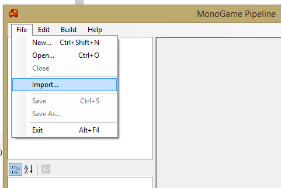
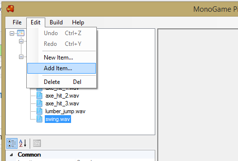
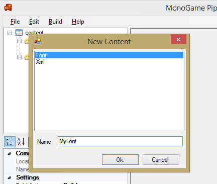
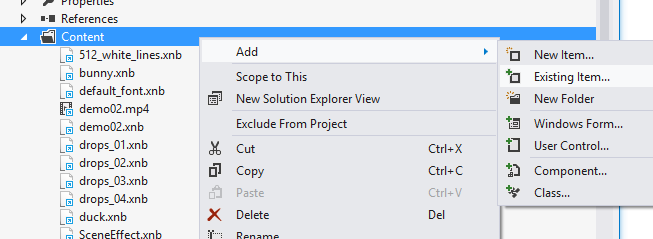
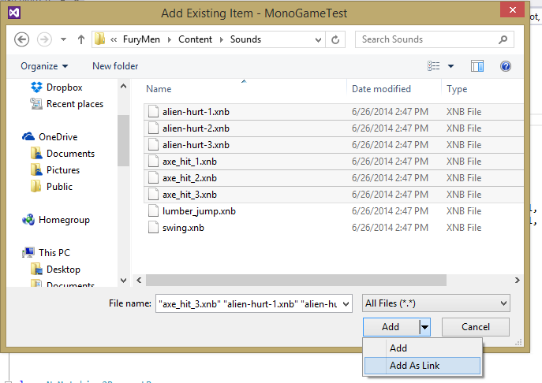
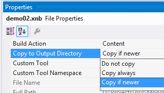

The [Pipeline Tool](pipeline.md) is used to organize and build content for use with MonoGame. It is installed as part of the MonoGame SDK Installer or can be built [directly from source](https://github.com/mono/MonoGame/tree/develop/Tools/Pipeline) if needed.

## Create A Project

To start a new project just select "New..." from the "File" menu.  This will give you a new empty project to add content to.

If you are starting from an existing XNA project, the Pipeline Tool supports importing your existing .contentproj.  Again you can access this from the the "File" menu:

<p align="center">

</p>

This creates a new project, adding all your content and content settings from the XNA project.  If you happened to be using custom processors you may need to edit the assembly references to link to the correct paths which we discuss next.

## Project Settings

You can edit the content project settings directly from the property grid editor after selecting the project node in the tree view:

<p align="center">

</p>

This is where you setup the folders for output, the platform to target, the assembly references for custom processors, etc.

Note that currently the Pipeline tool is not setup to support multiple target platforms.  This means you may need to manage mutliple content projects or manually change the target platform between builds.  We are working on adding functionaliy to support multiple platforms and configurations within a single project.


## Adding Content Items

Once you have a project setup you can add content to it for building.  You can do this from the "Edit" menu:

<p align="center">

</p>

Selecting "New Item..." will bring up the New Item dialog which displays a list of new items that can be created:

<p align="center">

</p>

When you select "Existing Item..." you get to select an existing item from disk to add to the content project.


## Custom Content Processors

Just like XNA, the MonoGame content pipeline supports custom content processors.  To use them you need to rebuild them correctly to work against MonoGame.

The first step is removing all `Microsoft.Xna.Framework.XXX` references and replacing them with references to `MonoGame.Framework` and `MonoGame.Framework.Content.Pipeline`.  This is required as you will no longer be building against Microsoft XNA.

Once you references are working you then need to change your assembly target platform.  MonoGame does not support x86 (aka 32bit) assemblies in the content pipeline.  This is mainly to allow of processing really big content as well as to simplify the number of configurations and native code dependancies.  For this reason you should try to target "Any CPU" with your custom content assembly.

After you have done these fixes you should be able to add these new processors to the content project "References".

## Building Content

The Pipeline Tool has 3 actions related to building content: Build, Rebuild and Clean. Build will build all content that needs to be built and put the xnb's in the output directory (bin by default). Content will be skipped if it hasn't changed since the last build. The time source content was last edited is saved in the intermediate directory (obj by default) to determine if content changed since the last build. Clean will empty the output and intermediate directories. Rebuild will first Clean and then Build.

## Linking Content To Your Game

Once you have built your content you have a few different ways to add the xnb's to your game project. They all have the same goal, to get the built xnb's in your project output folder so a ContentManager can easily find and load them.

### MonoGameContentReference

The simplest method is to setup your game project from one of the templates that come with the SDK. When you create a new project it will include a Content.mgcb file with its Build Action set to MonoGameContentReference. This build action is defined in the .targets file [here](https://github.com/MonoGame/MonoGame/blob/develop/MonoGame.Framework.Content.Pipeline/MonoGame.Content.Builder.targets). MonoGameContentReference is set up so that when the project is built, the mgcb will build any new/modified content and copy the resulting xnb's to the project output directory so they can be used in the project. Note that this way you don't even have to manually build the content with the Pipeline Tool. Just add your content to the .mgcb with the Pipeline Tool and the rest will happen when you build your project. The content files do not need to be added to your project.

### Manual Copy

If you don't want to use the automated process, you can build the content project with the Pipeline Tool and copy the xnb's to the output folder of your project manually.


### Add As Content

If you are using Visual Studio you can simply add the xnb files to your C# game project.  Create a folder in the project called Content then right click on the folder and select Add -> Existing Item.

<p align="center">

</p>

You will now see a file dialog from which you can add your content files.  Note that if you don't want Visual Studio to make a local copy of the files be sure to use "Add As Link".

<p align="center">

</p>

Once the files are added you need to select them all and change their build action to "Content" and "Copy if newer".

<p align="center">

</p>


### Add With Wildcard

The more automatic option is to hand edit your game .csproj and have it include you content using wildcards. To do this just open the .csproj with any text editor then add the following after any other `<ItemGroup>`:

```
  <ItemGroup>
    <Content Include="Content\**\*.*">
      <CopyToOutputDirectory>PreserveNewest</CopyToOutputDirectory>
    </Content>
  </ItemGroup>
```

Then any files you put in a Content folder within your game project will automatically be included in the build.


## Reporting Bugs

If you run into any problems with MGCB or the Pipeline Tool, please ask for help on the [community site](http://community.monogame.net/) or submit a [bug report on GitHub](https://github.com/MonoGame/MonoGame/issues).
