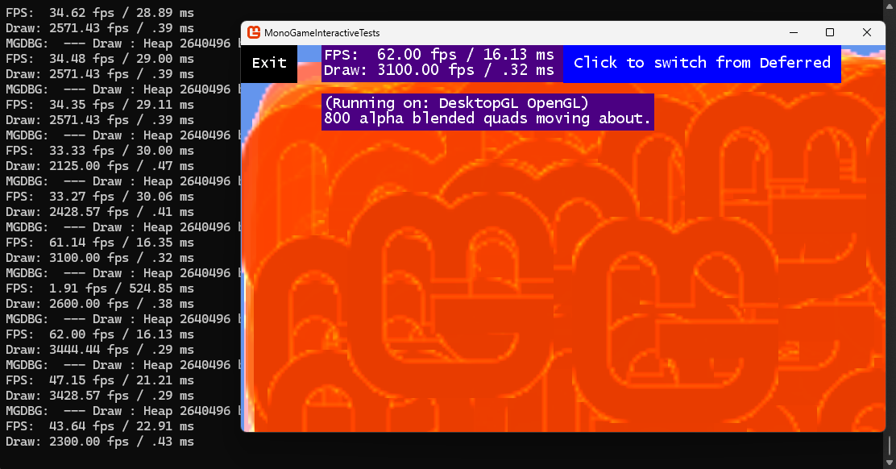
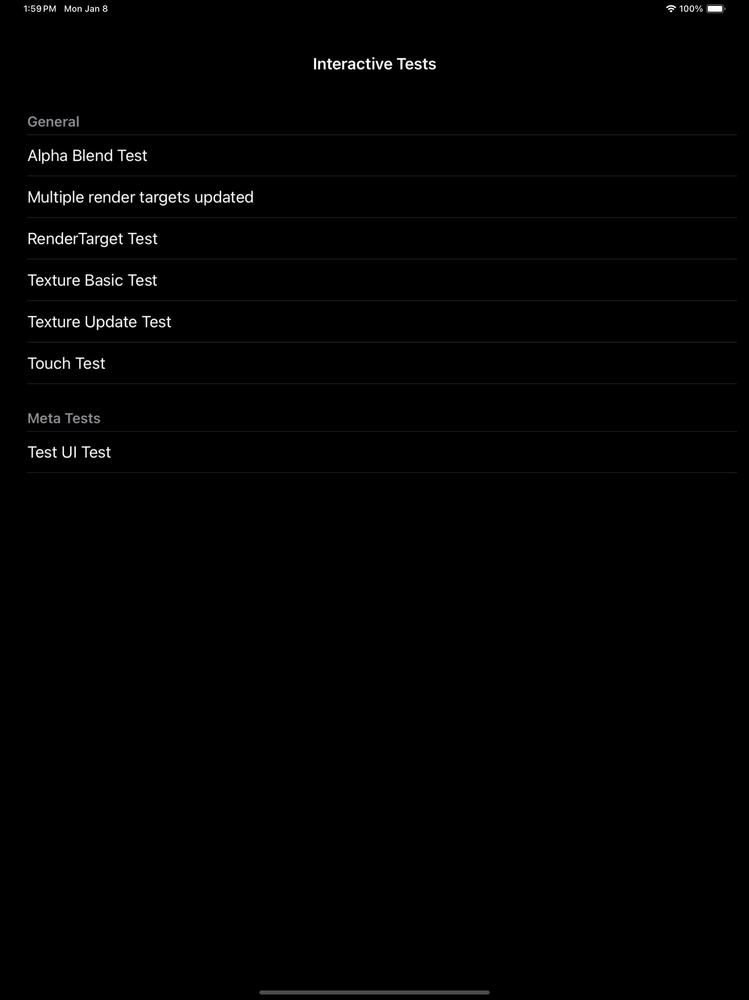

# Interactive Tests

# Running tests


## DesktopGL Interactive Tests

Individual platforms have their own test runners using shared test code (although not all tests are available yet for all platforms).

```bash
# DesktopGL tests on Windows/MacOS
cd Tests/Interactive/TestRunners/DesktopGL
# First discover tests:
dotnet run MonoGame.DesktopGL.TestRunner.csproj -t Debug
# You should see something like:
## Provided options : MonoGame.DesktopGL.TestRunner.csproj -t Debug; Interactive tests available:
## Touch Test
## Test UI Test

# Next choose which test to run (only the first one is run if there are multiple tests, given limitation of MonoGame on Desktop)
dotnet run MonoGame.DesktopGL.TestRunner.csproj -t Debug -- "Alpha Blend"
```




## iOS Interactive Tests

To run the test and launch via a simulator:

```bash
cd Tests/Interactive/TestRunners/iOS
dotnet run --project= MonoGame.InteractiveTests.iOS.csproj -c Debug -f net8.0-ios

```

To run the test on a specific device (or a specific simulator):

```bash
# Obtain the connected device(s)
/Applications/Xcode.app/Contents/Developer/usr/bin/xctrace list devices

cd Tests/Interactive/TestRunners/iOS 
dotnet build -t:Run -f net8.0-ios   -p:RuntimeIdentifier=ios-arm64  MonoGame.InteractiveTests.iOS.csproj -p:_DeviceName="<device id>"

cd Tests/Interactive/TestRunners/iOS

# To run on a simulator:
dotnet run --project= MonoGame.InteractiveTests.iOS.csproj -c Debug -f net8.0-ios 

# To run on a specific simulator (use XCode -> Windows -> Devices and Simulators to find the UDID):
dotnet build -t:Run -f net8.0-ios  -p:RuntimeIdentifier=iossimulator-arm64  MonoGame.InteractiveTests.iOS.csproj   -p:_DeviceName=:v2:udid="$1"

```




Once you choose a test, interact with it; exit by clicking the button on the top-left.


## Writing Interactive Tests

The easiest way is to copy over the simplest test such as [Texture Basic Test](.\Tests\TextureTest\TextureBasicTest.cs).
 - Extend from `TestGame` example in [Texture Basic Test](.\Tests\TextureTest\TextureBasicTest.cs). 
 - Fill in `LoadContent`, `Update`, `Draw` as needed.
 - Add UI elements to the `_universe` in your `InitializeGui`.

That's it. 

